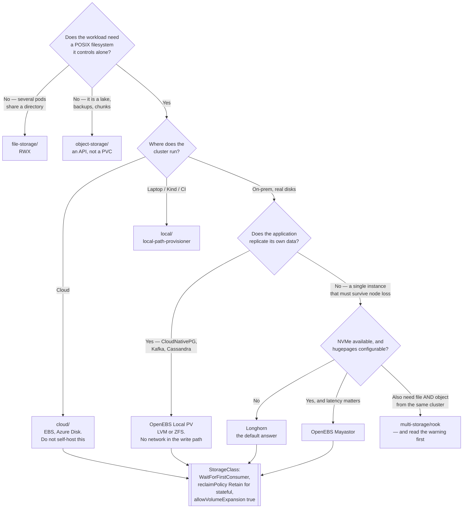

[← Storage](../README.md)

# Block storage

A raw disk attached to exactly one node — what a database wants, and what pins a pod in place.

Tools covered: [`longhorn/`](longhorn/README.md) · [`openebs/`](openebs/README.md) ·
[`hdfs/`](hdfs/README.md)

## Contents

1. [What block storage actually is](#1-what-block-storage-actually-is)
   1. [RWO is the whole story](#11-rwo-is-the-whole-story)
   2. [The failure everyone meets](#12-the-failure-everyone-meets)
2. [The CSI model](#2-the-csi-model)
   1. [The sidecars, and what each one breaks](#21-the-sidecars-and-what-each-one-breaks)
3. [StorageClass: the three fields that decide everything](#3-storageclass-the-three-fields-that-decide-everything)
   1. [`volumeBindingMode`](#31-volumebindingmode)
   2. [`reclaimPolicy`](#32-reclaimpolicy)
   3. [`allowVolumeExpansion`](#33-allowvolumeexpansion)
4. [The tools](#4-the-tools)
   1. [Longhorn vs OpenEBS](#41-longhorn-vs-openebs)
   2. [OpenEBS is several engines wearing one name](#42-openebs-is-several-engines-wearing-one-name)
   3. [HDFS is not a block provisioner](#43-hdfs-is-not-a-block-provisioner)
5. [Decision tree](#5-decision-tree)
6. [Anti-patterns](#6-anti-patterns)
7. [How this applies to pikakube](#7-how-this-applies-to-pikakube)

---

## 1. What block storage actually is

A block device is a raw disk. Kubernetes attaches it to a node, the kubelet puts a filesystem on
it (or hands it to the pod raw), and the pod gets a directory that behaves like a local disk:
POSIX semantics, file locking, `fsync`, partial writes.

That is precisely what a database needs, and it is why **every database in this repository wants
block storage** and nothing else.

| Property | Block | File | Object |
|---|---|---|---|
| POSIX semantics | yes | mostly | no |
| Attached to | one node | many nodes | nothing — it is an API |
| Latency | lowest | network filesystem | HTTP |
| Suits | databases, queues, WALs | shared directories | lakes, backups, chunks |

### 1.1 RWO is the whole story

Block storage gives `ReadWriteOnce`. The Kubernetes wording is misleading: RWO means **one
node** may mount it read-write, not one pod. Several pods on the same node can share an RWO
volume; a pod on a different node cannot.

`ReadWriteMany` is not something a block provisioner can grant. A raw disk written by two nodes
at once through two independent filesystem drivers corrupts. If a manifest asks for RWX against
a block StorageClass, the PVC simply never binds — and the error message points at scheduling,
not at storage. Shared access is [file storage](../file-storage/README.md).

### 1.2 The failure everyone meets

This is the single most common cause of "the database did not come back".

A node dies. The pod is rescheduled elsewhere. The new pod cannot start, because the volume is
still attached to the dead node and Kubernetes will not attach it twice — doing so would be the
corruption case above.

What follows:

| Step | Duration |
|---|---|
| Node marked `NotReady` | ~40s (`node-monitor-grace-period`) |
| Pod eviction begins | +5 min default toleration |
| `VolumeAttachment` force-detach | +6 min after that |
| Volume attaches to the new node | then, and only then |

The pod sits in `ContainerCreating` with `Multi-Attach error for volume` or `unable to attach or
mount volumes` the entire time. Nothing is wrong with the scheduler; the storage layer is doing
exactly what it should.

Two consequences worth internalising:

- **A StatefulSet does not fix this.** It is a property of RWO, not of the workload controller.
- **Replication belongs in the application.** A three-replica PostgreSQL cluster survives a node
  loss by failing over to a replica that already has its own volume. A single pod with a
  perfectly replicated volume still waits out the detach timer.

Longhorn and OpenEBS replicate the *volume* across nodes, which protects against disk loss. They
do not remove the detach delay.

## 2. The CSI model

Kubernetes stopped shipping storage drivers in-tree. Everything now speaks the **Container
Storage Interface**, and a "CSI driver" is really a set of cooperating components:

| Component | Runs as | Responsibility |
|---|---|---|
| **Controller plugin** | Deployment | create, delete, expand and snapshot volumes in the backend |
| **Node plugin** | DaemonSet | mount and format the volume on the node the pod landed on |
| **external-provisioner** | sidecar | watches PVCs, calls `CreateVolume` |
| **external-attacher** | sidecar | reconciles `VolumeAttachment` objects |
| **external-resizer** | sidecar | performs volume expansion |
| **external-snapshotter** | sidecar + **a separate controller** | performs `VolumeSnapshot` |
| **node-driver-registrar** | sidecar | registers the driver with the kubelet |

### 2.1 The sidecars, and what each one breaks

The sidecars are the useful mental model, because each missing one produces a distinct and
confusing symptom:

| Missing | Symptom |
|---|---|
| provisioner | PVC stays `Pending` forever, no events |
| attacher | `VolumeAttachment` created, never becomes `attached` |
| resizer | editing the PVC size is accepted and does nothing |
| snapshotter | `VolumeSnapshot` object exists, `readyToUse` never turns true |

The last row is the trap. `VolumeSnapshot` is a CRD, and **the CRDs plus the snapshot controller
are not part of Kubernetes** — they ship separately. Without them, snapshot-based backup tools
create objects that are never reconciled and report nothing wrong. See
[external-snapshotter](../../backup/external-snapshotter/README.md) and install it *before* the
backup tool, not after the first failed restore.

## 3. StorageClass: the three fields that decide everything

A StorageClass names a provisioner and its parameters. Three fields matter far more than the
rest, and two of them are how data gets lost.

### 3.1 `volumeBindingMode`

| Value | When the PV is created | Consequence |
|---|---|---|
| `Immediate` | as soon as the PVC exists | the backend picks a zone/node **before the scheduler has seen the pod** |
| `WaitForFirstConsumer` | when a pod referencing the PVC is scheduled | the volume lands where the pod can actually run |

`Immediate` binding is how a volume ends up in `us-east-1a` while the only node with capacity,
the right taint or the right GPU is in `us-east-1b`. The pod is then unschedulable forever, and
the event says `node(s) had volume node affinity conflict` — which reads like a node problem.

**Use `WaitForFirstConsumer`** for anything topology-aware, which on a multi-zone cluster or with
node-local storage means everything. `Immediate` is only defensible for storage with no topology
at all.

### 3.2 `reclaimPolicy`

| Value | When the PVC is deleted |
|---|---|
| `Delete` | the PV **and the underlying volume** are destroyed |
| `Retain` | the PV survives as `Released`; the data stays until someone acts |

`Delete` is the default on most dynamically provisioned classes. That means: deleting a PVC —
by `kubectl delete pvc`, by a Helm uninstall, by a Flux prune, by removing a StatefulSet with
its claims — permanently destroys a production database.

There is no undo, and the backing volume is gone at the provider level. **`Delete` on a
production database StorageClass is how data is lost.**

Use a separate class with `reclaimPolicy: Retain` for anything stateful that matters, and accept
that `Retain` leaves orphaned volumes to clean up by hand. That is the correct trade.

### 3.3 `allowVolumeExpansion`

Set it to `true` and a PVC can be grown by editing `spec.resources.requests.storage`. Two things
to know:

- **Shrinking is not supported.** Not "discouraged" — the API rejects it. Growing is one-way, so
  do not over-provision by reflex and do not assume a mistake can be walked back.
- Some drivers require the pod to restart for the filesystem resize to complete. Online expansion
  is a driver capability, not a Kubernetes guarantee.

Changing `storageClassName` or `accessModes` on an existing PVC is impossible at all: both are
immutable. Migration means a new PVC and a copy — see
[pv-migrate](../../backup/pv-migrate/README.md).

## 4. The tools

### 4.1 Longhorn vs OpenEBS

Both are CNCF projects that turn the local disks of your nodes into replicated block storage.
They are the realistic self-hosted answers when there is no cloud CSI driver available.

| | [Longhorn](longhorn/README.md) | [OpenEBS](openebs/README.md) |
|---|---|---|
| Shape | one product, one engine | an umbrella over **several** engines |
| Replication | synchronous, N replicas across nodes | depends entirely on the engine chosen |
| UI | yes, and genuinely good | no comparable equivalent |
| Backup | built in, to S3/NFS | per engine |
| Learning curve | low | the engine choice *is* the learning curve |
| Failure mode | rebuilds are network- and CPU-heavy | varies |

**Longhorn is the default recommendation** for a self-hosted cluster that needs replicated block
storage. It does one thing, the UI makes volume state legible during an incident, and the
snapshot/backup story works without assembling parts.

### 4.2 OpenEBS is several engines wearing one name

This is the main thing to understand about OpenEBS, and it is why comparisons of "Longhorn vs
OpenEBS" are usually incoherent — they compare Longhorn against an unspecified engine.

| Engine | What it is | Replication | Use it when |
|---|---|---|---|
| **Local PV hostpath** | a directory on the node's disk | **none** | the application replicates itself |
| **Local PV LVM** | an LVM logical volume on the node | none | you want snapshots and thin provisioning, node-local |
| **Local PV ZFS** | a ZFS dataset on the node | none | ZFS compression, snapshots, send/recv |
| **Mayastor** | NVMe-oF replicated storage, SPDK-based | **yes, synchronous** | low-latency replicated block, and you have NVMe |
| Jiva / cStor | the older replicated engines | yes | legacy; superseded by Mayastor |

The split that matters: **three of these do not replicate anything.** Local PV LVM/ZFS/hostpath
give a node-local volume with better management than a hostPath — losing the node loses the
volume. That is the right choice under a database that already replicates (CloudNativePG, a
Kafka cluster, a Cassandra ring), and it is fast because there is no network in the write path.

Mayastor is the replicated engine, and it is also the demanding one: it wants NVMe devices,
hugepages, and a kernel it approves of. It is not a drop-in.

So the honest comparison is:

- Need replicated block storage without much thought → **Longhorn**.
- Need node-local speed under a self-replicating database → **OpenEBS Local PV (LVM or ZFS)**.
- Need low-latency replicated NVMe and can meet the prerequisites → **OpenEBS Mayastor**.

### 4.3 HDFS is not a block provisioner

[HDFS](hdfs/README.md) sits in this folder and does not belong to the same category as the other
two. It is the **Hadoop Distributed File System** — a distributed filesystem from the Hadoop era,
designed for large sequential reads over commodity disks, accessed by Spark and MapReduce jobs
through an `hdfs://` URI.

It is not a CSI driver. It does not provision PersistentVolumes. It does not give a pod a
mounted PVC. It is an application that *consumes* PVCs — the NameNode and DataNodes each need
their own volume, and those come from a real block provisioner underneath.

It is here because the repository runs Spark, and Spark historically read from HDFS. For any new
work the answer is [object storage](../object-storage/README.md): S3-compatible, no NameNode to
keep alive, and every modern table format assumes it.

## 5. Decision tree

## 6. Anti-patterns

| Anti-pattern | Why it is bad | What to do instead |
|---|---|---|
| Requesting RWX from a block StorageClass | no block provisioner can grant it; the PVC hangs `Pending` with a scheduling-shaped error | [file storage](../file-storage/README.md), or redesign so pods do not share a directory |
| `reclaimPolicy: Delete` on a database class | deleting the PVC destroys the volume, irreversibly, at the provider level | a separate `Retain` class for stateful workloads |
| `volumeBindingMode: Immediate` on a zoned cluster | the volume is placed before the pod is scheduled; `volume node affinity conflict` forever | `WaitForFirstConsumer` |
| Expecting a StatefulSet to survive node loss quickly | the detach timers are a property of RWO, not of the controller | replicate in the application; expect ~7 minutes otherwise |
| Volume replication *instead of* application replication | protects the disk, not the availability — the pod still waits for detach | both, and application replication first |
| Installing a backup tool without the snapshot controller | `VolumeSnapshot` objects are created and never reconciled; backups silently do nothing | [external-snapshotter](../../backup/external-snapshotter/README.md) first |
| Over-provisioning "to be safe" | expansion works, shrinking is rejected by the API | size honestly, enable `allowVolumeExpansion` |
| Running Longhorn on the same disks as the workload | rebuild traffic and application I/O fight each other during exactly the incident you deployed it for | dedicated disks for the storage engine |
| Treating OpenEBS as one product | Local PV does not replicate and Mayastor does; the choice of engine *is* the decision | name the engine in every discussion |
| New pipelines on HDFS | a NameNode to keep alive for a filesystem the ecosystem has moved off | object storage and a table format |

## 7. How this applies to pikakube

Nothing here is the default in a Kind cluster. Kind ships
[local-path-provisioner](../local/local-path-provisioner/README.md), which is node-local,
unreplicated, and correct for a laptop. Longhorn and OpenEBS are both installed here through
Flux `HelmRelease` objects with pinned chart versions, and both are pinned deliberately —
storage drivers are the component where an unattended upgrade is least welcome.

Longhorn on a single Kind node demonstrates the API — a StorageClass, a PVC that binds, a volume
in the UI — and demonstrates none of the properties, because a replica count of three on one
node is three copies on one disk. That is worth saying out loud: the value of this folder is the
decision it records for a real cluster, not the running state of the sandbox.

The manifests here also include an HDFS deployment — a NameNode Deployment and a DataNode
StatefulSet backed by `hostPath` PersistentVolumes — which exists for
[Spark](../../../data-engineering/processing/spark/README.md) experiments and is explicitly not
a recommendation for new work.

---

[← Storage](../README.md)
