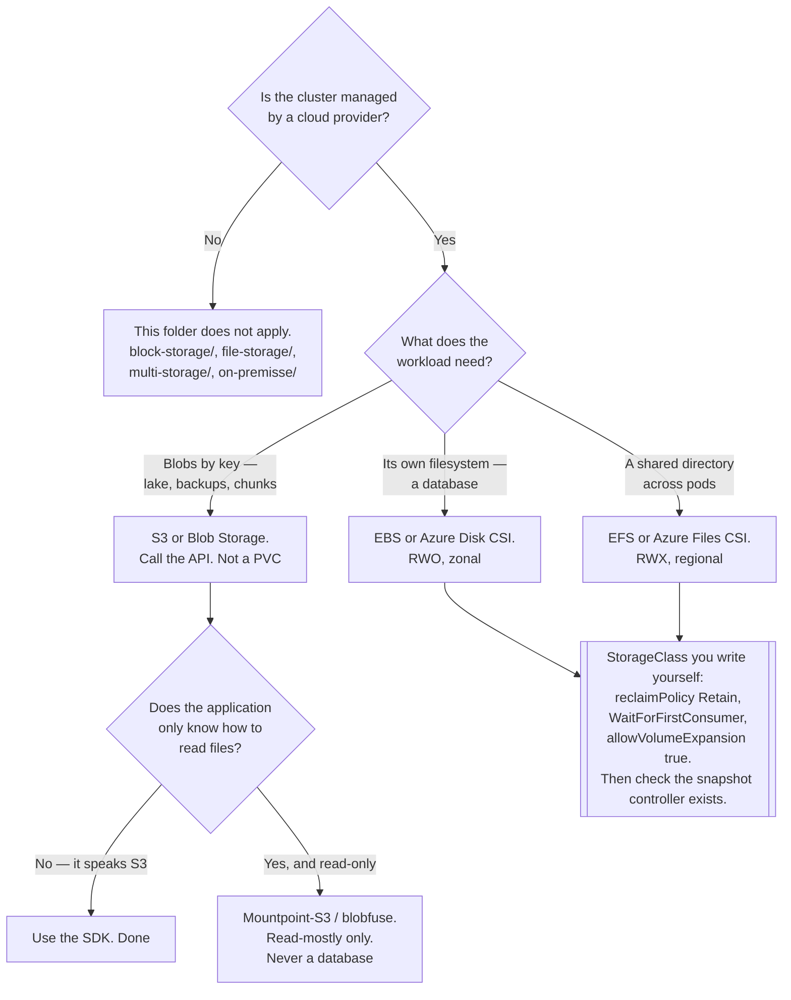

[← Storage](../README.md)

# Cloud storage

The provider's CSI drivers — and the reason most of the rest of this folder stops mattering.

Providers covered: [`aws/`](aws/README.md) · [`azure/`](azure/README.md)

## Contents

1. [The point of this folder](#1-the-point-of-this-folder)
2. [The mapping is the same everywhere](#2-the-mapping-is-the-same-everywhere)
   1. [Block: one node, low latency](#21-block-one-node-low-latency)
   2. [File: RWX without running a file server](#22-file-rwx-without-running-a-file-server)
   3. [Object: an API, not a PVC](#23-object-an-api-not-a-pvc)
3. [What the managed cluster still leaves to you](#3-what-the-managed-cluster-still-leaves-to-you)
   1. [The StorageClass is yours](#31-the-storageclass-is-yours)
   2. [Snapshots still need the snapshot controller](#32-snapshots-still-need-the-snapshot-controller)
   3. [Zones are the recurring failure](#33-zones-are-the-recurring-failure)
   4. [Identity, not access keys](#34-identity-not-access-keys)
4. [The FUSE drivers](#4-the-fuse-drivers)
5. [Decision tree](#5-decision-tree)
6. [Anti-patterns](#6-anti-patterns)
7. [How this applies to pikakube](#7-how-this-applies-to-pikakube)

---

## 1. The point of this folder

On a managed cluster — EKS, AKS, GKE — **you install the provider's CSI driver and you are
finished**. Longhorn, OpenEBS, Rook/Ceph, NFS Ganesha and every other tool in the sibling
folders exist to solve a problem the cloud provider has already solved, staffed and put behind
an SLA.

That is the entire content of this folder, and it is worth stating bluntly because the temptation
runs the other way: running Ceph on EKS is a real thing people do, and it means operating a
distributed storage system on top of storage that is already distributed, to obtain properties
EBS already has.

| What you would otherwise operate | What the provider gives you |
|---|---|
| Longhorn / OpenEBS replicated block | EBS, Azure Disk — replicated within a zone, with snapshots |
| NFS Ganesha, CephFS, CubeFS | EFS, Azure Files — RWX, no server to run |
| MinIO, Garage, SeaweedFS | S3, Blob Storage — the durability nobody self-hosts to |
| Backup of all of the above | provider snapshots, plus [Velero](../../backup/velero/README.md) on top |

The reasons to self-host storage on a managed cluster are narrow and should be named explicitly:
a hard data-residency requirement the provider cannot meet, a cost model that genuinely breaks
down at your volume, or portability across clouds as a stated architectural goal. "We prefer
open source" is not one of them at this layer — see the honest assessment in
[object-storage](../object-storage/README.md), where the open field is genuinely thin.

## 2. The mapping is the same everywhere

Every provider offers the same three shapes under different names. Once you see the mapping, the
provider-specific pages are mostly a matter of parameter names.

| Kind | AWS | Azure | Access mode | Use |
|---|---|---|---|---|
| **Block** | EBS | Azure Disk | `ReadWriteOnce` | databases, anything wanting its own filesystem |
| **File** | EFS | Azure Files | `ReadWriteMany` | shared directories across pods |
| **Object** | S3 | Blob Storage | **not a PVC** | lakes, backups, Loki and Thanos chunks |

### 2.1 Block: one node, low latency

EBS volumes and Azure Disks are network block devices that behave like local disks. They are
`ReadWriteOnce`, they are **zonal**, and everything in
[block-storage](../block-storage/README.md) applies unchanged — including the detach delay after
a node failure, which the cloud does not remove. A managed cluster still takes minutes to move a
volume off a dead node.

Volume type is the decision that matters: `gp3` and Premium SSD are the sensible defaults, and
IOPS/throughput are provisioned separately from capacity on the modern types. A database on a
volume sized for capacity and starved of IOPS is a common and confusing performance problem.

### 2.2 File: RWX without running a file server

EFS and Azure Files provide `ReadWriteMany` as a managed service. This is the single strongest
argument in the folder: everything in [file-storage](../file-storage/README.md) exists to avoid
running a file server, and here you simply do not have one.

Two caveats that survive the move to managed:

- **Latency is still a network filesystem's latency.** EFS in particular is much slower per
  operation than EBS, and workloads with heavy metadata traffic feel it immediately.
- **It is still not a place for a database.** Managed does not change the POSIX semantics.

### 2.3 Object: an API, not a PVC

S3 and Blob Storage are HTTP APIs. They are not mounted, they do not appear as a StorageClass,
and applications call them directly. This is where the lakehouse, the backups and the
observability chunks belong — see [object-storage](../object-storage/README.md).

The FUSE drivers that make a bucket look like a directory are covered in section 4, and the
short version is: they are a convenience for reading, not a filesystem.

## 3. What the managed cluster still leaves to you

"Use the provider's driver" is the whole strategy, but four things stay your responsibility and
each one is a recurring incident.

### 3.1 The StorageClass is yours

Managed clusters ship a default StorageClass, and its defaults are usually wrong for anything
stateful:

| Field | Typical default | What you want for a database |
|---|---|---|
| `reclaimPolicy` | `Delete` | **`Retain`** |
| `volumeBindingMode` | varies | `WaitForFirstConsumer` |
| `allowVolumeExpansion` | sometimes `false` | `true` |
| volume type | the cheapest | the one with the IOPS you need |

`reclaimPolicy: Delete` on a cloud class means deleting the PVC deletes the EBS volume or the
Azure Disk. At the provider. Permanently. A Helm uninstall, a Flux prune, or a StatefulSet
deleted with its claims is enough. This is how production data is lost on managed clusters, and
it is not the provider's fault — it is the default nobody changed. Full detail in
[block-storage §3.2](../block-storage/README.md#32-reclaimpolicy).

### 3.2 Snapshots still need the snapshot controller

The CSI drivers implement `CreateSnapshot`. The `VolumeSnapshot` CRDs and the snapshot controller
that reconciles them are **not installed by default on every managed cluster** — some providers
ship them, some do not, and the failure is silent: the object is created and nothing happens.

Check before trusting a backup schedule. See
[external-snapshotter](../../backup/external-snapshotter/README.md).

### 3.3 Zones are the recurring failure

Block volumes are zonal. A pod cannot mount an EBS volume from another availability zone, full
stop.

With `volumeBindingMode: Immediate`, the volume is created before the scheduler places the pod,
so it lands in whichever zone the provisioner picked. If the pod then cannot be scheduled there —
no capacity, wrong instance type, a taint, a node group in another zone — it is unschedulable
forever, and the event reads `node(s) had volume node affinity conflict`, which sounds like a
node problem.

`WaitForFirstConsumer` exists precisely for this and should be considered mandatory on any
multi-zone cluster.

The design consequence is larger than the setting: a stateful workload on zonal block storage is
**pinned to a zone**. Surviving a zone failure requires replication at the application layer
across zones, not a storage setting. Regional file storage (EFS, Azure Files) is the exception,
and it is one of the reasons to reach for it.

### 3.4 Identity, not access keys

Both drivers need permissions to create and attach volumes, and both providers have a way to
grant that to a pod's ServiceAccount without a long-lived secret — IRSA or EKS Pod Identity on
AWS, Workload Identity on Azure. Use it. A static access key in a Secret is the credential that
outlives everyone who remembers it exists.

The same applies to the applications that talk to S3 or Blob Storage, which in this repository
means most of the observability and data stack.

## 4. The FUSE drivers

Both providers offer ways to present object storage as a mounted directory:

| Tool | Provider | Nature |
|---|---|---|
| [Mountpoint for S3](https://github.com/awslabs/mountpoint-s3) | AWS | official, read-optimised, deliberately limited |
| [s3fs-fuse](https://github.com/s3fs-fuse/s3fs-fuse) | AWS | community, fuller POSIX pretence, slower |
| [blobfuse](https://github.com/Azure/azure-storage-fuse) | Azure | official, similar trade-offs |
| [blob-csi-driver](https://github.com/kubernetes-sigs/blob-csi-driver) | Azure | CSI driver wrapping blobfuse/NFSv3 |

They are useful for one thing: letting an application that only knows how to read files consume
data that lives in a bucket. Batch jobs reading Parquet, model weights loaded at startup,
read-mostly reference data.

They are **not** a filesystem. No file locking, no atomic rename, no partial writes, no `fsync`
semantics, and performance that does not resemble a disk. Mountpoint for S3 is explicit about
this and simply refuses to implement the operations it cannot do correctly, which is the honest
design. The community drivers implement more of them, less reliably, which is worse.

Never run a database, a queue or anything with a write-ahead log on one. See
[object-storage](../object-storage/README.md).

## 5. Decision tree

## 6. Anti-patterns

| Anti-pattern | Why it is bad | What to do instead |
|---|---|---|
| Self-hosting Ceph, Longhorn or MinIO on a managed cluster | operating distributed storage on top of storage that is already distributed and under an SLA | the provider's CSI driver; self-host only for a named requirement |
| Using the default StorageClass for a database | `reclaimPolicy: Delete` means deleting the PVC destroys the volume at the provider | a `Retain` class you wrote and reviewed |
| `volumeBindingMode: Immediate` on a multi-zone cluster | the volume is placed before the pod is scheduled; unschedulable forever | `WaitForFirstConsumer` |
| Assuming zone failure is survivable because storage is managed | block volumes are zonal; the pod cannot follow the data | replicate across zones in the application, or use regional file storage |
| Trusting snapshot backups without the snapshot controller | `VolumeSnapshot` objects are created and never reconciled, silently | install [external-snapshotter](../../backup/external-snapshotter/README.md) and verify `readyToUse` |
| Static access keys for the CSI driver or the apps | a long-lived credential nobody rotates | IRSA / Pod Identity / Workload Identity |
| EFS or Azure Files for a database | managed does not change POSIX semantics on a network filesystem | block storage |
| A FUSE-mounted bucket as a write target | no locking, no atomic rename, no `fsync` guarantees | the S3 API, or a real PVC |
| Sizing a volume by capacity alone | on `gp3` and Premium SSD, IOPS and throughput are provisioned separately | size for IOPS, then for capacity |
| Backups in the same account and region as the data | an account-level mistake takes both | a separate account or subscription, and test the restore |

## 7. How this applies to pikakube

This is the folder that says when the rest of the repository does not apply.

pikakube's centre of gravity is on-premise — the sibling folders exist because
[`on-premisse/`](../on-premisse/README.md) is the case being designed for, and Kind is the
sandbox it is designed in. This folder is the counterweight: **if the cluster runs on EKS or
AKS, install the provider's CSI driver and skip the rest.**

The provider pages record the specific drivers and the sharp edges found in each —
[`aws/`](aws/README.md) for the EBS and EFS drivers, plus the S3 FUSE options, and
[`azure/`](azure/README.md) for Disk, Files and Blob. Both are reference notes rather than
deployment manifests, which is correct: there is nothing to deploy here from a Kind cluster.

The idea worth carrying back the other way is section 3. Managed storage removes the operational
burden and leaves the **decisions** untouched — `reclaimPolicy`, `volumeBindingMode`, access
mode, IOPS, and whether a snapshot controller exists. Those are the same four decisions that
matter on Longhorn, and getting them wrong costs the same data.

---

[← Storage](../README.md)
