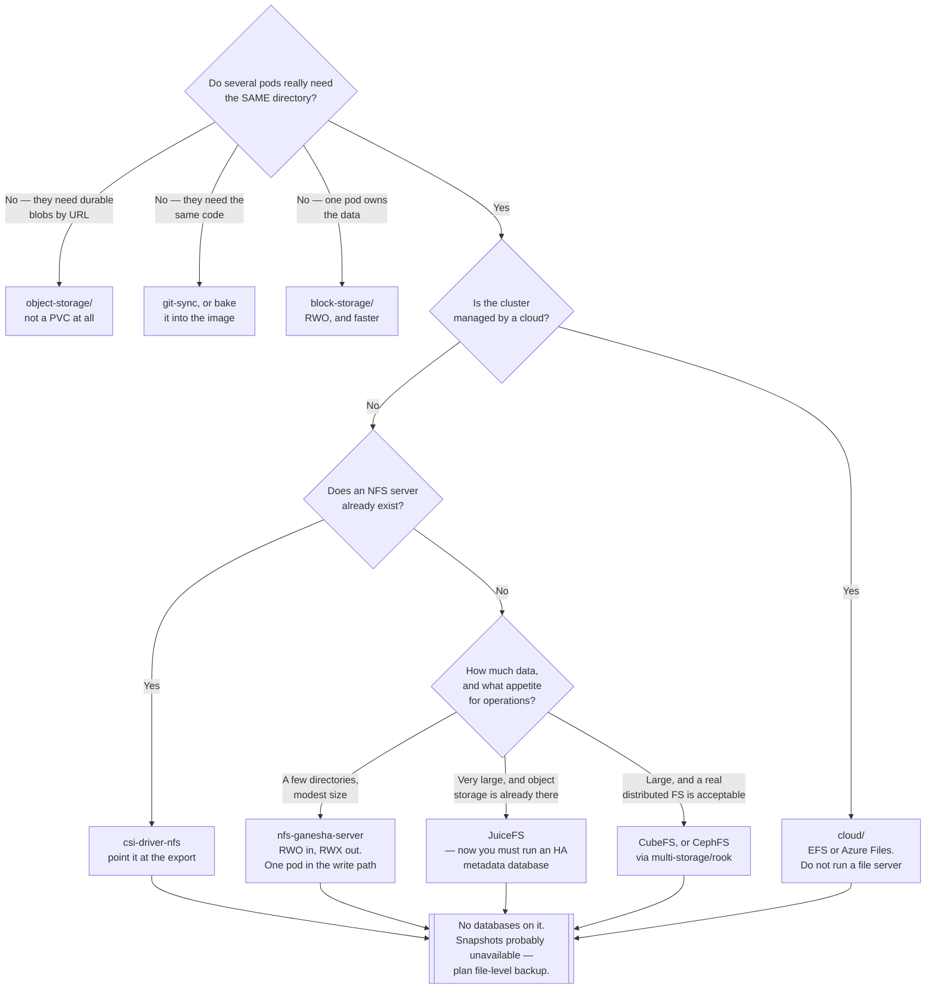

[← Storage](../README.md)

# File storage

A shared filesystem several pods mount at once — the only way to get `ReadWriteMany`.

Tools covered: [`csi-driver-nfs/`](csi-driver-nfs/README.md) ·
[`nfs-ganesha-server/`](nfs-ganesha-server/README.md) · [`juicefs/`](juicefs/README.md) ·
[`cubefs/`](cubefs/README.md)

## Contents

1. [RWX is the entire reason this folder exists](#1-rwx-is-the-entire-reason-this-folder-exists)
   1. [What RWX buys, and what it does not](#11-what-rwx-buys-and-what-it-does-not)
   2. [Ask whether you need it first](#12-ask-whether-you-need-it-first)
2. [How a shared filesystem reaches a pod](#2-how-a-shared-filesystem-reaches-a-pod)
   1. [Driver and server are two separate decisions](#21-driver-and-server-are-two-separate-decisions)
   2. [StorageClass behaviour differs here](#22-storageclass-behaviour-differs-here)
3. [The tools](#3-the-tools)
   1. [NFS: the boring answer](#31-nfs-the-boring-answer)
   2. [JuiceFS: object storage plus a metadata engine](#32-juicefs-object-storage-plus-a-metadata-engine)
   3. [CubeFS](#33-cubefs)
   4. [CephFS lives in multi-storage](#34-cephfs-lives-in-multi-storage)
4. [What breaks on a network filesystem](#4-what-breaks-on-a-network-filesystem)
5. [Decision tree](#5-decision-tree)
6. [Anti-patterns](#6-anti-patterns)
7. [How this applies to pikakube](#7-how-this-applies-to-pikakube)

---

## 1. RWX is the entire reason this folder exists

[Block storage](../block-storage/README.md) gives `ReadWriteOnce`: one node, read-write. That
covers databases and almost everything stateful. It does not cover the case where several pods,
on several nodes, must see the *same directory* — and no block provisioner can be made to cover
it, because two nodes writing a raw disk through two independent filesystem drivers corrupts it.

A shared filesystem solves this by putting a server in the middle. The pods do not touch a disk;
they talk to a filesystem service that serialises access. That is what NFS, CephFS, JuiceFS and
CubeFS all are, underneath the differences.

| Mode | Who can mount | Provided by |
|---|---|---|
| `ReadWriteOnce` | one node, read-write | block storage |
| `ReadWriteMany` (RWX) | many nodes, read-write | **this folder** |
| `ReadOnlyMany` | many nodes, read-only | either, if the driver supports it |
| `ReadWriteOncePod` | exactly one *pod* | block storage, newer CSI drivers |

### 1.1 What RWX buys, and what it does not

RWX gives concurrent mounts. It does **not** give concurrent-write correctness for free — the
filesystem serialises metadata operations, but two processes appending to one file still need to
coordinate, and NFS file locking is a well-known source of "works on my machine".

The honest summary: RWX makes it *possible* for several pods to share a directory. Making that
safe is still the application's problem.

### 1.2 Ask whether you need it first

RWX is asked for far more often than it is needed. Three common requests and better answers:

| The request | Usually the real need | Better answer |
|---|---|---|
| "The web pods need shared uploads" | durable blobs addressable by URL | [object storage](../object-storage/README.md) |
| "All Airflow workers need the DAGs" | the same code on every worker | git-sync sidecar, or bake into the image |
| "Several pods write logs to one directory" | logs that can be queried | stdout and a log pipeline |

A genuine RWX case looks like: a legacy application that hard-codes a filesystem path, a tool
that mmaps a shared file, a scratch space for a job that fans out. Those exist. They are rarer
than the request rate suggests, and every one of them adds a network filesystem to the critical
path of a workload that previously had none.

## 2. How a shared filesystem reaches a pod

### 2.1 Driver and server are two separate decisions

This trips people up constantly, and it is the reason
[`csi-driver-nfs/`](csi-driver-nfs/README.md) and
[`nfs-ganesha-server/`](nfs-ganesha-server/README.md) are separate folders.

| Piece | What it does | Example |
|---|---|---|
| **The server** | actually stores the bytes and exports a share | a NetApp filer, a Linux box with `/etc/exports`, NFS Ganesha in a pod |
| **The CSI driver** | mounts that share into pods and turns PVCs into subdirectories | `csi-driver-nfs` |

`csi-driver-nfs` stores nothing. Point it at a server that already exists — which is the normal
on-premise situation, where the storage team has run NFS for fifteen years — and it will carve a
subdirectory per PVC.

`nfs-server-provisioner` (NFS Ganesha) is the other shape: it *is* the server, running in the
cluster, backed by a block PVC, re-exporting that PVC as RWX. It converts RWO into RWX. That is
useful and it is also a single pod in the write path of everything that mounts it.

### 2.2 StorageClass behaviour differs here

The [block-storage README](../block-storage/README.md) covers `volumeBindingMode`,
`reclaimPolicy` and `allowVolumeExpansion` in full. Two differences apply to file storage:

- **`volumeBindingMode` matters less.** A network share has no node affinity — any node can mount
  it. `WaitForFirstConsumer` is still harmless and still the safer default.
- **`reclaimPolicy: Delete` deletes a directory tree.** On block storage that destroys a volume;
  here it recursively removes a subdirectory on a shared server, which is quieter and just as
  permanent. `Retain` for anything that matters, same as everywhere else.
- **Expansion is often a no-op.** Many NFS-backed classes report a size that is not enforced —
  the PVC says 10Gi and the real limit is whatever the export has left. Growing the PVC changes
  a number, not a quota. Do not treat the PVC size as a guarantee.

Volume snapshots are usually *not* available for NFS-backed classes. Snapshot-based backup —
[external-snapshotter](../../backup/external-snapshotter/README.md) and the tools that build on
it — assumes a driver that implements `CreateSnapshot`. For file storage the backup path is
normally file-level: [Velero](../../backup/velero/README.md) with Kopia, or
[VolSync](../../backup/volsync/README.md).

## 3. The tools

| Tool | Shape | Use it when |
|---|---|---|
| [csi-driver-nfs](csi-driver-nfs/README.md) | CSI driver, no storage of its own | an NFS server already exists |
| [nfs-ganesha-server](nfs-ganesha-server/README.md) | server + provisioner, in-cluster | you need RWX and have only RWO |
| [juicefs](juicefs/README.md) | object storage + metadata engine, POSIX on top | huge datasets, cloud object storage underneath |
| [cubefs](cubefs/README.md) | full distributed filesystem, CNCF | you want CephFS-scale file storage without Ceph |

### 3.1 NFS: the boring answer

NFS is forty years old, understood by every operations team on earth, and works. For most RWX
requirements it is the correct answer and the discussion should stop there.

Its weaknesses are equally well known: a single server is a single point of failure, file locking
is fragile across clients, and latency is the network's latency. None of those matter for
"several pods read the same config directory". All of them matter if a database ends up on it.

### 3.2 JuiceFS: object storage plus a metadata engine

[JuiceFS](juicefs/README.md) is the unusual one in this folder and worth understanding even if
you never deploy it, because the architecture explains its whole behaviour profile.

It does not store anything itself. It **composes two systems**:

| Half | Holds | Backed by |
|---|---|---|
| **Data** | file contents, chunked and stored as objects | S3, MinIO, Azure Blob, GCS — any object store |
| **Metadata** | the directory tree, inodes, file attributes, locks | **a separate database**: Redis, PostgreSQL, MySQL or TiKV |

A POSIX filesystem is presented on top. Reads and writes go to object storage; every `stat`,
`readdir`, `rename` and lock goes to the metadata engine.

The consequence, stated plainly: **the metadata engine is a hard dependency and a single point of
failure for the entire filesystem.** Lose the object store and you lose file contents. Lose the
metadata engine and you lose the filesystem itself — the objects are still sitting in the bucket,
chunked and named by hash, and without the metadata they are unreadable. A Redis instance with
persistence misconfigured is enough to do this.

So JuiceFS does not remove the operational burden, it *moves* it: from running a filesystem to
running a highly available database that must never lose a write. If that database is a
single-replica Redis with `appendonly no`, the filesystem is one restart from gone.

What it buys in exchange is real: effectively unbounded capacity, the durability of the
underlying object store for the bulk of the bytes, and cost that follows object-storage pricing
rather than provisioned block volumes.

### 3.3 CubeFS

[CubeFS](cubefs/README.md) is a CNCF distributed filesystem that provides both POSIX file access
and an S3-compatible object interface from its own cluster of metadata and data nodes. It is a
real distributed storage system with the operational weight that implies — a smaller commitment
than Ceph, a much larger one than pointing a CSI driver at an existing NFS export.

### 3.4 CephFS lives in multi-storage

The other serious RWX option in this repository is **CephFS**, and it is filed under
[`multi-storage/rook/`](../multi-storage/rook/README.md) rather than here, because Ceph provides
block, file and object from one cluster and splitting it across three folders would misrepresent
what it is.

If you already run Ceph, CephFS is the RWX answer and nothing in this folder improves on it. If
you do not, adopting Ceph *for* RWX is a very large lever for a small problem — read the warning
in that folder first.

## 4. What breaks on a network filesystem

Worth knowing before something lands on RWX by accident:

| Assumption | Reality on NFS/FUSE |
|---|---|
| `flock` / `fcntl` locking works | works *sometimes*, differs by NFS version and client |
| `fsync` means durable | means durable *on the server*, after a network round trip |
| Rename is atomic | atomic within a share, not across shares |
| `mmap` behaves | supported, with caching semantics that surprise people |
| Latency is negligible | every metadata operation is a network call |
| Permissions are simple | UID/GID must line up between client and server, or nothing works |

The practical rule: **never put a database on a network filesystem.** SQLite, PostgreSQL, etcd
and every embedded store assume locking and `fsync` semantics that NFS does not reliably provide.
The corruption is silent and shows up later.

The related rule for object storage: a FUSE driver that presents a bucket as a directory is not
a filesystem either — see [object-storage](../object-storage/README.md).

## 5. Decision tree

## 6. Anti-patterns

| Anti-pattern | Why it is bad | What to do instead |
|---|---|---|
| A database on RWX | locking and `fsync` semantics are not what the engine assumes; corruption is silent | block storage, always |
| Reaching for RWX by default | a network filesystem in the critical path of a workload that did not need one | ask what the pods actually share |
| Shared uploads directory for web pods | the classic case that object storage solves better | S3-compatible bucket and URLs |
| A single NFS server with no plan | every RWX workload in the cluster fails together | accept it explicitly, or run HA storage |
| `nfs-server-provisioner` for production data | one pod re-exporting one PVC, in the write path of everything | a real NFS appliance, CephFS, or CubeFS |
| JuiceFS with a single-replica Redis | losing metadata loses the filesystem, not just recent writes | HA metadata engine with durable persistence, backed up |
| Assuming the PVC size is enforced | NFS-backed classes often report a number nobody checks | quota on the export, monitor real free space |
| Expecting `VolumeSnapshot` to work | most file drivers do not implement `CreateSnapshot` | file-level backup — Velero/Kopia or VolSync |
| Mismatched UID/GID between pod and export | permission errors that look like application bugs | `fsGroup`, and agree the mapping with whoever runs the server |
| Adopting Ceph solely to get RWX | an enormous operational commitment for one access mode | NFS first; Ceph when you need block, file *and* object |

## 7. How this applies to pikakube

This folder is the RWX answer for the repository's on-premise focus, and the four tools are
deliberately four different *shapes* rather than four competitors.

What is actually here:

- **`csi-driver-nfs`** installed as a Flux `HelmRelease` in `kube-system`, plus an in-cluster
  `nfs-server` Deployment (`itsthenetwork/nfs-server-alpine`, privileged, `hostPath`-backed) used
  as a test target and an nginx pod that mounts it through a static PV. That combination is a
  demonstration of the driver, not a storage design.
- **`nfs-ganesha-server`** as the RWO-to-RWX converter, with a 4Gi backing PVC and a test PVC
  requesting `ReadWriteMany`.
- **`juicefs`** in two shapes — the CSI driver and the S3 gateway — with the backend fields left
  as placeholders, because the metadata engine and bucket are the deployment-specific part.
- **`cubefs`** pinned to a chart from the upstream Git repository.

None of these are load-bearing in a Kind cluster: a single node makes "shared across nodes"
meaningless, and the NFS server here is one pod on a `hostPath`. What the folder records is the
decision for a real cluster — and, more usefully, the **check before the decision**, which is
section 1.2: most RWX requests are object-storage requests wearing a filesystem costume.

---

[← Storage](../README.md)
