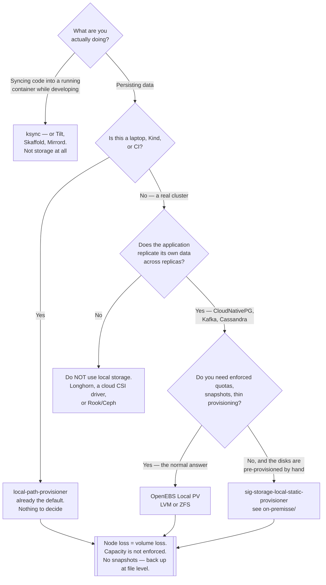

[← Storage](../README.md)

# Local storage

A directory on a node's disk, handed to a pod as a PVC — plus one tool that is not storage at all.

Tools covered: [`local-path-provisioner/`](local-path-provisioner/README.md) ·
[`ksync/`](ksync/README.md)

## Contents

1. [What "local" means, precisely](#1-what-local-means-precisely)
   1. [The three ways to get node-local storage](#11-the-three-ways-to-get-node-local-storage)
2. [local-path-provisioner](#2-local-path-provisioner)
   1. [Why Kind and k3s ship it](#21-why-kind-and-k3s-ship-it)
   2. [What it does not do](#22-what-it-does-not-do)
   3. [Fine in development, dangerous in production](#23-fine-in-development-dangerous-in-production)
   4. [The legitimate production case](#24-the-legitimate-production-case)
3. [ksync is not storage](#3-ksync-is-not-storage)
4. [Decision tree](#4-decision-tree)
5. [Anti-patterns](#5-anti-patterns)
6. [How this applies to pikakube](#6-how-this-applies-to-pikakube)

---

## 1. What "local" means, precisely

A local volume is a path on one node's filesystem, presented to Kubernetes as a
PersistentVolume. There is no network, no replication and no storage system — the "provisioner"
creates a directory and writes a PV object pointing at it.

That gives one genuine advantage and one fatal property, and they are the same fact seen twice:

| | Consequence |
|---|---|
| **Advantage** | the write path is the node's disk. No network hop, no replication overhead, the fastest storage available |
| **Fatal property** | the data exists on exactly one node. If that node dies, the data is gone. Not "unavailable" — gone |

Everything else in this folder follows from that sentence.

Note the difference from [block storage](../block-storage/README.md) generally: Longhorn's
volumes are also written to node disks, but they are replicated across nodes and survive losing
one. Local storage is not replicated by anyone. There is no rebuild, no failover and no restore
except from a backup you made elsewhere.

### 1.1 The three ways to get node-local storage

Worth separating, because they are frequently conflated:

| Approach | Mechanism | Scheduling |
|---|---|---|
| **`hostPath` volume** | a path in the pod spec, no PV at all | none — the pod can land anywhere and find an empty directory |
| **`local` PersistentVolume** | a PV with `nodeAffinity`, usually pre-created by an admin or by [sig-storage-local-static-provisioner](../on-premisse/README.md) | the scheduler honours the affinity |
| **`local-path-provisioner`** | dynamic: creates the directory and the PV on demand | binds `WaitForFirstConsumer`, so the node is chosen by the scheduler |

`hostPath` is the one to avoid. It has no node affinity, so a rescheduled pod silently gets a
different node's empty directory and the application starts from nothing — which reads as data
loss with no error anywhere. The `local` PV type exists specifically to fix that by pinning the
volume to its node.

## 2. local-path-provisioner

<https://github.com/rancher/local-path-provisioner>

Rancher's dynamic provisioner for node-local paths. A PVC arrives, it creates
`/opt/local-path-provisioner/<pv-name>` on whichever node the pod was scheduled to, and binds a
PV to it.

### 2.1 Why Kind and k3s ship it

**This is the default StorageClass in Kind and in k3s.** Anyone who has ever run `kubectl apply`
against a Kind cluster and watched a PVC bind has used it, usually without noticing.

The reason is that a single-node development cluster needs *something* to answer PVCs, and the
alternatives all require real infrastructure. local-path-provisioner needs a directory. It is
the smallest possible thing that makes dynamic provisioning work, which makes it exactly right
for the job it was chosen for.

The practical consequence for this repository: every PVC in every folder here binds against
local-path-provisioner unless something else was installed on purpose. Chart defaults that "just
work" in the sandbox are working because of this, not because the manifest is
production-shaped.

### 2.2 What it does not do

| Feature | Status |
|---|---|
| Replication | **none** |
| Snapshots | none — no CSI snapshot support |
| Volume expansion | not meaningfully; the "size" is not enforced |
| Enforced capacity | no. The PVC says 10Gi, the pod can fill the node's disk |
| High availability | no. The volume is pinned to one node by `nodeAffinity` |
| Backup integration | none of its own |

Two of those deserve emphasis. **Capacity is not enforced**: a PVC requesting 1Gi can consume
the entire node filesystem, and what fails is the kubelet, not the pod — disk pressure evicts
everything on the node. And there are **no snapshots**, so snapshot-based backup tools have
nothing to work with; the backup path is file-level ([Velero](../../backup/velero/README.md)
with Kopia, or [VolSync](../../backup/volsync/README.md)).

It does set `volumeBindingMode: WaitForFirstConsumer`, which is correct and necessary — binding
`Immediate` would create the directory on an arbitrary node before the scheduler had placed the
pod, and the pod would then be unschedulable. See
[block-storage §3.1](../block-storage/README.md#31-volumebindingmode).

Its `reclaimPolicy` default is `Delete`, and here that means the directory is removed from the
node when the PVC goes. Same rule as everywhere: `Retain` for anything you would miss.

### 2.3 Fine in development, dangerous in production

The distinction is not subtle, and the danger is specifically that **it works**. A production
cluster with local-path-provisioner as the default StorageClass behaves normally for months.
PVCs bind, pods start, the database runs. Nothing warns anybody.

Then a node is drained for a kernel upgrade, or fails, and:

- The pod is rescheduled to another node.
- Its PV has `nodeAffinity` pinned to the node that is gone.
- The pod is unschedulable, permanently.
- The data is on a disk in a machine that is not coming back.

There is no recovery procedure. There is no degraded mode. The only path is a backup taken by
some other system, and if nobody chose this StorageClass deliberately, nobody set that up either.

This is why the [storage README](../README.md) lists "`local-path-provisioner` outside
development" as an anti-pattern. The failure is total, and the warning arrives after the fact.

### 2.4 The legitimate production case

There is one, and it is worth stating so the rule above is understood rather than merely obeyed.

Node-local storage is the *right* choice when **the application already replicates its own
data**: a CloudNativePG cluster with three instances, a Kafka broker set with replication factor
three, a Cassandra ring. Each replica has its own volume, losing a node loses one replica, and
the cluster heals by rebuilding that replica elsewhere. Replicating the volume underneath as
well would mean paying twice for the same guarantee while adding the network to the write path.

For that case, prefer [OpenEBS Local PV](../block-storage/openebs/README.md) (LVM or ZFS) over
local-path-provisioner: same node-local model, but with real capacity enforcement, snapshots and
thin provisioning. local-path-provisioner's directory-on-a-disk approach has none of that.

The rule, then, is not "never node-local". It is: **node-local storage requires replication
somewhere, and if you cannot name where, you do not have it.**

## 3. ksync is not storage

<https://github.com/ksync/ksync>

[ksync](ksync/README.md) sits in this folder and is a completely different kind of thing. It is a
**development file-sync tool**: it watches a directory on a developer's laptop and mirrors
changes into a running container, so edits appear inside the pod without rebuilding an image or
redeploying.

It provisions nothing. It does not implement CSI. It does not create a PersistentVolume, does
not appear as a StorageClass, and has no role in how data is persisted. It belongs to the inner
development loop, alongside Skaffold, Tilt, Telepresence and Mirrord — not alongside a storage
driver.

It is filed here because "local" is the shared word, and that is a filing accident worth
flagging rather than a category. Treat it as an inner-loop tool that happens to move files.

Also worth knowing: the project has been effectively unmaintained for years, and the ecosystem
moved to the tools listed above. Verify its status before adopting it.

## 4. Decision tree

## 5. Anti-patterns

| Anti-pattern | Why it is bad | What to do instead |
|---|---|---|
| local-path-provisioner as the production default StorageClass | it works perfectly until a node dies, then the data is unrecoverable | a replicated CSI driver, and set the default class deliberately |
| Node-local storage without application-level replication | there is no failover, no rebuild and no restore path | replicate in the application, or replicate the volume |
| `hostPath` volumes for persistent data | no node affinity — a rescheduled pod silently gets an empty directory | a `local` PV, or a real provisioner |
| Trusting the PVC size | capacity is not enforced; the pod can fill the node disk and evict everything on it | monitor node disk, use LVM/ZFS-backed local PVs for real quotas |
| Expecting `VolumeSnapshot` to work | there is no CSI snapshot implementation to call | file-level backup — Velero/Kopia or VolSync |
| Testing an operator's HA behaviour on local storage | node-local volumes make failover untestable, so the test proves nothing | test failover where the storage can actually move |
| `reclaimPolicy: Delete` and no backup | deleting the PVC removes the directory, with nothing behind it | `Retain`, plus a real backup |
| Filing ksync as a storage decision | it is an inner-loop dev tool; nothing about persistence changes | evaluate it against Tilt/Skaffold/Mirrord, and check whether it is still maintained |

## 6. How this applies to pikakube

This folder describes the ground the whole repository stands on, whether or not anyone chose it.

pikakube runs on Kind, and **Kind's default StorageClass is local-path-provisioner**. Every
`HelmRelease` in this repository that asks for a PVC and does not name a class gets a directory
on the Kind node. That is correct for the sandbox and it is the reason storage rarely comes up
while working here — which is exactly the condition under which the production mistake gets made
later.

The folder also installs local-path-provisioner explicitly, from the upstream Rancher Git
repository at a pinned tag rather than a Helm registry, which is how the repository handles
charts that live inside a project's source tree.

Two things worth carrying out of this folder:

1. **The sandbox's storage is not a design.** Any manifest here that works because a PVC bound
   instantly is untested against real storage — including its `accessModes`, which is the field
   that cannot be changed later.
2. **ksync is misfiled by category, not by mistake.** It is an inner-loop tool. Nothing in the
   storage decision tree leads to it.

---

[← Storage](../README.md)
