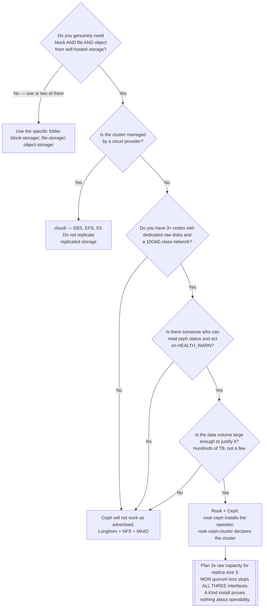

[← Storage](../README.md)

# Multi-storage

One cluster that provides block, file and object at the same time — and what that costs.

Tools covered: [`rook/`](rook/README.md) — the Rook operator for Ceph

## Contents

1. [Why this is a category](#1-why-this-is-a-category)
2. [Ceph, in the terms that matter](#2-ceph-in-the-terms-that-matter)
   1. [The daemons](#21-the-daemons)
   2. [The three interfaces](#22-the-three-interfaces)
   3. [What Rook adds](#23-what-rook-adds)
3. [The cost, stated plainly](#3-the-cost-stated-plainly)
   1. [It needs real disks](#31-it-needs-real-disks)
   2. [It needs real nodes and a real network](#32-it-needs-real-nodes-and-a-real-network)
   3. [A single node demonstrates the API and none of the properties](#33-a-single-node-demonstrates-the-api-and-none-of-the-properties)
4. [When consolidation is worth it](#4-when-consolidation-is-worth-it)
5. [Decision tree](#5-decision-tree)
6. [Anti-patterns](#6-anti-patterns)
7. [How this applies to pikakube](#7-how-this-applies-to-pikakube)

---

## 1. Why this is a category

The other storage folders are each one shape. [Block](../block-storage/README.md) gives RWO
volumes. [File](../file-storage/README.md) gives RWX shares. [Object](../object-storage/README.md)
gives an S3 API. A self-hosted platform generally needs all three, which normally means three
systems: Longhorn plus an NFS server plus MinIO, each with its own disks, failure modes,
upgrades and on-call knowledge.

Multi-storage is the alternative: **one storage cluster, three interfaces**. Ceph is the mature
implementation, and Rook is how it is run on Kubernetes. That is the whole category — the folder
has one tool because there is realistically one answer.

The trade is legible: one system to operate instead of three, in exchange for that system being
substantially harder than any of the three individually.

## 2. Ceph, in the terms that matter

Ceph is a distributed object store with three access layers built on top. Everything it does
rests on **RADOS**, its underlying object store, and on CRUSH, the algorithm that decides which
disks hold which data without a central lookup table.

### 2.1 The daemons

| Daemon | Role | Count |
|---|---|---|
| **MON** (monitor) | holds the cluster map and forms quorum | **odd number, 3 or 5** |
| **OSD** (object storage daemon) | one per disk; stores the actual data | one per physical device |
| **MGR** (manager) | metrics, dashboard, orchestration | 2, active/standby |
| **MDS** (metadata server) | the POSIX metadata layer, required only for CephFS | 2+ if using CephFS |
| **RGW** (RADOS gateway) | the S3/Swift HTTP endpoint | as many as you need |

The MON quorum is the part that surprises people: Ceph is a quorum system, so **losing MON
quorum stops the entire cluster** — all three interfaces at once — regardless of how healthy the
OSDs are. That is a stronger coupling than running three separate storage systems, and it is the
central risk of consolidation.

### 2.2 The three interfaces

| Interface | Kubernetes sees | Backed by |
|---|---|---|
| **RBD** (RADOS Block Device) | `ReadWriteOnce` PVCs | a `CephBlockPool` |
| **CephFS** | `ReadWriteMany` PVCs | a `CephFilesystem` + MDS daemons |
| **RGW** | an S3-compatible endpoint, not a PVC | a `CephObjectStore` |

This is why the folder is called multi-storage. One cluster, one set of disks, one CRUSH map,
and a database gets RBD while an Airflow deployment gets CephFS and Loki writes to RGW.

CephFS is the serious RWX option referenced from [file-storage §3.4](../file-storage/README.md),
and RGW is a genuine alternative to MinIO for anyone already committed to Ceph — worth knowing
given the licence situation described in [object-storage](../object-storage/README.md).

### 2.3 What Rook adds

Rook is a **Kubernetes operator for Ceph**. It does not reimplement storage; Ceph does all of
it. Rook translates custom resources into Ceph configuration and runs the daemons as pods.

| You declare | Rook produces |
|---|---|
| `CephCluster` | MONs, MGRs, and an OSD per discovered device |
| `CephBlockPool` | a RADOS pool, with a matching StorageClass for RBD |
| `CephFilesystem` | MDS daemons and a StorageClass for CephFS |
| `CephObjectStore` | RGW pods and an S3 endpoint |
| `CephObjectStoreUser` | S3 credentials in a Secret |

The value is real: disk discovery, rolling upgrades, OSD replacement and failure handling become
declarative instead of a runbook. The important thing to be clear about is that **Rook does not
make Ceph simple** — it makes Ceph *declarative*. The concepts underneath, placement groups,
CRUSH rules, pool sizing, `HEALTH_WARN` states, are all still yours to understand when something
goes wrong.

## 3. The cost, stated plainly

Ceph is genuinely heavy. This is not a hedge before recommending it anyway.

### 3.1 It needs real disks

Ceph wants **raw block devices** — whole disks or partitions with no filesystem on them. It does
not want a directory, a `hostPath`, or a volume carved out of another storage system.

Running Ceph on top of another storage layer means two layers of replication, two write
amplification factors and two sets of failure semantics stacked on each other. On a cloud
provider, an OSD on an EBS volume is Ceph replicating data that EBS has already replicated.

Sizing follows from replication: the default `size: 3` means **3× raw capacity for usable
capacity**. Erasure coding reduces the overhead and costs CPU and recovery time. Neither is free,
and neither is adjustable after the fact without a data migration.

### 3.2 It needs real nodes and a real network

| Resource | Reality |
|---|---|
| Nodes | 3 minimum for MON quorum; more for meaningful failure domains |
| Memory | several GB per OSD, and it is not optional under recovery |
| CPU | significant during rebalancing, which is when everything else also wants CPU |
| Network | rebuild traffic is large; 10GbE is the usual assumption |
| Disks | dedicated, raw, ideally SSD or NVMe for anything latency-sensitive |

The recurring operational surprise is that **recovery is expensive**. A failed disk triggers a
rebalance that consumes network and CPU across the cluster — precisely while an incident is in
progress and everything else is also degraded. Ceph clusters are usually tuned for this after
experiencing it once.

### 3.3 A single node demonstrates the API and none of the properties

This matters for this repository specifically, and it is worth being blunt.

Rook and Ceph can be installed on a single-node Kind cluster. The CRDs reconcile, a StorageClass
appears, a PVC binds, and the dashboard loads. **None of the properties Ceph exists for are
present:**

| Claim | On one node |
|---|---|
| Replication across failure domains | three copies on one disk |
| MON quorum surviving node loss | one MON; the node is the cluster |
| Rebalance on disk failure | nowhere to rebalance to |
| Performance characteristics | dominated by a virtualised loopback device |
| Upgrade and failure behaviour | untestable |

So a working Rook install in a sandbox proves that the manifests are syntactically correct and
that the operator reconciles. It proves nothing about whether Ceph is the right choice or whether
you can operate it. Those are answered on real hardware, or not at all.

The same caution applies to any Rook tutorial that starts with Minikube.

## 4. When consolidation is worth it

Ceph is the right answer in a narrow, identifiable situation:

- **On-premise, with real hardware** — several nodes, dedicated disks, a network that was
  designed rather than inherited.
- **All three shapes are genuinely needed** — block for databases, RWX for shared directories,
  and S3 for a lake or for observability chunks.
- **There is someone to operate it.** Ceph rewards expertise and punishes its absence. If nobody
  on the team can read `ceph status` and act on it, the cluster is a liability.
- **Scale justifies it.** Ceph is designed for hundreds of terabytes upward. Below a few
  terabytes the operational cost dominates every benefit.

If any of those is missing, the composition of simpler tools is the better answer: Longhorn for
block, an NFS export for RWX, MinIO or Garage for object. Three systems that each fail
independently and are each understandable in an afternoon.

And on a managed cluster, the answer is [cloud/](../cloud/README.md) — the provider already runs
all three.

## 5. Decision tree

## 6. Anti-patterns

| Anti-pattern | Why it is bad | What to do instead |
|---|---|---|
| Ceph on a single node or a Kind cluster | demonstrates the API and none of the durability, quorum or performance properties | treat it as a manifest smoke test only; evaluate on real hardware |
| Ceph on a managed cloud cluster | replicating data the provider already replicates, at 3× cost and full operational burden | [cloud/](../cloud/README.md) CSI drivers |
| OSDs on volumes from another storage system | two layers of replication and two failure models stacked | dedicated raw block devices |
| Adopting Ceph to obtain one access mode | an enormous commitment for a problem NFS solves in an afternoon | [file-storage](../file-storage/README.md) or [block-storage](../block-storage/README.md) |
| Sizing capacity without accounting for replication | `size: 3` means usable capacity is one third of raw | plan 3×, or accept erasure coding's CPU and recovery cost |
| Even numbers of MONs | quorum needs a majority; an even count adds no tolerance | 3 or 5 |
| Ignoring `HEALTH_WARN` | Ceph warns long before it fails, and the warnings are the whole early-warning system | alert on cluster health, treat `WARN` as actionable |
| Not planning for rebalance load | a disk failure triggers cluster-wide recovery traffic during an incident | tune backfill limits, size the network for it |
| Deleting a `CephCluster` to "start over" | it can take the data with it, and OSD disks need wiping before reuse | understand the cleanup policy before you need it |
| Assuming Rook makes Ceph easy | Rook makes it declarative; the concepts underneath are unchanged | learn Ceph, then use Rook to run it |

## 7. How this applies to pikakube

Rook is present here in the repository's usual shape: two Flux `HelmRelease` objects at pinned
chart versions, split the way Rook itself splits — [`rook-ceph`](rook/rook-ceph/README.md)
installs the operator and CRDs, [`rook-ceph-cluster`](rook/rook-ceph-cluster/README.md) declares
the actual cluster and its pools. Both carry a `CephBlockPool` example with `failureDomain: host`
and `replicated.size: 3`.

`failureDomain: host` with three replicas on a Kind cluster is the exact case section 3.3
describes: three copies of every object on one machine's single disk. The manifests are correct
and the guarantees are absent.

That is not a criticism of having it here. This folder is a **decision record**: it maps what
consolidated storage would look like for the on-premise case in
[`on-premisse/`](../on-premisse/README.md), so that the choice can be made deliberately rather
than discovered halfway through. The honest conclusion it records is that for most clusters —
including anything this repository can actually exercise — the composition of
[Longhorn](../block-storage/longhorn/README.md), an NFS export and
[MinIO](../object-storage/minio/README.md) is the better trade, and Ceph earns its keep only at a
scale and a hardware profile that has to be real before it counts.

---

[← Storage](../README.md)
