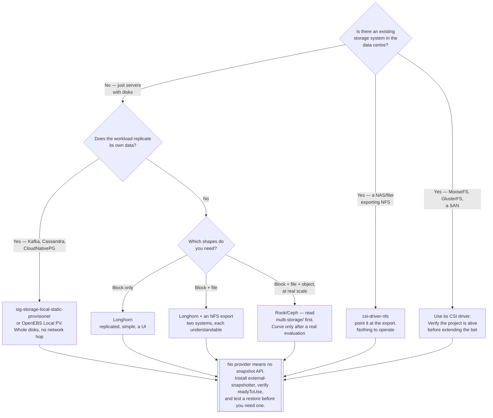

[← Storage](../README.md)

# On-premise storage

No provider underneath — the disks are yours, and so is everything that goes wrong with them.

No subfolders. Related: [`block-storage/`](../block-storage/README.md) ·
[`file-storage/`](../file-storage/README.md) ·
[`object-storage/`](../object-storage/README.md) ·
[`multi-storage/`](../multi-storage/README.md) · [`local/`](../local/README.md)

## Contents

1. [What this folder is for](#1-what-this-folder-is-for)
2. [The server-side systems](#2-the-server-side-systems)
   1. [MooseFS and GlusterFS](#21-moosefs-and-glusterfs)
   2. [Curve](#22-curve)
3. [Turning server disks into PVCs](#3-turning-server-disks-into-pvcs)
   1. [sig-storage-local-static-provisioner](#31-sig-storage-local-static-provisioner)
   2. [Static and dynamic are different jobs](#32-static-and-dynamic-are-different-jobs)
4. [The decisions the cloud used to make for you](#4-the-decisions-the-cloud-used-to-make-for-you)
5. [Decision tree](#5-decision-tree)
6. [Anti-patterns](#6-anti-patterns)
7. [Notes](#7-notes)
8. [How this applies to pikakube](#8-how-this-applies-to-pikakube)

---

## 1. What this folder is for

[`cloud/`](../cloud/README.md) is the case where the provider runs the storage and you install a
CSI driver. This is the other case: **bare metal, or virtual machines you own, with disks you
bought.** No EBS, no EFS, no S3, no SLA, and no snapshot API unless you build one.

The rest of the storage folders name specific tools. This one records the evaluation notes for
the on-premise situation itself — the server-side systems that sit *underneath* Kubernetes, and
the piece that connects an existing server disk to a PVC. It is deliberately short and
deliberately kept, because these are options that get forgotten and then re-researched.

The two questions that split everything here:

| Question | Answer lives in |
|---|---|
| What stores the bytes? | this folder, or a Kubernetes-native tool from the sibling folders |
| How does a pod get a PVC out of it? | a CSI driver — always |

## 2. The server-side systems

These are distributed storage systems that run **on servers, not as Kubernetes workloads**. They
predate the Kubernetes storage ecosystem and are the kind of thing an existing infrastructure
team may already operate. They are recorded here as evaluation candidates, not as deployments.

### 2.1 MooseFS and GlusterFS

<https://github.com/moosefs/moosefs>
<https://github.com/gluster/glusterfs>

Two distributed **file storage** systems — POSIX filesystems spread across a set of servers,
giving shared access from many clients at once. In Kubernetes terms, they are a way to get
`ReadWriteMany` backed by real hardware rather than by an in-cluster pod.

| | MooseFS | GlusterFS |
|---|---|---|
| Shape | POSIX distributed FS, chunk servers plus a master | POSIX distributed FS, no metadata server |
| Metadata | a **master server** holds all metadata | distributed; no separate metadata tier |
| Kubernetes access | its own CSI driver | a CSI driver, or NFS export |
| Status to verify | community and Pro editions differ in features | **development has effectively wound down; Red Hat ended Gluster Storage** |

The MooseFS master is the same architectural pattern as JuiceFS's metadata engine and HDFS's
NameNode: one component that knows where everything is, and whose loss makes the data
unreadable even though every byte is still on disk. The community edition's master is a single
node. That is the fact to check before adopting it.

GlusterFS deserves a plain warning rather than a comparison table row: **it is in maintenance at
best.** Red Hat discontinued its commercial offering and upstream activity has fallen away. It
appears in a great many older Kubernetes storage tutorials, which is exactly why it needs saying
here — encountering it in a search result is not evidence that it is a current option.

Neither of these is the modern default. If RWX is the requirement and there is no existing
deployment to inherit, [file-storage](../file-storage/README.md) — an NFS export via
[csi-driver-nfs](../file-storage/csi-driver-nfs/README.md), or CephFS via
[Rook](../multi-storage/rook/README.md) — is the better-supported path. These are here for the
case where the servers already exist.

### 2.2 Curve

<https://github.com/opencurve/curve>

A CNCF sandbox **multi-storage** system from NetEase: CurveBS for block and CurveFS for file,
from one cluster. Its stated design goal is to be an alternative to Ceph with better latency
and simpler operation, particularly for block storage under virtual machines and databases.

The same category as [multi-storage/rook](../multi-storage/README.md), and the honest assessment
is the same as for the object-storage alternatives to MinIO: it is a real project solving a real
problem, with a smaller community, thinner English documentation, and far fewer people who have
operated it in production. Ceph's weight is a genuine cost, and Ceph's ubiquity is a genuine
asset — the person you hire has probably seen it.

Worth tracking, not worth betting the platform's persistence layer on without a deliberate
evaluation.

## 3. Turning server disks into PVCs

### 3.1 sig-storage-local-static-provisioner

<https://github.com/kubernetes-sigs/sig-storage-local-static-provisioner>

The recorded note is precise: *for on-premise Kubernetes, provisioning PVCs based on the
server's disk.* This is the tool for that.

It is a Kubernetes SIG project that discovers pre-prepared disks on each node and publishes them
as `local` PersistentVolumes. The operator's job is to attach the disk, format it and mount it
under a known directory — typically `/mnt/disks/<something>` — and the provisioner does the rest:

| It does | It does not |
|---|---|
| discover mounted disks under a configured directory | partition, format or attach anything |
| create a `local` PV per disk, with `nodeAffinity` | resize, snapshot or replicate |
| clean the disk when its PVC is released | give you `ReadWriteMany` |
| set `WaitForFirstConsumer` on its StorageClass | survive the loss of the node |

The result is a PVC backed by a **whole physical device**, with no filesystem-in-a-directory
indirection and no network in the write path. For a Kafka broker or a Cassandra node on bare
metal with a dozen NVMe drives, that is the fastest storage the machine can offer, and the
correct one — because those systems replicate their own data and do not want a storage layer
replicating it again.

The same warning as everything node-local applies in full, and this is the place to repeat it:
**losing the node loses the volume.** Not "degrades" — the PV has `nodeAffinity` to a machine
that is gone, the pod becomes permanently unschedulable, and the only recovery is a backup taken
elsewhere. See [local/](../local/README.md) for the complete version of that argument.

### 3.2 Static and dynamic are different jobs

Three things get confused, and separating them makes the choice obvious:

| Tool | Provisioning | Backed by | Suits |
|---|---|---|---|
| [sig-storage-local-static-provisioner](https://github.com/kubernetes-sigs/sig-storage-local-static-provisioner) | **static** — one PV per real disk | a whole physical device | bare metal, self-replicating databases |
| [local-path-provisioner](../local/local-path-provisioner/README.md) | dynamic | a directory on a shared filesystem | development, Kind, k3s |
| [OpenEBS Local PV](../block-storage/openebs/README.md) (LVM/ZFS) | dynamic | an LVM volume or ZFS dataset | bare metal, when you want quotas and snapshots too |

"Static" means the disks are prepared by hand or by configuration management, and the
provisioner only publishes what it finds. That is more work up front and gives an exact,
enforced one-disk-per-PV mapping. Dynamic provisioners carve volumes on demand from something
that already exists.

For on-premise Kubernetes with real drives, the static provisioner and OpenEBS Local PV are the
two serious answers. local-path-provisioner is not one of them outside development.

## 4. The decisions the cloud used to make for you

Everything here follows from having no provider. Five things that were previously invisible
become yours:

| Concern | What the cloud did | What you must now do |
|---|---|---|
| **Replication** | replicated the block device inside a zone, silently | choose: application-level, or Longhorn/Ceph underneath |
| **Snapshots** | an API call, always available | install [external-snapshotter](../../backup/external-snapshotter/README.md), and pick a driver that implements `CreateSnapshot` |
| **Failure domains** | availability zones, with a scheduler that understood them | define them yourself — rack, host, PSU — and encode them in the storage layer |
| **Capacity growth** | resize the volume, wait a minute | buy disks, install them, rebalance |
| **Disk failure** | somebody else's pager | yours, and rebuild traffic hits during the incident |

The second row is the one most often discovered late. Snapshot-based backup in Kubernetes is not
a Kubernetes feature — it is a driver feature plus a separately installed controller. On-premise,
the `VolumeSnapshot` object may be accepted and never reconciled, and the backup schedule reports
success while producing nothing. Verify `readyToUse` on a real snapshot before believing any of
it.

The fourth row shapes design more than people expect: on-premise capacity is a **procurement
lead time**, not an API call. Storage classes should be sized with that in mind, and
`allowVolumeExpansion: true` is worth setting everywhere because the alternative — a new PVC and
a copy via [pv-migrate](../../backup/pv-migrate/README.md) — is far worse when the disk is
already in the rack.

## 5. Decision tree

## 6. Anti-patterns

| Anti-pattern | Why it is bad | What to do instead |
|---|---|---|
| Adopting GlusterFS because a tutorial used it | upstream activity has wound down and the commercial product was discontinued | check project health first; NFS or CephFS for new RWX |
| A single metadata master with no failover | MooseFS's master, HDFS's NameNode and JuiceFS's metadata engine all lose the whole filesystem when they go | HA metadata, or accept and document the outage window |
| `hostPath` volumes because "it is our hardware anyway" | no node affinity — a rescheduled pod silently gets an empty directory | the static local provisioner, which pins the PV to its node |
| local-path-provisioner on production bare metal | a directory on a shared filesystem, no quota, no snapshots, no replication | sig-storage-local-static-provisioner or OpenEBS Local PV |
| Node-local disks under a workload that does not self-replicate | node loss is total loss, with no rebuild path | replicated storage, or move the replication into the application |
| Assuming snapshots work | on-premise there is no snapshot API unless a driver and a controller provide one | install external-snapshotter and verify a real snapshot reaches `readyToUse` |
| Treating capacity as elastic | adding a disk on-premise is procurement plus installation plus rebalance | `allowVolumeExpansion: true` everywhere, and headroom alerts that fire early |
| One failure domain because it was never defined | replicas land on the same rack or the same PSU and fail together | encode host/rack failure domains in the storage layer explicitly |
| Betting on a young multi-storage project to avoid Ceph | Ceph's weight is a real cost, but its ubiquity is a real asset | evaluate Curve deliberately; default to the composition of simpler tools |

## 7. Notes

The original notes recorded in this folder, translated and placed:

- **Server-side file storage: [MooseFS](https://github.com/moosefs/moosefs) and
  [GlusterFS](https://github.com/gluster/glusterfs).** Both distributed POSIX filesystems that
  run on servers rather than as cluster workloads — §2.1. The important addition is the status
  check: GlusterFS is effectively wound down, and MooseFS's community-edition master is a single
  point of failure.
- **Multi-storage: [Curve](https://github.com/opencurve/curve).** A CNCF sandbox block-plus-file
  system positioned as a lighter alternative to Ceph — §2.2. Recorded as a candidate to track.
- **"For on-premise Kubernetes, provisioning PVCs based on the server's disk":
  [sig-storage-local-static-provisioner](https://github.com/kubernetes-sigs/sig-storage-local-static-provisioner).**
  §3.1. This is the direct answer to that requirement, and the distinction from
  local-path-provisioner in §3.2 is the part worth keeping: static provisioning of whole physical
  devices, versus dynamic carving of directories.

No manifests exist in this folder, and that is correct — there is nothing here that a Kind
cluster can deploy. It is an evaluation record.

## 8. How this applies to pikakube

This is the folder the rest of the repository is actually aimed at. pikakube's focus is
self-managed Kubernetes, which means [`cloud/`](../cloud/README.md) is the escape hatch and this
is the real case: no provider, no SLA, no snapshot API, and every decision in
[`../README.md`](../README.md) landing on someone who has to make it.

The practical shape of a real on-premise deployment, assembled from the sibling folders:

| Need | Answer |
|---|---|
| Block for databases | [Longhorn](../block-storage/longhorn/README.md), or [OpenEBS Local PV](../block-storage/openebs/README.md) under a self-replicating database |
| Whole physical disks as PVCs | sig-storage-local-static-provisioner |
| RWX | an existing NFS export via [csi-driver-nfs](../file-storage/csi-driver-nfs/README.md) |
| Object | [MinIO](../object-storage/minio/README.md) or [Garage](../object-storage/garage/README.md) — with the licence caveats recorded there |
| All three at real scale | [Rook/Ceph](../multi-storage/README.md), if the hardware and the expertise are both real |

The gap this folder makes visible is snapshots. Nothing in the Kind sandbox exercises
`VolumeSnapshot`, and on-premise it is the piece that most reliably turns out to be missing
exactly when a restore is needed — see
[external-snapshotter](../../backup/external-snapshotter/README.md) and
[backup/](../../backup/README.md).

---

[← Storage](../README.md)
