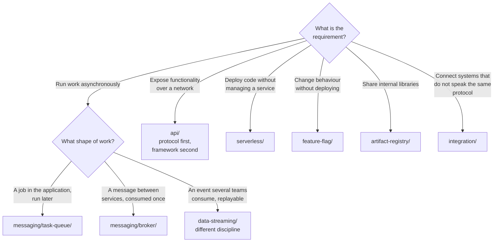

# Software engineering

The capabilities a platform offers the people building on it — and the practices that keep what
they build maintainable.

Capabilities: [`language/`](language/README.md) · [`api/`](api/README.md) ·
[`frontend/`](frontend/README.md) · [`messaging/`](messaging/README.md) ·
[`serverless/`](serverless/README.md) · [`integration/`](integration/README.md) ·
[`feature-flag/`](feature-flag/README.md) ·
[`backend-as-a-service/`](backend-as-a-service/README.md) ·
[`artifact-registry/`](artifact-registry/README.md) ·
[`code-quality/`](code-quality/README.md) · [`testing/`](testing/README.md) ·
[`developer-environment/`](developer-environment/README.md) ·
[`web-scraping/`](web-scraping/README.md)

## Contents

1. [What this discipline covers](#1-what-this-discipline-covers)
2. [Three kinds of folder](#2-three-kinds-of-folder)
3. [Where the boundaries are](#3-where-the-boundaries-are)
4. [Decision tree](#4-decision-tree)
5. [Anti-patterns](#5-anti-patterns)
6. [How this applies to pikakube](#6-how-this-applies-to-pikakube)

---

## 1. What this discipline covers

Every other discipline in [`infrastructure/`](../README.md) runs something the platform needs. This one is
about the **application layer** — what gets built on top, and what supports building it.

That makes it the discipline most directly experienced by the people the platform exists for. A
developer never notices the CNI; they notice whether there is somewhere to publish a package, a
way to run a load test, and a review process that catches things before production.

## 2. Three kinds of folder

The top level mixes three things deliberately, and knowing which is which makes the tree easier to
navigate:

| Kind | Folders | What it is |
|---|---|---|
| **Runtime capability** | [`messaging/`](messaging/README.md) · [`serverless/`](serverless/README.md) · [`integration/`](integration/README.md) · [`feature-flag/`](feature-flag/README.md) · [`backend-as-a-service/`](backend-as-a-service/README.md) · [`artifact-registry/`](artifact-registry/README.md) | something the platform **runs** for applications |
| **What gets built** | [`language/`](language/README.md) · [`api/`](api/README.md) · [`frontend/`](frontend/README.md) · [`web-scraping/`](web-scraping/README.md) | the shape of the application itself |
| **Engineering practice** | [`code-quality/`](code-quality/README.md) · [`testing/`](testing/README.md) · [`developer-environment/`](developer-environment/README.md) | how it is built, reviewed and verified |

## 3. Where the boundaries are

Several capabilities here have neighbours in other disciplines, and the boundaries are the thing
worth writing down — otherwise the same tool gets evaluated twice under two names.

**Messaging is split three ways, on purpose:**

| Folder | Model | Tools |
|---|---|---|
| [`messaging/broker/`](messaging/broker/README.md) | **work queues** — a message consumed once, by one worker | RabbitMQ, NATS, ActiveMQ |
| [`messaging/task-queue/`](messaging/task-queue/README.md) | **application jobs** — a function executed asynchronously | Celery |
| [`data-streaming/`](../data-streaming/README.md) | **an event log** — retained, replayable, many consumers | Kafka, Pulsar, Redpanda |

The distinction that matters: a broker **delivers and forgets**, a log **retains and replays**.
Choosing a log because "we need queues" is the most common and most expensive confusion in this
area.

**Other boundaries:**

| Concern | Here | Elsewhere |
|---|---|---|
| Static analysis | [`code-quality/static-analysis/`](code-quality/static-analysis/README.md) — maintainability | [`security/4-code/sast/`](../security/4-code/sast/README.md) — vulnerabilities |
| API contracts | [`api/`](api/README.md) — protocols and frameworks | [`docs/api-contract/`](../docs/api-contract/README.md) — OpenAPI, AsyncAPI |
| Container registry | [`artifact-registry/`](artifact-registry/README.md) — language packages | [`devops/`](../devops/README.md) — images |
| Serverless | [`serverless/`](serverless/README.md) — function platforms | [`devops/event-driven/keda/`](../devops/event-driven/keda/README.md) — scaling on events |

The first row is a real overlap and is worth stating: **SonarQube and Semgrep both analyse source
code**, and they answer different questions. One asks "is this maintainable?", the other "is this
exploitable?"

## 4. Decision tree

## 5. Anti-patterns

| Anti-pattern | Why it is bad | What to do instead |
|---|---|---|
| Kafka used as a work queue | retention, partitions and consumer groups solve a problem you do not have | a broker — [`messaging/broker/`](messaging/broker/README.md) |
| A broker used as an event log | messages are gone once acknowledged; replay is impossible | [`data-streaming/`](../data-streaming/README.md) |
| Linting that only warns | ignored within a fortnight | fail the build |
| Feature flags never removed | the codebase accumulates permanent branches | an expiry date per flag |
| A serverless platform for one function | a control plane to run a cron job | a `Job`, or [KEDA](../devops/event-driven/keda/README.md) |
| Tests that need the whole environment | slow, flaky, and skipped under pressure | [`testing/unit/`](testing/unit/README.md), with real dependencies via testcontainers |
| Static analysis treated as security | maintainability and exploitability are different questions | both — see section 3 |
| Copying shared code between repositories | it diverges immediately | [`artifact-registry/`](artifact-registry/README.md) |
| A development environment nobody can reproduce | "works on my machine", permanently | [`developer-environment/`](developer-environment/README.md) |
| An integration framework for two HTTP calls | a runtime and a DSL to do what a function does | see [`integration/`](integration/README.md) |

## 6. How this applies to pikakube

The folders with **real working depth** here, rather than a catalogue:

| Folder | What exists |
|---|---|
| [`artifact-registry/`](artifact-registry/README.md) | a working private PyPI, with a package built, published and installed end to end |
| [`language/python/`](language/python/README.md) | Poetry, uv and virtualenv compared from actual use, with the Docker findings |
| [`api/`](api/README.md) | Flask and WebSocket applications with Dockerfiles and manifests |
| [`messaging/broker/rabbitmq/`](messaging/broker/rabbitmq/README.md) | the operator, a streams producer and consumer, and a notebook |

Those are the parts where the notes record what was actually run, which is what makes them worth
more than the tool's own documentation.

The recorded opinions worth carrying forward, because they are judgements rather than facts:

- **[Dapr](integration/dapr/README.md)** — *"cool, but too much overengineering"*
- **[uv over Poetry](language/python/dependency-management/uv/README.md)** — uv's Docker
  documentation is good and Poetry's is not, and Poetry does not support constraints
- **[Celery's Helm chart](messaging/task-queue/celery/README.md)** is very new
- **[ActiveMQ Artemis](messaging/broker/activemq-artemis/README.md)** and
  [Knative](serverless/knative/README.md) have **no Helm chart**, which decides a lot in a
  GitOps setup

One organisational note: [`web-scraping/`](web-scraping/README.md) holds Playwright and Selenium,
which are also — arguably primarily — end-to-end browser testing tools. They are classified here by
how they are used rather than by what they can do, which is the rule this repository follows
elsewhere.

---

[← infrastructure/](../README.md)
