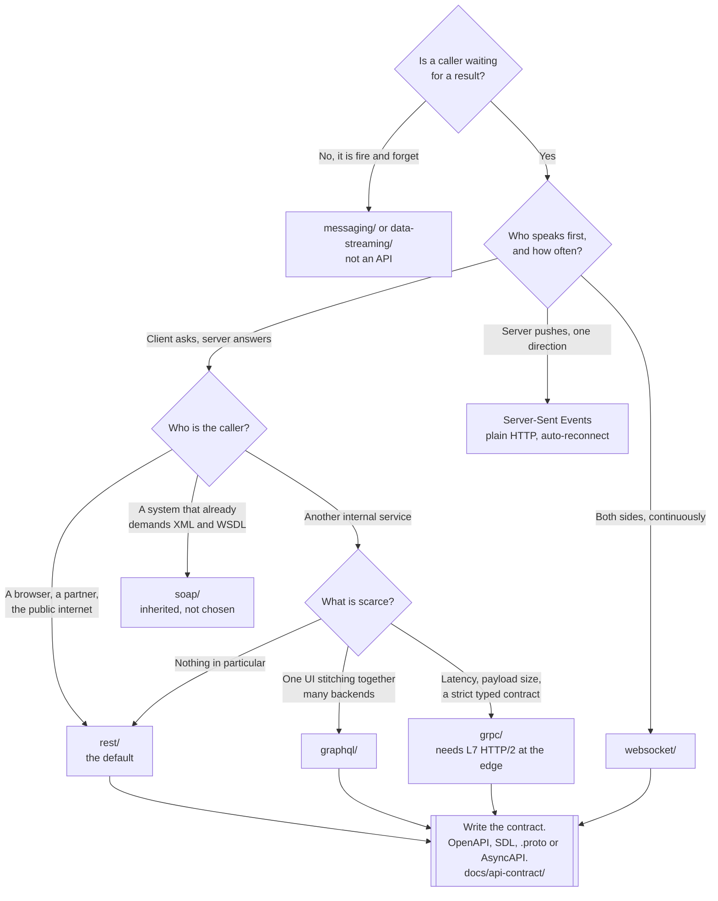

[← Software engineering](../README.md)

# API

How a service exposes functionality over a network — the protocol decides almost everything, the
framework almost nothing.

Tools covered: [`rest/`](rest/README.md) · [`graphql/`](graphql/README.md) ·
[`grpc/`](grpc/README.md) · [`soap/`](soap/README.md) · [`websocket/`](websocket/README.md)

## Contents

1. [Protocol first, framework second](#1-protocol-first-framework-second)
2. [The five protocols](#2-the-five-protocols)
3. [Request/response or streaming](#3-requestresponse-or-streaming)
4. [The contract is the interface](#4-the-contract-is-the-interface)
5. [What the protocol costs at the edge](#5-what-the-protocol-costs-at-the-edge)
6. [Decision tree](#6-decision-tree)
7. [Anti-patterns](#7-anti-patterns)
8. [How this applies to pikakube](#8-how-this-applies-to-pikakube)

---

## 1. Protocol first, framework second

A framework is a dependency: it can be swapped in a sprint, and the callers never find out. A
protocol is a **contract with every client that has already been written against it**, and once
those clients exist outside your team, changing it is a migration project rather than a refactor.

So the order of the decision is fixed:

1. **Protocol** — what shape of conversation is this?
2. **Contract** — how is that conversation written down?
3. **Framework** — what runs it?

Most of the arguments in an API design review are about step 3, which is the step that matters
least. The reason this folder is organised by protocol, with frameworks buried two levels down in
[`rest/framework/`](rest/framework/README.md), is to keep that ordering visible in the tree.

## 2. The five protocols

| Protocol | Transport | Payload | Conversation | Where it fits |
|---|---|---|---|---|
| **[REST](rest/README.md)** | HTTP/1.1 or HTTP/2 | JSON, usually | one request, one response | the default — public APIs, anything a browser or `curl` will touch |
| **[GraphQL](graphql/README.md)** | HTTP, one endpoint | JSON | one request, **the client chooses the fields** | a UI aggregating several backends |
| **[gRPC](grpc/README.md)** | HTTP/2, required | **Protobuf**, binary | unary **and** streaming, both directions | service-to-service, internal, performance-sensitive |
| **[SOAP](soap/README.md)** | HTTP, usually | XML in an envelope | one request, one response | integrating with something that already speaks it |
| **[WebSocket](websocket/README.md)** | HTTP upgrade, then a persistent TCP connection | anything | **full duplex**, long-lived | the server needs to push |

Two of these are chosen and three are usually inherited. REST and gRPC are real decisions.
GraphQL is a decision that a frontend team makes and a platform team lives with. SOAP is almost
never chosen in a new system — it appears because a partner, a bank or an ERP requires it.
WebSocket is not really an alternative to the others; it answers a different question, covered
next.

## 3. Request/response or streaming

The axis that actually separates these protocols is **who is allowed to speak first**.

| Requirement | Answer |
|---|---|
| The client asks, the server answers | REST, GraphQL, gRPC unary, SOAP |
| The server pushes, one direction only | **Server-Sent Events** — plain HTTP, reconnects on its own |
| Both sides speak at any time | [WebSocket](websocket/README.md), or gRPC bidirectional streaming |
| The message has no waiting caller at all | not an API — see [`messaging/`](../messaging/README.md) |

The mistake this table exists to prevent is reaching for WebSocket because "we need real time".
Server-Sent Events is one direction over ordinary HTTP: it survives proxies, load balancers and
corporate networks that mangle upgrades, and the browser reconnects for you. If the client only
ever *receives*, it is the cheaper answer.

And the row that matters most for architecture is the last one. An API implies a caller waiting
for a result. If nothing is waiting, the request/response shape is being used to fake a queue, and
the failure modes of a queue — retries, backpressure, dead letters — will have to be reinvented
badly. That belongs in [`messaging/`](../messaging/README.md) or
[`data-streaming/`](../../data-streaming/README.md).

## 4. The contract is the interface

Every protocol here has a machine-readable description, and whether it is written **before** the
code or generated **after** it is the single biggest predictor of whether the API is usable by
anyone who did not write it.

| Protocol | Contract format | Generated from code, or the source of truth? |
|---|---|---|
| REST | **OpenAPI** | either — and the choice is worth making deliberately |
| GraphQL | **SDL** schema | the schema is the source of truth by construction |
| gRPC | **`.proto`** | the `.proto` is the source of truth; the code is generated from it |
| SOAP | **WSDL** | the WSDL is the source of truth |
| WebSocket | **AsyncAPI** | almost always nothing, which is the problem |

gRPC and SOAP get this right by force: there is no way to write the service without writing the
contract first. REST gets it right only by discipline, and GraphQL sits in between.

WebSocket is the gap. There is no required contract, so what a socket accepts and emits usually
lives in one team's head, and AsyncAPI exists precisely to fix that — see
[`docs/api-contract/`](../../docs/api-contract/README.md), which holds OpenAPI, AsyncAPI and the
tooling around them. **This folder is about protocols and frameworks; that folder is about the
documents that describe them.**

## 5. What the protocol costs at the edge

The protocol is not only an application decision. It changes what the ingress, the load balancer
and the service mesh have to do, and this is where the surprises land.

| Protocol | What the edge has to handle |
|---|---|
| REST | nothing special — this is why it is the default |
| GraphQL | one URL, one HTTP verb, so **per-route rate limiting and caching stop working**; depth and complexity limits move into the application |
| gRPC | HTTP/2 end to end. A load balancer working at L4 pins every call from a client to **one** pod, because it balances connections and gRPC opens one |
| SOAP | large XML bodies; body size limits and parse timeouts |
| WebSocket | long-lived connections: idle timeouts must be raised, and **every rolling deploy disconnects every client** |

Three of these are outages waiting for enough traffic:

- **gRPC behind an L4 balancer** looks fine in staging with three pods and one client, and produces
  a single hot pod in production. It needs an L7 proxy that understands HTTP/2 streams.
- **WebSocket and rolling deploys** are a permanent tension. Clients must reconnect with backoff
  and jitter; without jitter they all come back at the same instant and take down what they just
  reconnected to.
- **GraphQL and caching** — an HTTP cache keys on the URL, and every GraphQL query has the same
  one. Whatever caching existed for free is now the application's job.

The edge itself lives in [`network/`](../../network/README.md) — ingress controllers and API
gateways. What belongs here is knowing which protocol makes that configuration hard.

## 6. Decision tree

## 7. Anti-patterns

| Anti-pattern | Why it is bad | What to do instead |
|---|---|---|
| Choosing the framework before the protocol | the reversible decision is made first and constrains the irreversible one | protocol, contract, then framework |
| An API where nothing waits for the answer | request/response used as a queue, so retries and backpressure get reinvented badly | [`messaging/`](../messaging/README.md) |
| WebSocket when the client only receives | a stateful connection, and proxies that mangle upgrades, for one-way data | Server-Sent Events |
| gRPC exposed to browsers or partners | browsers cannot speak gRPC directly, and partners will not | REST at the edge, gRPC behind it |
| gRPC behind an L4 load balancer | one connection per client means one pod gets all of it | an L7 proxy that balances HTTP/2 streams |
| GraphQL without depth or complexity limits | one nested query can read the whole database in a single request | limits enforced in the resolver layer |
| No contract, or a contract written after the fact | it drifts from the implementation and stops being trusted | [`docs/api-contract/`](../../docs/api-contract/README.md) |
| No versioning until a breaking change is needed | there is nowhere to put it, so the change ships as a surprise | decide the versioning scheme on day one |
| Unbounded list endpoints | fine with a thousand rows, fatal with a million | pagination from the first version |
| One protocol mandated across the whole estate | internal service calls and public APIs have different constraints | REST at the edge, whatever fits behind it |
| Long-lived sockets with no reconnect backoff | every deploy produces a synchronised reconnect storm | exponential backoff **with jitter** |

## 8. How this applies to pikakube

Two of the five folders contain something that actually runs; the rest are mapped.

| Folder | What exists |
|---|---|
| [`rest/framework/flask/`](rest/framework/flask/README.md) | an application, a `Dockerfile`, pinned requirements and a **hadolint configuration** |
| [`websocket/`](websocket/README.md) | a server and a client, a `Dockerfile`, a `build.sh` that loads the image into **kind**, and namespace, service and deployment manifests |
| [`rest/framework/fastapi/`](rest/framework/fastapi/README.md) · [`graphql/`](graphql/README.md) · [`grpc/`](grpc/README.md) | a reference each — mapped, not deployed |
| [`soap/`](soap/README.md) | an **empty** note. Placed to mark the protocol exists, and left blank |

The WebSocket folder is the most valuable one here, because it is the only place in the repository
where an application was built, containerised, loaded into the local cluster and given manifests —
and because the manifests contain two defects that are recorded rather than fixed. Both are
described in [`websocket/`](websocket/README.md); both are the kind of thing that only shows up
when something is actually deployed, which is exactly why running it was worth doing.

The gap worth naming: **nothing here is exposed through an ingress**. The WebSocket service is
`ClusterIP`, so the interesting part of section 5 — idle timeouts, upgrade handling, connection
draining on deploy — has not been exercised. That work sits at the boundary with
[`network/`](../../network/README.md) and is the natural next step for this folder.

---

[← Software engineering](../README.md)
