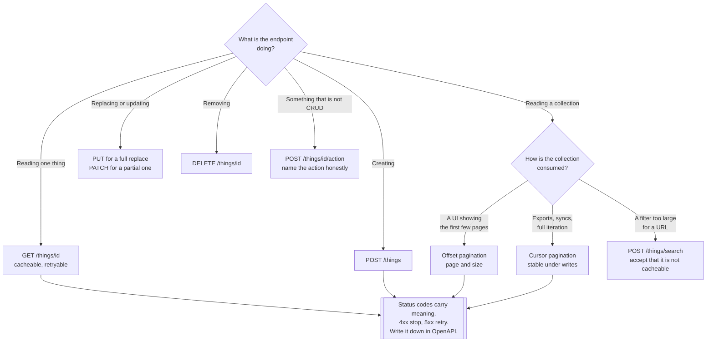

[← API](../README.md)

# REST

The default protocol, and the one with the fewest rules — which is why most of the decisions have
to be made deliberately.

Tools covered: [`framework/`](framework/README.md)

## Contents

1. [What REST actually gives you](#1-what-rest-actually-gives-you)
2. [Resources, not verbs](#2-resources-not-verbs)
3. [Querying collections](#3-querying-collections)
4. [Versioning](#4-versioning)
5. [Status codes and errors](#5-status-codes-and-errors)
6. [Decision tree](#6-decision-tree)
7. [Anti-patterns](#7-anti-patterns)
8. [Notes](#8-notes)
9. [How this applies to pikakube](#9-how-this-applies-to-pikakube)

---

## 1. What REST actually gives you

REST is chosen because everything already supports it. That is a real advantage and it is worth
being precise about what comes with it:

| You get for free | Because |
|---|---|
| Caching | proxies, CDNs and browsers understand `GET`, `ETag` and `Cache-Control` |
| Load balancing | every request is independent, so any pod can serve it |
| Debugging | `curl` and a browser are sufficient tools |
| Rate limiting per route | the URL and the method are visible to the proxy |
| Idempotent retries | `GET`, `PUT` and `DELETE` are defined as safe to repeat |

None of these are properties of REST as a design philosophy. They are properties of **HTTP used the
way it was specified**, and they are exactly what is lost when a service tunnels everything through
`POST /api` with an action name in the body. The list above is the entire argument for using the
verbs and status codes properly.

What REST does **not** give you is a contract. Nothing prevents a REST API from being undocumented,
and nothing generates a client. That has to be added — see
[`docs/api-contract/`](../../../docs/api-contract/README.md).

## 2. Resources, not verbs

The one design rule with real consequences: **a URL names a thing, the method says what to do with
it.**

| Instead of | Use |
|---|---|
| `POST /getUser?id=1` | `GET /users/1` |
| `POST /createUser` | `POST /users` |
| `POST /updateUser` | `PUT /users/1` or `PATCH /users/1` |
| `POST /deleteUser` | `DELETE /users/1` |
| `POST /searchUsers` | `GET /users?status=active` |

This is not aesthetics. `GET /users/1` is cacheable, retryable and rate-limitable by the proxy;
`POST /getUser` is none of those, because to HTTP a `POST` is a request that changes something.

Two places where the rule genuinely does not fit, and where forcing it makes things worse:

- **Actions that are not CRUD** — `POST /orders/1/cancel` is honest. Modelling a cancellation as a
  `PATCH` that sets a status field hides an operation with side effects behind a field assignment.
- **Search with a large or structured query** — a filter that will not fit in a URL has to go in a
  body, and then it is a `POST`. Accept that this endpoint is not cacheable rather than
  contorting the URL.

The difference between these and `POST /getUser` is that here the constraint is real, not
laziness.

## 3. Querying collections

Every REST API eventually needs filtering, sorting, field selection and pagination, and every team
invents its own spelling for them. **OData** is the standard that already answered this — an OASIS
specification defining the conventions, not a framework:

| Concern | OData spelling |
|---|---|
| Filter | `$filter=status eq 'active'` |
| Select fields | `$select=id,name` |
| Sort | `$orderby=created desc` |
| Page | `$top=50&$skip=100` |
| Expand a relation | `$expand=orders` |

Two things are worth separating here. The **conventions** are useful even if OData is never
adopted: reading the specification and copying the parameter names costs nothing and gives you an
answer that has already been argued about by other people. The **full standard** — the metadata
document, the type system, the batch protocol, the client libraries — is a much larger commitment,
and it is only justified when a consumer already expects OData.

The pagination decision underneath is independent of spelling and matters more:

| Style | Behaviour |
|---|---|
| **Offset** (`$skip` / `$top`, `LIMIT`/`OFFSET`) | simple; gets slow on deep pages and **skips or repeats rows** when the data changes underneath |
| **Cursor / keyset** | stable under concurrent writes and fast at any depth; no random access to page 500 |

Offset is the default everywhere and is fine for a UI showing the first few pages. Anything
iterating a whole collection — an export, a sync, a batch job — needs a cursor, and retrofitting
one after clients depend on `?page=` is a breaking change.

## 4. Versioning

Decide the scheme before the first client exists, because the point at which you need it is the
point at which it is too late to introduce it cheaply.

| Where the version goes | Trade-off |
|---|---|
| **Path** — `/v1/users` | visible, trivially routable at the ingress, ugly. The usual answer |
| **Header** — `Accept: application/vnd.api.v1+json` | clean URLs, invisible in a browser, and easy for a client to omit by accident |
| **Query** — `?version=1` | easy to add, easy to forget, and it interferes with caching |

The more important discipline is **not needing a new version**. Additive changes — a new optional
field, a new endpoint — do not break clients that ignore what they do not recognise. Removing a
field, renaming one, tightening validation or changing a status code does.

So the working rule is: add freely, never remove within a version, and when something genuinely
must be removed, ship `/v2` alongside `/v1` and give the old one a **published end date**. A
version with no removal date is not a migration, it is a permanent second codebase.

## 5. Status codes and errors

The codes that carry information a client can act on:

| Code | Meaning the client can use |
|---|---|
| `400` | the request is malformed — **do not retry**, it will fail again |
| `401` / `403` | not authenticated / authenticated but not allowed — different fixes |
| `404` | no such resource |
| `409` | conflict — the state changed under you |
| `422` | the shape was valid, the content was not |
| `429` | slow down — and honour `Retry-After` |
| `500` | our fault — **retry with backoff** |
| `503` | temporarily unavailable — retry, and `Retry-After` if you know when |

The distinction that clients depend on is `4xx` versus `5xx`: one means *stop*, the other means
*try again later*. An API that returns `200` with `{"error": "..."}` in the body destroys that
signal, and every client then has to parse a body to discover whether it succeeded. Retries,
circuit breakers, dashboards and alerts all key on the status code, and all of them go blind.

Error bodies deserve one decision, made once: **RFC 7807 `application/problem+json`** gives a
`type`, `title`, `status` and `detail`. Any consistent shape is acceptable; a different shape per
endpoint is not.

## 6. Decision tree

## 7. Anti-patterns

| Anti-pattern | Why it is bad | What to do instead |
|---|---|---|
| `POST` for everything, with an action in the body | loses caching, retries, per-route limits — every advantage in section 1 | resources and methods |
| `200 OK` with an error in the body | clients, retries, circuit breakers and alerts all go blind | correct status codes |
| No pagination on a collection | correct with a thousand rows, fatal with a million | paginate from version one |
| Offset pagination for a full export | rows are skipped or repeated when data changes mid-iteration | cursor pagination |
| A different error shape per endpoint | every client writes a parser per route | one shape, e.g. `problem+json` |
| No versioning scheme until it is needed | the first breaking change has nowhere to go, so it ships as a surprise | decide it on day one |
| `/v2` with no end date for `/v1` | two codebases, permanently | publish a removal date |
| Verbs in URLs (`/getUser`, `/createOrder`) | the method already says this, and proxies read the method | nouns in URLs |
| Internal database fields exposed directly | the schema becomes the public contract and cannot be changed | an explicit response model |
| A hand-invented query syntax | reinvents what OData already specified, badly | copy the OData conventions |
| A contract written after the code, if at all | it drifts and stops being trusted | [`docs/api-contract/`](../../../docs/api-contract/README.md) |

## 8. Notes

The original note in this folder recorded two references.

**[httpx](https://github.com/projectdiscovery/httpx)** — ProjectDiscovery's HTTP toolkit. It takes
a list of hosts or URLs and probes them concurrently, reporting status codes, titles, response
sizes, redirect chains and detected technologies. Its origin is security reconnaissance, and the
reason it is filed under REST is that it is the fastest way to answer operational questions about
a fleet of HTTP endpoints: which of these still respond, which return `500`, which are serving an
unexpected redirect. It is a probe, not a load tester and not a client library.

> Worth stating explicitly because the collision causes real confusion: this is **not** the Python
> `httpx` package. Same name, unrelated project — one is a Go CLI for probing hosts, the other is
> an async HTTP client for Python.

**[OData](https://github.com/OData/odataorg.github.io)** and specifically
[Querying Collections](https://docs.oasis-open.org/odata/odata/v4.01/odata-v4.01-part1-protocol.html#sec_QueryingCollections)
from the v4.01 protocol specification — the section covering `$filter`, `$select`, `$orderby`,
`$top`, `$skip` and `$expand`. The link points at that section rather than the standard as a whole,
which reflects how it is most useful here: as a settled vocabulary for collection queries to copy,
described in section 3 above, rather than as a stack to adopt.

## 9. How this applies to pikakube

The only REST code in the repository is the Flask application under
[`framework/flask/`](framework/flask/README.md) — a single `/` route, a `Dockerfile`, a pinned
requirements file and a hadolint configuration. It exists to exercise the container build, not to
demonstrate API design, and nothing on this page is visible in it: no pagination, no versioning, no
error shape, no contract.

That is honest for what it is, and it also marks the gap. **There is no OpenAPI document anywhere
in this folder**, so the tooling in
[`docs/api-contract/`](../../../docs/api-contract/README.md) — Swagger UI, Redoc — has nothing to
render. The cheapest way to close that is
[FastAPI](framework/fastapi/README.md), which produces the schema from the code without being
asked; see [`framework/`](framework/README.md) for why that changes the calculation between the
two frameworks mapped here.

---

[← API](../README.md)
