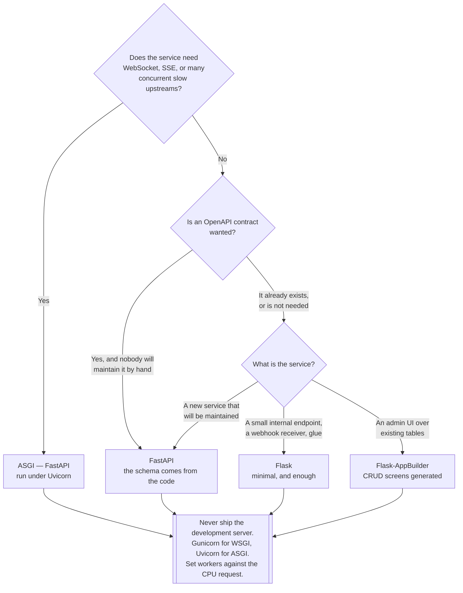

[← REST](../README.md)

# REST frameworks

The replaceable part of the decision — and the two things about it that are not replaceable.

Tools covered: [`fastapi/`](fastapi/README.md) · [`flask/`](flask/README.md)

## Contents

1. [What the framework actually decides](#1-what-the-framework-actually-decides)
2. [WSGI or ASGI](#2-wsgi-or-asgi)
3. [The server is not the framework](#3-the-server-is-not-the-framework)
4. [Decision tree](#4-decision-tree)
5. [Anti-patterns](#5-anti-patterns)
6. [How this applies to pikakube](#6-how-this-applies-to-pikakube)

---

## 1. What the framework actually decides

Routing, templating and middleware are interchangeable across every framework in this category.
Two things are not:

| Decision | Why it sticks |
|---|---|
| **Sync or async** — WSGI or ASGI | it determines what the code can do, not just how it is written. Changing later means rewriting every I/O call |
| **Whether a schema exists** | a framework that produces OpenAPI from the code gives you a contract for free; one that does not means the contract is a separate artefact that will drift |

Everything else — decorators versus class-based views, which ORM, which templating engine — is a
preference. These two produce work that cannot be undone in an afternoon.

The second one is the reason [FastAPI](fastapi/README.md) is not simply "Flask but newer". Type
hints on the handler produce validation, serialisation and an OpenAPI document from the same
declaration. In [Flask](flask/README.md) each of those is a separate library and a separate
decision, and the OpenAPI document is a file somebody has to remember to update.

## 2. WSGI or ASGI

| | **WSGI** | **ASGI** |
|---|---|---|
| Model | one request per worker thread, blocking | an event loop, `async`/`await` |
| Concurrency comes from | processes and threads | awaiting I/O |
| Good at | CPU-bound work, ordinary CRUD over a database | many concurrent slow calls, long-lived connections |
| Supports WebSocket | no | **yes** |
| Frameworks | [Flask](flask/README.md), Django (classically) | [FastAPI](fastapi/README.md), Starlette, Django with ASGI |

The honest summary: **async is not faster, it is more concurrent.** A handler that reads a row and
returns JSON gains nothing from `async` — the work is a fraction of a millisecond and the process
model handles it fine. A handler that calls three upstream services and waits 200 ms on each gains
a great deal, because the worker can serve other requests while it waits.

Where ASGI is not a preference but a requirement:

- **WebSocket** — WSGI has no concept of a persistent bidirectional connection. See
  [`websocket/`](../../websocket/README.md)
- Server-Sent Events and other long-lived streaming responses
- Fan-out to many slow upstreams from a single request

The trap, and it is the most common failure in an async service: **a blocking call inside an async
handler stalls the entire event loop**, not just that request. A synchronous database driver, a
`requests` call, `time.sleep`, or a CPU-heavy loop will freeze every other request on that worker.
Mixing the models by accident is worse than committing to the slower one.

## 3. The server is not the framework

Both frameworks here ship a development server, and both print a warning telling you not to use it
in production. The warning is accurate and is ignored constantly.

| Layer | WSGI | ASGI |
|---|---|---|
| Framework | Flask | FastAPI |
| **Server** | **Gunicorn**, uWSGI | **Uvicorn**, or Gunicorn managing Uvicorn workers |
| Reverse proxy / ingress | see [`network/`](../../../../network/README.md) | same |

What the development server does not do: run multiple workers, restart a worker that has died,
enforce request timeouts, limit request body size, or handle slow clients without blocking. It is
single-process and single-threaded by default — so on Kubernetes, one pod serves one request at a
time, and the horizontal autoscaler responds by adding pods to work around a problem that is one
line of configuration.

The Kubernetes-specific corollary: **worker count is now a two-level decision.** Processes per pod
and pods per deployment both scale, and they interact with the CPU request. Two or three workers
per pod against a one-CPU request is a reasonable starting point; one worker per pod wastes the
process manager, and eight workers on a one-CPU request just adds context switching.

## 4. Decision tree

## 5. Anti-patterns

| Anti-pattern | Why it is bad | What to do instead |
|---|---|---|
| The development server in a container | one request at a time, no worker recycling, no timeouts | Gunicorn or Uvicorn |
| A blocking call in an `async` handler | stalls the whole event loop, so every request on that worker hangs | an async driver, or a thread pool |
| `async` chosen for a CPU-bound service | added complexity, no concurrency gained, and the loop blocks anyway | WSGI with more workers |
| Workers left at the default under Kubernetes | either one request per pod, or context switching against a fractional CPU | size workers against the CPU request |
| An OpenAPI file maintained by hand | it drifts from the code within a release | generate it, or validate it in CI |
| Business logic in the handler | untestable without HTTP, and unreusable | handlers parse and delegate |
| No request timeout anywhere in the stack | one slow upstream exhausts every worker | timeouts at the client, the server and the ingress |
| Unpinned framework versions in the image | the build is not reproducible and breaks on an unrelated day | pin them, and rebuild deliberately |
| Health endpoint that checks the database | a slow dependency makes Kubernetes kill healthy pods | liveness stays trivial; readiness may check dependencies |

## 6. How this applies to pikakube

[Flask](flask/README.md) is the one with code: an application, a `Dockerfile`, a pinned
`requirements.txt` and a `.hadolint.yaml`. [FastAPI](fastapi/README.md) is a reference only.

The recorded Flask setup demonstrates section 3 exactly as described. The container's command is
`python app.py`, which is the Werkzeug development server — the layer this page says never to ship.
That is fine for exercising a container build, which is what the folder was for, and it is the
single change that would make it a template worth copying.

The more interesting artefact is the **hadolint configuration**, which is more thought than the
application itself received and which carries a genuine misconfiguration. Both are described in
[`flask/`](flask/README.md).

The gap that matters for the platform: with FastAPI unexplored, there is no OpenAPI document
anywhere under [`api/`](../../README.md), so
[`docs/api-contract/`](../../../../docs/api-contract/README.md) has nothing to render. FastAPI
produces one without being asked, which makes it the cheapest way to connect these two folders —
see [`rest/`](../README.md) section 9.

---

[← REST](../README.md)
