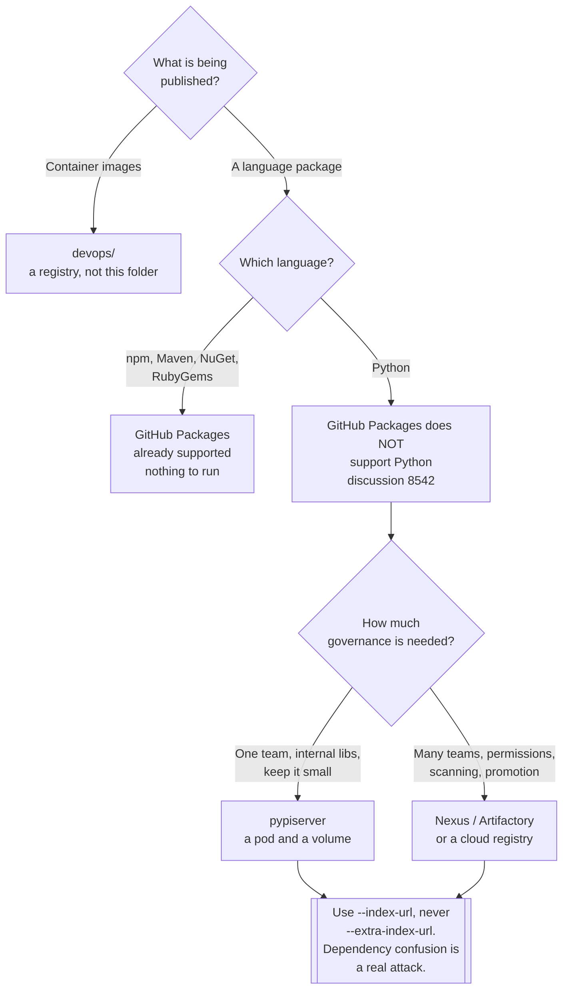

[← Software engineering](../README.md)

# Artifact registry

Somewhere to publish an internal library — and the reason that somewhere cannot be GitHub.

Tools covered: [`pypi-server`](pypi-server/README.md)

## Contents

1. [The problem: shared code without copy-paste](#1-the-problem-shared-code-without-copy-paste)
2. [GitHub Packages does not support Python](#2-github-packages-does-not-support-python)
3. [The options](#3-the-options)
4. [Decision tree](#4-decision-tree)
5. [What a registry has to do beyond serving files](#5-what-a-registry-has-to-do-beyond-serving-files)
6. [Anti-patterns](#6-anti-patterns)
7. [How this applies to pikakube](#7-how-this-applies-to-pikakube)

---

## 1. The problem: shared code without copy-paste

Two services need the same client, the same models, the same set of helpers. There are four ways
to arrange that, and three of them are bad:

| Approach | What happens |
|---|---|
| Copy the files | the copies diverge within a sprint, and a fix lands in one of them |
| A Git submodule | pinned to a commit, not a version; the tooling is hostile; nobody updates it |
| `pip install git+ssh://...` | works, but there is no version resolution, no immutability and every consumer needs repository access |
| **A package in a registry** | a name, a version, a resolver — the model every language already has |

The fourth is the only one that gives **semantic versioning and dependency resolution**, which is
the actual requirement. Once a library is a versioned package, a consumer can pin, upgrade
deliberately, and be told by the resolver when two dependencies disagree.

That requires somewhere to publish it that is not public PyPI. This folder is about that place.

## 2. GitHub Packages does not support Python

This is the finding that decides the whole folder, and it surprises people:

> **GitHub Packages hosts npm, Maven, Gradle, NuGet, RubyGems and container images. It does not
> host Python packages.**

The open community request is recorded here:
<https://github.com/orgs/community/discussions/8542>

Why it matters so much: if GitHub is the forge, the reasonable expectation is that GitHub is also
the registry — that is exactly how it works for a JavaScript or a .NET team, with no extra
infrastructure, using credentials that already exist. A Python team follows the same path, reaches
the end of it, and finds nothing there.

The consequences are concrete:

| Consequence | Detail |
|---|---|
| **Something must be self-hosted** | a registry becomes infrastructure to run, back up and secure |
| **Authentication is separate** | it does not ride on the GitHub token CI already has |
| **Storage is yours** | packages live on a volume that needs backing up |
| **Or a third party** | GitLab, Artifactory, Nexus, or a cloud registry — each a new dependency |

This is not an exotic edge case. It is the ordinary situation for any team on GitHub writing
Python, which is a very large number of teams, and it is the reason a small self-hosted PyPI —
[pypiserver](pypi-server/README.md) — is the entry in this folder rather than a paragraph saying
"use GitHub Packages".

## 3. The options

| Option | Fits when | Cost |
|---|---|---|
| **pypiserver** | one team, internal packages, minimal needs | you run it: a pod, a volume, an htpasswd file |
| **devpi** | Python-specific, with caching and staging indexes | more moving parts than pypiserver |
| **Nexus / Artifactory** | many languages, one registry, real access control | heavy; a platform in its own right |
| **GitLab Package Registry** | already on GitLab — it **does** support PyPI | ties packages to the forge |
| **Cloud-managed** (CodeArtifact, Artifact Registry, Azure Artifacts) | already committed to that cloud | per-request and per-GB cost; another IAM surface |

The honest summary: **pypiserver is deliberately minimal**. It serves and accepts packages over
the PyPI protocols and does very little else — no vulnerability scanning, no promotion between
staging and release, no fine-grained permissions. For an internal library shared between a handful
of services that is the correct amount of tool. For a regulated estate with dozens of teams it is
not, and the answer becomes Nexus or Artifactory.

**Container images are not here.** They belong to `infrastructure/devops/`, which is a different
protocol, a different tool set and a different lifecycle. This folder is language packages only.

## 4. Decision tree

## 5. What a registry has to do beyond serving files

Serving files over HTTP is the easy part. The parts that matter operationally:

| Requirement | Why | With pypiserver |
|---|---|---|
| **Authentication on upload** | otherwise anyone on the network can publish under your names | htpasswd, via `-P` |
| **Authentication on download** | internal package names are information | optional; `-a` controls which actions require it |
| **Durable storage** | the registry is the only copy of a published version | a volume, and a backup of it |
| **Immutability** | a re-uploaded version means two builds of "1.2.3" differ | pypiserver rejects overwrites; do not work around it |
| **Retention** | old versions are still someone's pin | keep them; disk is cheaper than a broken build |
| **TLS** | credentials go over the wire on every upload | an Ingress in front — the pod itself serves plain HTTP |

**Dependency confusion** deserves stating on its own, because the mitigation is one flag:

- `--index-url` **replaces** the index. Only your registry is consulted.
- `--extra-index-url` **adds** to it, and pip may resolve a name from *either* index — typically
  the highest version. If someone registers your internal package name on public PyPI with version
  `99.0.0`, that is what gets installed.

Use `--index-url` pointing at a registry that proxies public PyPI, or pin exactly. The recorded
workflow in [`pypi-server/`](pypi-server/README.md) uses `--index-url`, which is the correct form.

## 6. Anti-patterns

| Anti-pattern | Why it is bad | What to do instead |
|---|---|---|
| Copying shared code between repositories | it diverges immediately, and fixes land in one copy | publish a package |
| `pip install git+ssh://...` in production | no resolution, no immutability, and every consumer needs repo access | a registry |
| `--extra-index-url` to a public index | dependency confusion: a public `99.0.0` wins | `--index-url`, or a proxying registry |
| Re-uploading an existing version | two different builds answer to the same version string | a new version, always |
| The registry on ephemeral storage | published versions vanish on a reschedule | a persistent volume, and back it up |
| No authentication on upload | anyone on the network can publish under your names | htpasswd at minimum |
| Plain HTTP outside a port-forward | credentials in the clear on every publish | TLS at the Ingress |
| Deleting old versions to save disk | someone's build is pinned to them | keep them |
| Publishing by hand from a laptop | unreproducible, and it works only from that laptop | publish from CI, on a tag |
| One registry per team | no shared names, five things to operate | one registry, namespaced by package name |

## 7. How this applies to pikakube

This is one of the folders with **real depth** — a package was built, published and installed end
to end, and the commands are recorded in [`pypi-server/`](pypi-server/README.md). The result
recorded there is *"top!"*: it worked.

What exists:

| Piece | Detail |
|---|---|
| [pypiserver](pypi-server/README.md) | the tool, and the full working publish/install workflow |
| [manifests](pypi-server/pypi-server/README.md) | namespace, deployment, service, PVC, secret, and a Dockerfile that adds htpasswd auth |
| a sample package | `muddy_wave`, from the testdriven.io tutorial, used as the thing to publish |

The open item, recorded and carried forward: the workflow uses `setup.py sdist` and `twine`, which
is **the older way**. The note says to test build and publish with **Poetry and uv** — consistent
with [`../language/python/dependency-management/`](../language/python/dependency-management/README.md),
where uv is already the preference.

The other honest gap: publishing was done by hand through a `kubectl port-forward`. That proved
the registry works; it is not how packages should be published. The next step is a CI job that
publishes on a tag, and an Ingress with TLS so the port-forward is not the access path.

---

[← Software engineering](../README.md)
