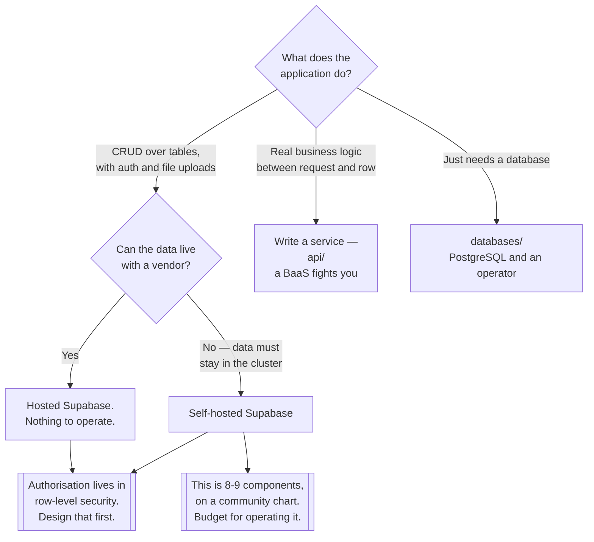

[← Software engineering](../README.md)

# Backend as a service

A database, an API, authentication and file storage from one deployment — and what that costs.

Tools covered: [`supabase`](supabase/README.md)

## Contents

1. [What a BaaS actually is](#1-what-a-baas-actually-is)
2. [What you give up](#2-what-you-give-up)
3. [Self-hosting changes the deal](#3-self-hosting-changes-the-deal)
4. [Decision tree](#4-decision-tree)
5. [The authorisation model is the real decision](#5-the-authorisation-model-is-the-real-decision)
6. [Anti-patterns](#6-anti-patterns)
7. [How this applies to pikakube](#7-how-this-applies-to-pikakube)

---

## 1. What a BaaS actually is

Four things every application needs, assembled once instead of five times:

| Piece | Normally | With a BaaS |
|---|---|---|
| Database | you deploy and operate it | included |
| **CRUD API** | you write a service per table | **generated from the schema** |
| Authentication | a library, or a separate identity provider | included, with providers |
| File storage | object storage, plus a service to sign URLs | included |
| Realtime updates | websockets and a change feed you build | included |

The generated API is the part that changes how an application is written. Instead of a backend
service whose job is to translate HTTP into SQL, the client talks to the database's API directly
and the schema **is** the contract. For a CRUD-shaped application that removes most of the code
that would otherwise exist, and most of the code that would otherwise be reviewed, tested and
deployed.

The honest framing: a BaaS is a **very good default backend for applications that are mostly
tables and forms**, and a poor one for applications whose value is in what happens between the
request and the row.

## 2. What you give up

| Given up | Detail |
|---|---|
| **A place for business logic** | rules move into database policies, triggers and functions — or into the client, which is worse |
| **Schema freedom** | the API is generated from the schema, so a refactor is a public API change |
| **Framework choice** | the auth model, the API shape and the storage semantics are the vendor's |
| **Simple debugging** | a request crosses a gateway, a REST layer and the database before failing |
| **Portability** | leaving means rebuilding the API, the auth and the storage layer |

The first row is the one that decides projects. A BaaS pushes authorisation into the database as
row-level security. That is genuinely powerful — the rule sits next to the data and cannot be
bypassed by a client that forgets to check — and it is genuinely awkward, because policies are
SQL, they are hard to unit test, and complex ones are hard to read.

The failure that follows: rules that do not fit into policies drift into the client, where they
are not enforcement at all.

## 3. Self-hosting changes the deal

Most of a BaaS's appeal is that somebody else runs it. Self-hosting keeps the developer experience
and gives back every operational concern:

| | Hosted | Self-hosted on Kubernetes |
|---|---|---|
| Upgrades | theirs | yours, across every component at once |
| Backups | theirs | yours — and it is a Postgres backup, plus object storage |
| Scaling | theirs | yours |
| Component count | invisible | a gateway, an auth service, a REST layer, storage, realtime, an image proxy, a studio, log collection |
| Data location | theirs | yours — often the actual reason |
| Cost | per usage | a cluster you already run |

That component list is the thing to look at before deciding. A self-hosted BaaS is not one
service; it is **eight or nine services with one name**, and each has its own version, its own
configuration and its own failure mode. What was bought was a productive API surface, and what is
being operated is a distributed system.

The good news is that the important state is ordinary PostgreSQL, which this repository already
knows how to run — see [`../../databases/sql/postgresql/`](../../databases/sql/postgresql/README.md).

## 4. Decision tree

## 5. The authorisation model is the real decision

Everything else about adopting a BaaS is reversible with effort. This is not.

When the client talks to the generated API directly, **the database is the security boundary**.
There is no service layer left to check permissions in, so every rule about who may read or write
which row has to be expressed as a policy the database enforces.

That has consequences worth accepting deliberately:

| Consequence | Detail |
|---|---|
| Policies are the application's security model | if a table has RLS disabled, it is public to anyone with a key |
| Testing them is database testing | not unit tests — a real database, with real roles |
| The service-role key bypasses everything | it must never reach a browser; treat it as a root credential |
| Anonymous keys are public by design | they are shipped to clients; all the protection is in the policies |

The single most common self-hosted BaaS incident is a table with RLS left off, reachable with the
anonymous key. **Default-deny, then add policies** — not the reverse.

## 6. Anti-patterns

| Anti-pattern | Why it is bad | What to do instead |
|---|---|---|
| A table without row-level security | anyone with the public key can read it | default-deny; enable RLS on every table |
| The service-role key in a client | it bypasses every policy | server-side only; rotate if exposed |
| Business logic in the client | it is not enforcement, it is a suggestion | policies, database functions, or a real service |
| A BaaS for a logic-heavy application | you fight the generated API on every endpoint | write the service — `api/` |
| Self-hosting to "save money" | eight components to operate is not free | self-host for data location or control |
| Default demo credentials left in place | the values file ships insecure ones on purpose | generate and store them properly |
| No backup of the database | the BaaS is the system of record for everything | a Postgres backup, plus the object store |
| Treating the generated API as internal | it is the client-facing contract | schema changes are API changes |
| Pinning nothing | a chart that follows a branch upgrades nine components at once | pin, and upgrade deliberately |

## 7. How this applies to pikakube

[Supabase](supabase/README.md) is the only entry, and it **is deployed via Flux**: a
`GitRepository` tracking `supabase-community/supabase-kubernetes` on `main` with an `ignore`
rule that pulls only `charts/supabase`, a `HelmRelease` for it, and a namespace.

Two facts about that arrangement matter more than the rest:

- **The chart is community-maintained, not official.** Supabase's supported self-hosting path is
  Docker Compose. That is not a reason to avoid it, but it is a reason to pin.
- **The source is a Git branch, not a chart version.** `ref.branch: main` means the chart moves
  when upstream moves. For a nine-component stateful application that is the riskiest possible
  upgrade policy. Compare with [SonarQube](../code-quality/static-analysis/sonarqube/README.md),
  where the chart version is pinned to `2026.3.1` — same problem, handled.

The values in the release are unmistakably from the upstream example: `example.com` URLs,
`xxxxxxxxxxxxxxxxx` JWT keys and the literal string
`this_password_is_insecure_and_should_be_updated`. That is a mapped deployment rather than a
running one, and the credentials are the first thing to fix.

The boundary with the rest of the repository: Supabase brings **its own PostgreSQL**, deployed by
the chart with a 1Gi volume, entirely separate from
[`../../databases/sql/postgresql/`](../../databases/sql/postgresql/README.md) and its operators. Two
PostgreSQL deployments with two different lifecycles is a real cost, and worth being a decision
rather than an accident.

---

[← Software engineering](../README.md)
