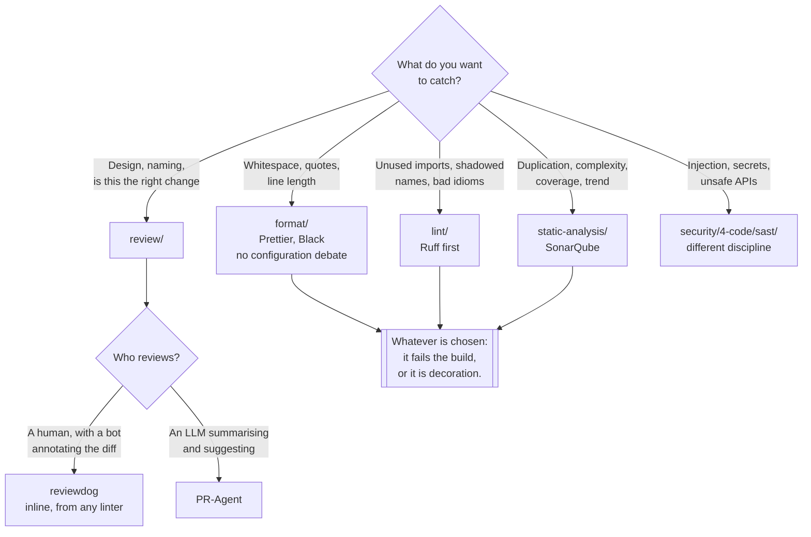

[← Software engineering](../README.md)

# Code quality

Four different questions about the same source file — and four different places to answer them.

Subfolders: [`format/`](format/README.md) — Prettier ·
[`lint/`](lint/README.md) — Ruff, pylint, and the rest of the Python set ·
[`static-analysis/`](static-analysis/README.md) — SonarQube ·
[`review/`](review/README.md) — reviewdog, PR-Agent, Open Code Review

## Contents

1. [Four questions, not one](#1-four-questions-not-one)
2. [Why the folders are grouped this way](#2-why-the-folders-are-grouped-this-way)
3. [The boundary with security](#3-the-boundary-with-security)
4. [Where each check runs](#4-where-each-check-runs)
5. [Decision tree](#5-decision-tree)
6. [Anti-patterns](#6-anti-patterns)
7. [How this applies to pikakube](#7-how-this-applies-to-pikakube)

---

## 1. Four questions, not one

"Code quality" is used as if it were a single activity. It is four, and they differ in scope, in
speed, and in whether a machine can decide the answer:

| Question | Scope | Judgement | Folder |
|---|---|---|---|
| **Does it look the same as everything else?** | one file, syntax only | none — mechanical | [`format/`](format/README.md) |
| **Does it break a rule we agreed on?** | one file, sometimes a module | encoded in rules | [`lint/`](lint/README.md) |
| **Is the codebase getting worse over time?** | the whole project, across commits | measured, trended | [`static-analysis/`](static-analysis/README.md) |
| **Is this change a good idea?** | the diff, in context | genuine judgement | [`review/`](review/README.md) |

The ordering is not arbitrary. Each level is slower, broader and less mechanical than the one
above it, and **each one should stop bothering the next**. A reviewer who spends a comment on
indentation is doing the formatter's job; a formatter that has opinions about cyclomatic
complexity is doing SonarQube's.

## 2. Why the folders are grouped this way

This folder was reorganised, and the grouping is the point of it:

| Was | Is now | Why |
|---|---|---|
| `code-review/` at the top level | [`review/`](review/README.md) | it is one of four peers, not a sibling of the whole discipline |
| `sonarqube/` loose at the top level | [`static-analysis/`](static-analysis/README.md)`/sonarqube/` | a tool needed a capability above it, so a second one has somewhere to go |

The rule the tree now follows: **the top level names a question, the level below names a tool.**
`sonarqube/` sitting directly under `code-quality/` broke that — it put a product name at the
same level as an activity, which meant the next static-analysis tool evaluated would have had
nowhere obvious to live. `static-analysis/` fixes that with one directory and no new content.

The same reasoning renamed `code-review/` to `review/`: inside `code-quality/`, the word "code"
was already implied, and the folder is a peer of `format/` and `lint/`, not a heading for them.

A consequence worth stating: [`format/`](format/README.md) currently holds a single tool and
[`lint/`](lint/README.md) holds none as subfolders — only a catalogue. That is fine. The taxonomy
exists so the folders are correct when they fill up, not because they are full now.

## 3. The boundary with security

There is a real overlap, and it is the one most often collapsed by mistake.

SonarQube and Semgrep both parse source code and both report findings on it. They answer
different questions:

| | Here — `code-quality/static-analysis/` | Security — `security/4-code/sast/` |
|---|---|---|
| Asks | **is this maintainable?** | **is this exploitable?** |
| Findings | duplication, complexity, dead code, coverage, code smells | injection, unsafe deserialisation, hardcoded secrets |
| Owner | the team that maintains the code | the team accountable for risk |
| Failing the build means | quality gate not met | a vulnerability ships |

The security discipline holds Semgrep, Bandit, CodeQL, gosec and Horusec under
`infrastructure/security/4-code/sast/`. That path is deliberately not a link here — the folder
exists, its README does not yet, and this repository does not link to files that are not there.

**Neither substitutes for the other.** A codebase can be immaculate by SonarQube's measures and
still concatenate user input into SQL; it can be free of every CWE Semgrep knows and still be
unmaintainable. Running one and calling it "static analysis, done" is the anti-pattern.

## 4. Where each check runs

The same check costs very different amounts depending on where it fires, and the cheapest place
that can catch a class of problem is where it belongs:

| Stage | What belongs there | Why |
|---|---|---|
| **Editor** | formatter on save, linter inline | the feedback loop is seconds — see [`lint/`](lint/README.md) on the pylint extension |
| **Pre-commit hook** | formatter, fast linter | catches it before it is anyone else's problem |
| **CI, on every push** | formatter check (`--check`), linter, unit tests | the enforcement point — the only one that cannot be skipped |
| **CI, on the pull request** | static analysis, automated review comments | needs the diff and the base branch to be meaningful |
| **Scheduled** | full-project scan, trend metrics | too slow per-commit, and the value is the trend |

Two rules that make this work:

- **The pre-commit hook is a convenience, not a gate.** Anyone can pass `--no-verify`. If a check
  matters, it runs in CI as well.
- **The formatter runs in `--check` mode in CI, not in write mode.** A pipeline that reformats and
  pushes is a pipeline that fights the developer's next rebase.

## 5. Decision tree

## 6. Anti-patterns

| Anti-pattern | Why it is bad | What to do instead |
|---|---|---|
| Linting that only warns | it is ignored within a fortnight, then permanently | fail the build |
| Formatting discussed in review | the most expensive way to decide where a brace goes | a formatter, no options |
| A formatter and a linter that disagree | every commit flips the same lines back and forth | one owns style; the linter disables those rules |
| Introducing a linter on a legacy repo at full strictness | ten thousand findings, so nobody reads any of them | fail only on new code; ratchet |
| Static analysis treated as security | maintainability and exploitability are different questions | run both — see section 3 |
| Quality gate applied to the whole codebase from day one | it is red on day one and stays red | gate on the diff, not the total |
| CI that reformats and pushes | the branch moves under the developer | `--check` mode; let it fail |
| An AI reviewer as the only reviewer | it has no context on why the change exists | it annotates; a person approves |
| Suppression comments with no reason | `# noqa` accumulates until the rule is meaningless | require a rule code and a reason |
| A different linter per repository | no shared standard, and no shared fixes | one configuration, shared |

## 7. How this applies to pikakube

What actually exists here is a **catalogue with one deployed tool**:
[SonarQube](static-analysis/sonarqube/README.md) has Flux manifests — a `HelmRepository`, a
`HelmRelease` pinned to chart version `2026.3.1`, and a namespace. Everything else in this folder
is evaluated rather than running.

The recorded opinions worth carrying forward, because they are judgements rather than facts:

- **Ruff is the recommendation for Python** — see [`lint/`](lint/README.md). It replaces flake8,
  isort, pycodestyle, autopep8 and much of pylint with one Rust binary, from the same vendor as
  `uv`, which this repository already prefers for
  [dependency management](../language/python/dependency-management/README.md).
- **The VS Code pylint extension is very good** — recorded from use, and the reason pylint is
  still worth having next to Ruff.
- **EditorConfig is redundant here** — "linters already cover this". It is catalogued so the
  decision is visible rather than repeated.

The gap: nothing in [`review/`](review/README.md) is deployed, and the three tools there are not
alternatives to each other — reviewdog is plumbing, PR-Agent and Open Code Review are LLM
reviewers. That distinction is in that folder's README, and it is the one to get right before
installing any of them.

---

[← Software engineering](../README.md)
