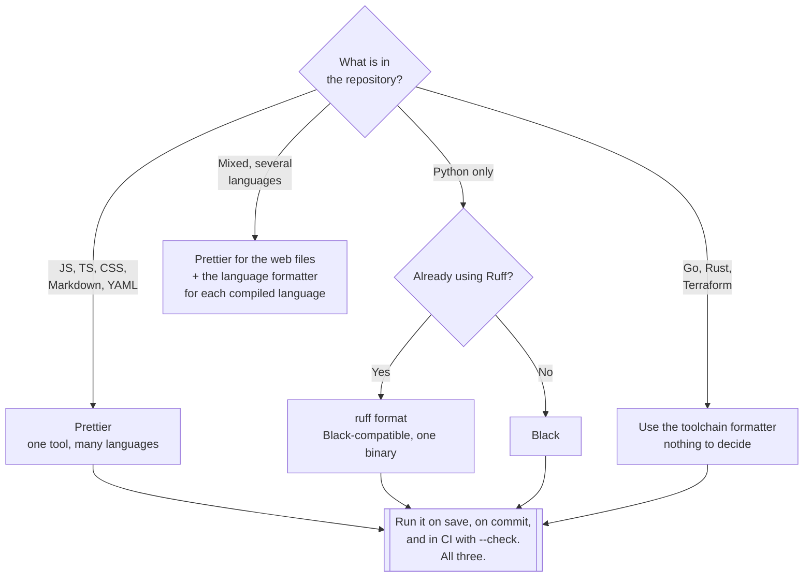

[← Code quality](../README.md)

# Format

Ending the argument about whitespace by removing the option to have one.

Tools covered: [`prettier`](prettier/README.md)

## Contents

1. [The problem](#1-the-problem)
2. [Formatting is not linting](#2-formatting-is-not-linting)
3. [The tools, by language](#3-the-tools-by-language)
4. [Decision tree](#4-decision-tree)
5. [Making it stick](#5-making-it-stick)
6. [Anti-patterns](#6-anti-patterns)
7. [How this applies to pikakube](#7-how-this-applies-to-pikakube)

---

## 1. The problem

Formatting is the only part of code quality where the correct answer does not matter — only that
everyone has the same one. Two costs come from not having it:

| Cost | What it looks like |
|---|---|
| **Review noise** | comments about indentation, quote style and trailing commas, on every pull request |
| **Diff noise** | a one-line change shows as forty, because an editor reflowed the file |

The second is the expensive one. A diff that cannot be read is a diff that is not reviewed, and
`git blame` stops answering questions once a file has been reformatted by three different editors.

The fix is a single formatter, run automatically, with **as few options as possible**. An
opinionated formatter is not a limitation — the opinions are the product.

## 2. Formatting is not linting

These get conflated, and it causes tools to fight each other:

| | **Formatter** | **Linter** |
|---|---|---|
| Changes | how the code **looks** | flags how the code **behaves** |
| Semantics | never altered | never altered, but the fix might |
| Decidable | yes — one correct output | no — rules encode judgement |
| Disagreement possible | no | yes, constantly |
| Examples | Prettier, Black, `gofmt` | Ruff, pylint, ESLint |

The practical consequence: **the formatter owns style, and the linter must be told to shut up
about it.** Ruff and pylint both ship stylistic rules that will contradict a formatter; those
rules get disabled once a formatter is in place. Running both with default configuration produces
a loop where each tool undoes the other, which is the most common way this setup fails.

See [`../lint/`](../lint/README.md) for the other side of that boundary — including the note that
Black, catalogued there, is really a formatter and belongs conceptually here.

## 3. The tools, by language

| Language | Tool | Notes |
|---|---|---|
| JS, TS, CSS, HTML, JSON, YAML, Markdown | **Prettier** | the default; multi-language is its main advantage — [→](prettier/README.md) |
| Python | **Black**, or `ruff format` | Ruff's formatter is Black-compatible and much faster — see [`../lint/`](../lint/README.md) |
| Go | `gofmt` / `gofumpt` | shipped with the toolchain; the settled case |
| Rust | `rustfmt` | same — part of the toolchain |
| Terraform | `terraform fmt` | built into the CLI |

The pattern across all of them: the languages where formatting is a solved, non-discussed problem
are the ones where the formatter came **with the toolchain**. Prettier and Black earned the same
position by being opinionated enough that configuring them stopped being interesting.

## 4. Decision tree

## 5. Making it stick

A formatter that is not automatic is a formatter that is applied inconsistently, which is worse
than none — it produces reformatting commits.

| Where | How | Purpose |
|---|---|---|
| **Editor** | format on save | the developer never thinks about it |
| **Pre-commit** | a hook that rewrites the staged files | catches whoever has not configured their editor |
| **CI** | `--check` mode: report and exit non-zero | the enforcement point; **never rewrite and push** |

Two details that matter more than they look:

- **Adopt in one commit, and record it.** Reformatting an existing repository ruins `git blame`
  once. Do it in a single commit that touches nothing else, and add its hash to
  `.git-blame-ignore-revs` so `git blame --ignore-revs-file` skips it.
- **CI checks, it does not fix.** A pipeline that commits a reformat pushes to the developer's
  branch under them and turns the next `git pull` into a conflict.

## 6. Anti-patterns

| Anti-pattern | Why it is bad | What to do instead |
|---|---|---|
| Style debated in code review | the most expensive way to decide where a brace goes | a formatter, and no discussion |
| A formatter and a linter both owning style | each undoes the other, forever | the formatter wins; disable the linter's style rules |
| Manual formatting runs | applied inconsistently, so diffs stay noisy | on save, on commit, in CI |
| Reformatting mixed into a feature commit | the real change is invisible in the diff | a separate, formatting-only commit |
| CI that formats and pushes | the branch moves under the developer | `--check`, and let it fail |
| Heavily customised formatter config | reintroduces the argument the tool exists to end | defaults, unless there is a concrete reason |
| Different formatters per directory | the boundary becomes a permanent source of churn | one per language, repository-wide |
| Formatting an inherited repo file by file | `git blame` degrades gradually and permanently | one big-bang commit, ignored in blame |

## 7. How this applies to pikakube

This folder holds **one tool**: [Prettier](prettier/README.md), catalogued rather than deployed.
It is a build-time concern rather than a cluster service, so there is nothing to run on
Kubernetes — the correct home for it is a pre-commit hook and a CI job in each repository.

The gap worth naming: this repository's own content is largely **Python, YAML and Markdown**.
Prettier covers YAML and Markdown; the Python side is covered by Black or `ruff format`, which are
catalogued in [`../lint/`](../lint/README.md) rather than here — a classification the
[`../README.md`](../README.md) taxonomy would put here, and which is left as recorded because that
is where the original notes put them.

Neither is currently wired into CI in this repository. That is the honest state: the decision is
documented, the enforcement is not built.

---

[← Code quality](../README.md)
