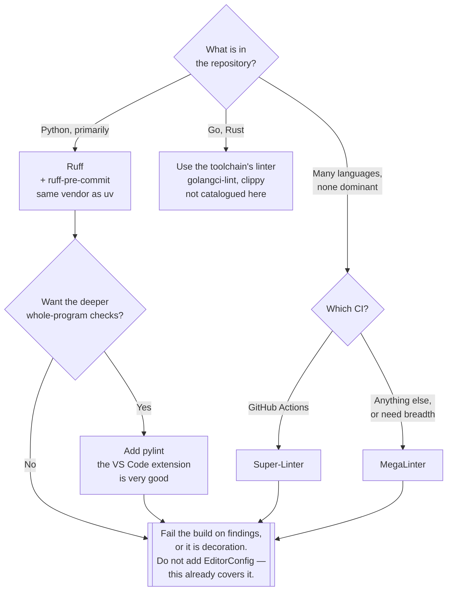

[← Code quality](../README.md)

# Lint

Rules that a machine can check, enforced before anyone has to read the code.

Tools covered: Ruff · pylint · flake8 · isort · pycodestyle · autopep8 · Black · MegaLinter ·
Super-Linter · EditorConfig — catalogued as [a table in section 3](#3-the-tools), with upstream
links. There are no tool subfolders here; nothing in this folder is deployed.

## Contents

1. [What a linter is actually for](#1-what-a-linter-is-actually-for)
2. [The Python set, and how it collapsed](#2-the-python-set-and-how-it-collapsed)
3. [The tools](#3-the-tools)
4. [Meta-linters](#4-meta-linters)
5. [Decision tree](#5-decision-tree)
6. [Adopting a linter on code that already exists](#6-adopting-a-linter-on-code-that-already-exists)
7. [Anti-patterns](#7-anti-patterns)
8. [Notes](#8-notes)
9. [How this applies to pikakube](#9-how-this-applies-to-pikakube)

---

## 1. What a linter is actually for

Not style — [`../format/`](../format/README.md) owns that. A linter exists to catch the class of
mistake that is **syntactically legal and obviously wrong**:

| Category | Example |
|---|---|
| Certain bugs | a mutable default argument; comparing with `is` instead of `==` |
| Dead weight | unused imports, unreachable code, variables assigned and never read |
| Shadowing | a local named `list`, or a variable that hides an outer one |
| Bad idioms | a bare `except:`; string concatenation in a loop |
| Complexity | a function with fifteen branches |

The value is the **timing**, not the finding. Every one of these would eventually be caught by a
test, a reviewer, or an incident. A linter catches them in the editor, for free, before the
developer has moved on to the next thing.

The rule that decides whether any of this is worth configuring: **a linter that only warns is
decoration.** Findings that do not fail the build are ignored within a fortnight and permanently
thereafter.

## 2. The Python set, and how it collapsed

Python's tooling accumulated as one tool per concern, each with its own configuration file, its
own plugin ecosystem and its own opinions:

| Concern | Tool |
|---|---|
| Style — PEP 8 conformance | pycodestyle |
| Style + a few bug checks, plugin host | flake8 |
| Deep static checks, type inference, complexity | pylint |
| Import ordering | isort |
| Automatically fixing PEP 8 violations | autopep8 |
| Formatting | Black |

A typical repository ran four of these, and paid for it in three ways: four configuration files
that had to be kept mutually consistent, four chances for the tools to contradict each other, and
a pre-commit hook slow enough that people started skipping it.

**Ruff replaced most of that.** It is written in Rust, reimplements the rules of flake8,
pycodestyle, isort, autopep8 and a large part of pylint behind a single configuration in
`pyproject.toml`, and runs one to two orders of magnitude faster — fast enough that linting the
whole repository on every keystroke is reasonable.

That speed is not a vanity metric. It changes where the linter can run: a tool that takes ten
seconds belongs in CI, and a tool that takes fifty milliseconds belongs in the editor, where the
feedback is worth far more.

**Ruff is the recommendation here.** It comes from Astral, the same vendor as `uv`, which this
repository already prefers for
[Python dependency management](../../language/python/dependency-management/README.md) — so it is
also one fewer vendor and one fewer toolchain to reason about.

What Ruff does **not** replace: pylint's deepest whole-program checks, and type checking, which
was never a linter's job in the first place (that is mypy or pyright, and neither is catalogued
here).

## 3. The tools

| Tool | What it is | Verdict | Link |
|---|---|---|---|
| **Ruff** | linter + formatter, Rust, from Astral | **the recommendation** — replaces the five rows below it | <https://github.com/astral-sh/ruff> |
| **ruff-pre-commit** | the pre-commit hook for Ruff | how it gets wired in; use it | <https://github.com/astral-sh/ruff-pre-commit> |
| **pylint** | the deep, opinionated Python linter | still worth having — the VS Code extension is very good | <https://github.com/pylint-dev/pylint> |
| **flake8** | pycodestyle + pyflakes + a plugin system | superseded by Ruff | <https://github.com/PyCQA/flake8> |
| **isort** | sorts and groups imports | superseded — Ruff implements the same rules (`I`) | <https://github.com/PyCQA/isort> |
| **pycodestyle** | PEP 8 conformance only | superseded — Ruff implements it (`E`, `W`) | <https://github.com/PyCQA/pycodestyle> |
| **autopep8** | auto-fixes PEP 8 violations | superseded by `ruff --fix` and by formatters | <https://github.com/hhatto/autopep8> |
| **Black** | the opinionated Python formatter | a **formatter**, not a linter — see [`../format/`](../format/README.md); `ruff format` is compatible with it | <https://github.com/psf/black> |
| **MegaLinter** | meta-linter, many languages, CI-oriented | useful for polyglot repositories; heavy | <https://github.com/oxsecurity/megalinter> |
| **Super-Linter** | GitHub's meta-linter action | same idea, GitHub Actions-native | <https://github.com/super-linter/super-linter> |
| **EditorConfig** | per-editor whitespace settings | **redundant here** — linters and formatters already cover it | <https://github.com/editorconfig/editorconfig> |

Black is catalogued in this folder because that is where the original notes recorded it. It is a
formatter and conceptually belongs in [`../format/`](../format/README.md); the classification is
left visible rather than silently moved, because knowing which tool is which is exactly the
distinction that keeps a formatter and a linter from fighting.

## 4. Meta-linters

MegaLinter and Super-Linter solve a different problem from the tools above: a repository with
Python, YAML, Dockerfiles, shell scripts, Markdown and Terraform in it needs six linters, and
wiring six linters into CI is six pieces of maintenance.

A meta-linter bundles them into one container and one CI step.

| | Advantage | Cost |
|---|---|---|
| **MegaLinter** | very broad language coverage; runs anywhere Docker runs | a large image; slow; configuring what to disable takes real effort |
| **Super-Linter** | native to GitHub Actions, minimal setup | tied to GitHub; less configurable |

The trade-off is honest and worth stating: a meta-linter is **the fastest way to get some linting
on everything**, and **a poor way to get good linting on the main language**. The default rule
sets are generic, and the first run on an existing repository produces thousands of findings.

The reasonable split: a meta-linter for the long tail of file types, and the language's own
linter — Ruff for Python — configured properly for the code that actually matters.

## 5. Decision tree

## 6. Adopting a linter on code that already exists

Turning a linter on at full strictness against an existing codebase produces several thousand
findings, and the reliable outcome of several thousand findings is that nobody reads any of them.
The rule set then gets disabled, and the exercise has cost effort and produced nothing.

Two approaches that work:

| Approach | How |
|---|---|
| **Ratchet** | enable a small rule set, fail the build, add rules one at a time as they are fixed |
| **New code only** | measure findings on the diff, not the codebase; the total falls as files are touched |

The second is what SonarQube calls a *clean-as-you-code* gate — see
[`../static-analysis/`](../static-analysis/README.md), where the same idea is the central design
of the tool.

Whichever is chosen, the fixes land in a **separate commit** from feature work. A pull request in
which two hundred lines of lint fixes surround the actual change is a pull request nobody can
review.

## 7. Anti-patterns

| Anti-pattern | Why it is bad | What to do instead |
|---|---|---|
| A linter that only warns | ignored within a fortnight | fail the build |
| Enabling every rule on day one | thousands of findings, so none are read | ratchet, or gate on new code only |
| Linter and formatter both owning style | each undoes the other on every commit | the formatter wins; disable the linter's style rules |
| `# noqa` with no rule code or reason | the suppression outlives the reason for it | require a specific code and a comment |
| Four Python linters where one would do | four configs, four disagreements, a slow hook | Ruff |
| Linting only in CI | the feedback arrives minutes late, after the context is gone | the editor first, CI as the gate |
| A meta-linter as the only linter for the main language | generic rule sets, tuned for nothing | the language's own linter, configured |
| A different configuration per repository | no shared standard and no shared fixes | one shared config |
| Adding EditorConfig on top of a formatter | a second source of truth for whitespace | let the formatter decide |
| Lint fixes mixed into a feature branch | the real change is invisible | a separate commit |

## 8. Notes

Everything recorded in the original note for this folder, preserved and explained.

**Reference videos** — recorded as-is, without titles:

- <https://www.youtube.com/watch?v=7_eAQ7SeuEg>
- <https://www.youtube.com/watch?v=bqxXWfCrUXs>

**Tool links** — all of them are in [the table in section 3](#3-the-tools), which is the
organised form of the original flat list: flake8, isort, pylint, Black, pycodestyle, autopep8,
Ruff, ruff-pre-commit, MegaLinter, Super-Linter and EditorConfig.

**Recorded opinions**, both worth carrying forward because they are judgements rather than facts:

| Note (original) | Translated | What it means |
|---|---|---|
| *"extensão vscode pylint muito bom"* | **the VS Code pylint extension is very good** | this is the argument for keeping pylint after adopting Ruff: the value is inline, in the editor, where its deeper checks are cheap to act on. In CI, Ruff covers most of what pylint reports and does it far faster. |
| *"linters já matam isso"* (against EditorConfig) | **linters already cover this** | EditorConfig configures editors — indentation, line endings, trailing whitespace. Once a formatter rewrites the file and a linter fails the build, EditorConfig is a third place where the same settings live and a third place they can drift. Recorded as a deliberate decision not to adopt it, so it does not get re-proposed. |

## 9. How this applies to pikakube

Nothing here is deployed, and nothing here should be — linters run in editors, pre-commit hooks
and CI, not in a cluster. This folder is a **decision record**, and the decision is Ruff.

For this repository specifically:

| Content | Tool |
|---|---|
| Python — the Flask, FastAPI and Celery examples under `api/` and `messaging/` | **Ruff**, via `ruff-pre-commit` |
| YAML — the Flux manifests, which are most of the repository | not covered by anything here; `yamllint` or a meta-linter would be the answer |
| Markdown — these READMEs | Prettier, in [`../format/`](../format/README.md) |

The gap is the middle row, and it is the one that would find real problems: a repository that is
mostly Kubernetes YAML has no linting on its YAML. MegaLinter or Super-Linter would close it in
one CI step, at the cost of a slow job — which for a documentation-and-manifests repository is an
acceptable trade.

---

[← Code quality](../README.md)
