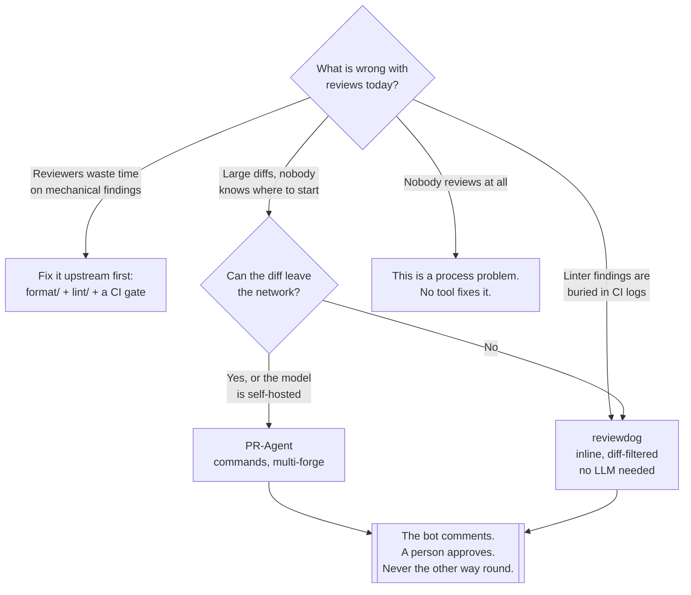

[← Code quality](../README.md)

# Review

The part no formatter, linter or scanner can do — and the tools that keep them out of its way.

Tools covered: [`reviewdog`](reviewdog/README.md) ·
[`pr-agent`](pr-agent/README.md) · [`open-code-review`](open-code-review/README.md)

## Contents

1. [What review is for](#1-what-review-is-for)
2. [Three tools, three different jobs](#2-three-tools-three-different-jobs)
3. [What an LLM reviewer is good at](#3-what-an-llm-reviewer-is-good-at)
4. [Decision tree](#4-decision-tree)
5. [What makes review work](#5-what-makes-review-work)
6. [Anti-patterns](#6-anti-patterns)
7. [How this applies to pikakube](#7-how-this-applies-to-pikakube)

---

## 1. What review is for

Everything a machine can decide should have been decided before the pull request opened —
formatting by [`../format/`](../format/README.md), rule violations by
[`../lint/`](../lint/README.md), complexity and duplication by
[`../static-analysis/`](../static-analysis/README.md).

What is left is the part that needs a person who knows why the change exists:

| Question | Why no tool answers it |
|---|---|
| Is this solving the right problem? | the tool cannot see the ticket, the incident, or the conversation |
| Does this belong here? | architecture is a decision, not a property of the diff |
| Will the next person understand it? | readability is judgement about a specific team |
| What happens when this fails? | requires knowing the operational context |
| Is there a simpler way? | requires knowing what else exists in the codebase |

The corollary: **every automated comment about style is stealing attention from those five
questions.** That is the argument for the tools in this folder — not that they review the code,
but that they clear the mechanical findings out of the way so the human review is about something
worth arguing over.

## 2. Three tools, three different jobs

These are catalogued together and are **not alternatives to each other**. Choosing between them
as if they were is the mistake this section exists to prevent:

| Tool | What it is | What it produces | Needs an LLM |
|---|---|---|---|
| **reviewdog** | plumbing — a pipe from any linter to the pull request | inline comments on the changed lines, from tools you already run | no |
| **PR-Agent** | an LLM reviewer with commands (`/review`, `/describe`, `/improve`) | a summary, a description, suggestions | yes |
| **Open Code Review** | Alibaba's open-source AI review tool | automated review comments | yes |

**reviewdog is the one with no downside.** It runs no analysis of its own; it reads the output of
a linter, filters findings to the lines the diff actually touched, and posts them as review
comments or a check. If Ruff is already in CI, reviewdog is the difference between "the build is
red, go look at the log" and "line 43 is the problem".

The filtering is the whole value. Running a linter over a legacy repository produces thousands of
findings; reviewdog shows only the ones the author introduced, which makes adopting a linter on an
existing codebase possible at all — the ratchet strategy from [`../lint/`](../lint/README.md), but
implemented in the review surface.

PR-Agent and Open Code Review are the actual alternatives to each other: both are LLMs reading
the diff and writing comments.

## 3. What an LLM reviewer is good at

Stated plainly, because the marketing around this category is not:

| Genuinely useful | Genuinely weak |
|---|---|
| Summarising a large diff so a reviewer knows where to start | knowing whether the change should exist |
| Writing the pull request description the author did not | architectural fit |
| Spotting a missing null check, an unhandled error path | anything requiring context outside the diff |
| Catching the copy-paste bug in the fourth near-identical block | judging whether an abstraction is worth it |
| Reviewing at 3am when nobody else is available | being accountable for the outcome |

Two costs that are real and rarely mentioned:

- **Comment volume.** An LLM reviewer will find something to say about every file. Unfiltered,
  it produces exactly the noise this folder exists to remove, and reviewers learn to scroll past
  it — at which point it is worse than nothing, because the real comments are in the same stream.
- **The code leaves the building.** Both LLM tools send the diff to a model. Self-hosting the
  model or using a provider with an appropriate agreement is a prerequisite, not a detail.

The position that holds up: **an LLM annotates, a person approves.** Configure it to comment, not
to block, and never let it be the only reviewer.

## 4. Decision tree

## 5. What makes review work

The tooling is the smaller half. The things that decide whether review catches anything:

| Practice | Why |
|---|---|
| **Small pull requests** | review quality falls off a cliff past a few hundred lines; beyond that it becomes approval |
| **CI green before review** | a human reading code a machine has not yet checked is wasted attention |
| **A description that says why** | the diff shows what changed; only the author knows why |
| **Comments distinguish blocking from optional** | otherwise every nit reads as a veto |
| **One reviewer who is accountable** | "anyone can review" means nobody does |

The first row dominates everything else. A tool that summarises a two-thousand-line pull request
is treating the symptom; the disease is the two-thousand-line pull request.

## 6. Anti-patterns

| Anti-pattern | Why it is bad | What to do instead |
|---|---|---|
| An AI reviewer as the only reviewer | it has no context on why the change exists, and cannot be accountable | it annotates; a person approves |
| Style comments in review | the most expensive way to enforce formatting | [`../format/`](../format/README.md), in CI |
| Linter output only in the CI log | the finding is three clicks from the code it concerns | reviewdog, inline on the diff |
| Bot comments on the whole file, not the diff | thousands of pre-existing findings drown the change | diff-filtered reporting |
| An LLM reviewer that blocks merges | a false positive stops delivery, and the tool gets disabled | comment-only |
| Two-thousand-line pull requests | review degrades into approval | split the change |
| Review before CI passes | humans doing a machine's first pass | gate on CI, then request review |
| Sending proprietary code to a hosted model unexamined | the diff is the most sensitive thing in the repository | self-host, or check the agreement first |
| Approving to unblock | the process still exists, but stops catching anything | make review a real gate, or drop the pretence |

## 7. How this applies to pikakube

Nothing here is deployed. All three tools are **catalogued**, and each folder records only the
upstream repository — an honest reflection of where the evaluation stands.

The order of adoption that makes sense for this repository:

1. **reviewdog first.** It has no LLM dependency, no data-egress question and no running cost. It
   only becomes useful once there is a linter in CI to feed it, which there is not yet — see
   [`../lint/`](../lint/README.md). Those two are a single piece of work, not two.
2. **An LLM reviewer second, if at all.** [PR-Agent](pr-agent/README.md) is the more established
   of the two options recorded here; [Open Code Review](open-code-review/README.md) is noted but
   not evaluated. Both require deciding where the diff goes before either can be installed.

This is also the folder that moved: it was `code-quality/code-review/` and is now `review/`,
because inside `code-quality/` the word "code" was redundant and the folder is a peer of
[`format/`](../format/README.md), [`lint/`](../lint/README.md) and
[`static-analysis/`](../static-analysis/README.md) rather than a heading above them. The reasoning
is in [`../README.md`](../README.md).

---

[← Code quality](../README.md)
