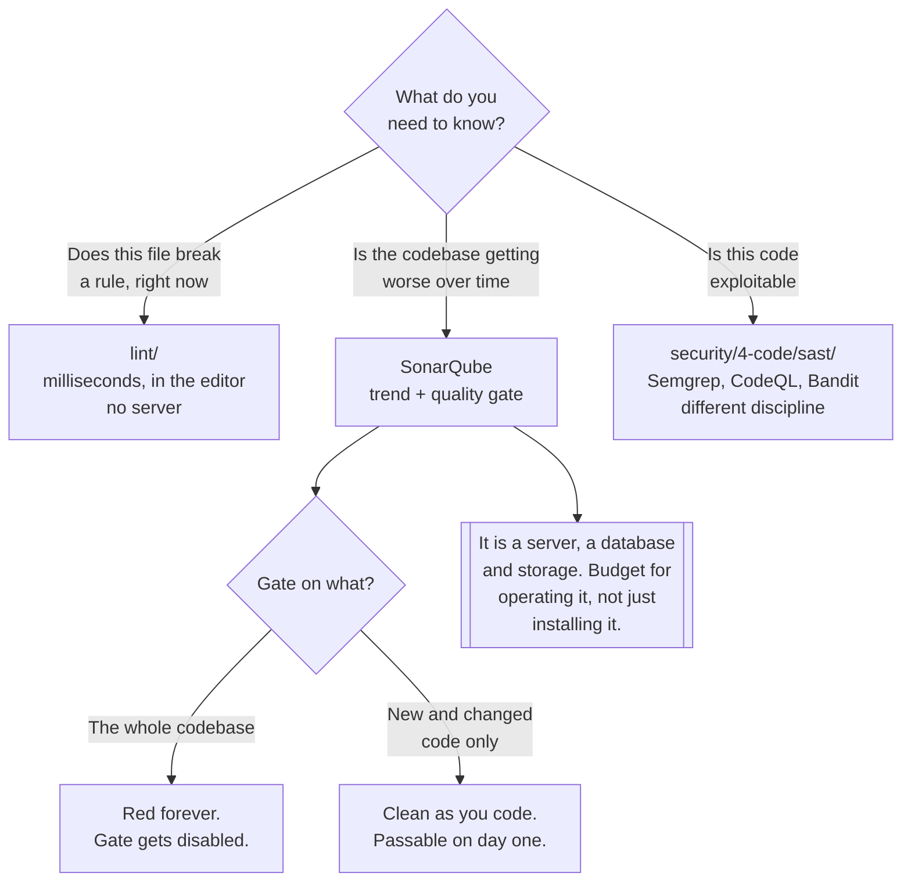

[← Code quality](../README.md)

# Static analysis

Measuring whether the codebase is getting better or worse — across the whole project, over time.

Tools covered: [`sonarqube`](sonarqube/README.md)

## Contents

1. [What this adds over a linter](#1-what-this-adds-over-a-linter)
2. [Clean as you code](#2-clean-as-you-code)
3. [The boundary with security](#3-the-boundary-with-security)
4. [Decision tree](#4-decision-tree)
5. [The operational cost](#5-the-operational-cost)
6. [Anti-patterns](#6-anti-patterns)
7. [How this applies to pikakube](#7-how-this-applies-to-pikakube)

---

## 1. What this adds over a linter

A linter reads one file and applies rules to it. Static analysis in this sense reads the **whole
project**, keeps the results, and compares them to last week:

| | **Linter** | **Static analysis platform** |
|---|---|---|
| Scope | a file, sometimes a module | the whole project, across files |
| State | none — stateless per run | a database of every scan |
| Output | a list of findings | findings **plus a trend**, plus a gate |
| Finds | unused imports, bad idioms | duplication across files, complexity, dead code, coverage gaps |
| Runs | in the editor, in milliseconds | in CI, in minutes |
| Needs | a binary | a server, a database, storage |

Three things only the second column can do:

- **Cross-file duplication.** The same forty lines in three services is invisible to a per-file
  linter and obvious to a project-wide scan.
- **Trend.** "Complexity is rising" is a fact about two scans, not one. It is also the only
  finding in this category that reliably changes behaviour.
- **A gate with memory.** A rule that says *the new code must be clean* requires knowing what the
  old code looked like.

That last one is the reason the category exists at all, and it deserves its own section.

## 2. Clean as you code

The failure mode of every quality tool applied to an existing codebase: turn it on, receive four
thousand findings, gate on the total, watch the gate stay red forever, disable the gate.

The way out is to **stop measuring the codebase and start measuring the change**:

| Gate on | Result |
|---|---|
| The whole codebase | red on day one, red on day two hundred, ignored by day three |
| **New and changed code only** | passable immediately; the total falls as files are touched |

Under this model the pull request that adds untested, duplicated, over-complex code fails, and the
pull request that touches nothing else passes — regardless of how bad the surrounding file is. The
existing debt is paid down by whoever next has a reason to edit that file, which is the only
schedule on which it ever actually gets paid.

The same idea appears in [`../lint/`](../lint/README.md) as the ratchet, and in
[`../review/`](../review/README.md) as reviewdog's diff filtering. Three tools, one principle: **a
finding on a line nobody is touching is not actionable.**

## 3. The boundary with security

SonarQube and Semgrep both parse source code and both produce findings on it. They are not
substitutes, and treating them as such is the anti-pattern this folder most needs to name:

| | Here — `static-analysis/` | Security — `security/4-code/sast/` |
|---|---|---|
| Asks | **is this maintainable?** | **is this exploitable?** |
| Findings | duplication, complexity, dead code, coverage, code smells | injection, unsafe deserialisation, hardcoded secrets, unsafe APIs |
| A failure means | quality is degrading | a vulnerability is shipping |
| Owner | the team maintaining the code | the team accountable for risk |
| Urgency | this quarter | this release |

The security discipline in this repository holds Semgrep, Bandit, CodeQL, gosec and Horusec under
`infrastructure/security/4-code/sast/`. That path is written as text rather than a link
deliberately: the directory exists, its README does not yet, and a link to a file that is not
there is a defect.

The overlap is real but partial — SonarQube does report a set of security rules, and Semgrep can
be given maintainability rules. Neither is good at the other's job, and **"we run SonarQube" is
not an answer to "do you do SAST?"**

## 4. Decision tree

## 5. The operational cost

This is the only part of [`../`](../README.md) that is a **running service**. Everything else —
formatters, linters, review bots — is a binary in a pipeline. That difference is most of the
decision:

| Concern | Reality |
|---|---|
| Components | a JVM application plus a database, and historically an embedded search index |
| Storage | grows with every scan of every branch; it is a database that is never pruned by default |
| Memory | the JVM is not small, and analysis of a large project is memory-hungry |
| Upgrades | version-to-version migrations of the scan database, which are not instant |
| Credentials | the scanner needs a token; CI needs to reach the server |

For a single small repository this is a poor trade — the findings do not justify operating a
database. The value scales with the number of repositories and the number of teams, because what
is being bought is a **shared, comparable measure** across all of them.

## 6. Anti-patterns

| Anti-pattern | Why it is bad | What to do instead |
|---|---|---|
| Gating on the whole codebase | red from day one; the gate gets disabled | gate on new and changed code |
| Static analysis treated as security | maintainability and exploitability are different questions | run both — section 3 |
| Coverage as the only metric | 100% coverage of assertions that assert nothing | coverage plus the other measures, on new code |
| Scanning only the main branch | findings arrive after the merge, when they are expensive | scan the pull request |
| A quality gate nobody can fail | reporting without consequence is reporting nobody reads | make it block, on new code |
| Rules never tuned | teams learn to mass-suppress instead of to fix | disable the rules that do not fit; keep the rest sharp |
| A server nobody maintains | it fills its disk and stops mid-quarter | own the upgrades and the retention policy |
| One instance per team | the point was comparability across teams | one instance, projects inside it |
| Running it for a single small repo | a database and a JVM to find what a linter finds | a linter is enough until there are several repos |

## 7. How this applies to pikakube

This folder exists because of a reorganisation: `sonarqube/` used to sit directly under
[`../`](../README.md), which put a product name at the same level as an activity. `static-analysis/`
restores the rule the rest of the tree follows — **the top level names a question, the level below
names a tool** — and gives the next tool in this category somewhere obvious to go.

[SonarQube](sonarqube/README.md) is the only entry, and it is the **one deployed thing** in
[`../`](../README.md): Flux manifests exist for it — a `HelmRepository`, a `HelmRelease` pinned to
chart `2026.3.1`, and a namespace.

Two things follow from that, and they are the honest state of it:

- The **scanner side is not wired up**. A SonarQube server with no CI job pointing at it produces
  no findings. The recorded link to the scan action in
  [`sonarqube/`](sonarqube/README.md) is the missing half.
- **Nothing in [`../lint/`](../lint/README.md) is in CI either.** Installing the heavier tool
  before the cheap one is the wrong order — Ruff would find more, sooner, for no operational cost.

---

[← Code quality](../README.md)
