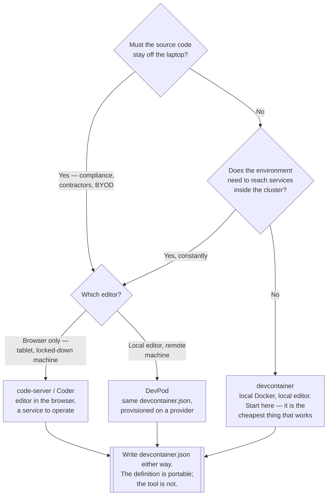

[← Software engineering](../README.md)

# Developer environment

Making "works on my machine" a statement about a machine anyone can recreate.

Tools covered: [`devcontainer`](devcontainer/README.md) · [`code-server`](code-server/README.md) ·
[`devpod`](devpod/README.md) · [`vscodium`](vscodium/README.md)

Sub-capability: [`toolchain/`](toolchain/README.md) — mise, devenv, flox, spack

## Contents

1. [The problem](#1-the-problem)
2. [Three axes: where it runs, what edits it, what is in it](#2-three-axes-where-it-runs-what-edits-it-what-is-in-it)
3. [The devcontainer specification is the portable part](#3-the-devcontainer-specification-is-the-portable-part)
4. [What a remote environment actually buys](#4-what-a-remote-environment-actually-buys)
5. [What it costs](#5-what-it-costs)
6. [Decision tree](#6-decision-tree)
7. [Anti-patterns](#7-anti-patterns)
8. [How this applies to pikakube](#8-how-this-applies-to-pikakube)

---

## 1. The problem

A developer environment is an undeclared dependency of every project. It exists as a README that
went stale, a `brew install` list, and whatever the last person had to figure out. The symptoms
are familiar and expensive:

| Symptom | What is actually happening |
|---|---|
| A new hire loses two days to setup | the environment is tribal knowledge, not a definition |
| "Works on my machine" | two machines with different versions of something nobody documented |
| Passes locally, fails in CI | CI has a declared environment and the laptop does not |
| Nobody upgrades the language version | every machine would have to be touched by hand |
| Onboarding needs production credentials | the environment cannot stand up on its own |

The fix is the same one applied everywhere else in this repository: **declare it in a file, put the
file in the repository, and let a tool build it.** A development environment is infrastructure, and
it should be code for the same reasons the cluster is.

## 2. Three axes: where it runs, what edits it, what is in it

These four tools look overlapping until you separate the two questions they answer:

| | Environment runs locally | Environment runs remotely |
|---|---|---|
| **Local editor** | [devcontainer](devcontainer/README.md) in VS Code | [DevPod](devpod/README.md) |
| **Browser editor** | — | [code-server](code-server/README.md) |

[VSCodium](vscodium/README.md) is on neither axis: it is the *editor itself*, telemetry-free and
free of Microsoft's proprietary licence. It matters here because it changes what the other three
can do — several Microsoft extensions are licensed for Microsoft-branded builds only, which is a
constraint you meet on the day it stops you rather than in advance.

The distinction that matters most:

- **Where it runs** decides who pays for the CPU, whether the source ever touches the laptop, and
  whether the environment can reach internal services directly.
- **What edits it** decides whether a browser is enough, which is what makes a tablet or a locked
  down machine viable.

### The axis those two do not cover

Both questions above are about *where you write code*. Neither says anything about **which tools,
at which versions, exist in the environment once you are in it**. A devcontainer says "this runs
in a Debian container with VS Code attached"; it does not say the repository is built against
Terraform 1.7 and Node 20.11. An image tag is an approximation of that, and it drifts the moment
the image is rebuilt.

That is a third, orthogonal question, and it has its own folder:

| Axis | Question | Where |
|---|---|---|
| Where it runs | local or remote machine | [devcontainer](devcontainer/README.md), [DevPod](devpod/README.md) |
| What edits it | local editor or browser | [code-server](code-server/README.md), [VSCodium](vscodium/README.md) |
| **What is in it** | which tools, at which versions | [`toolchain/`](toolchain/README.md) |

The three axes **compose rather than compete**. A devcontainer can run `mise` inside it — the
image supplies the OS, the toolchain file supplies the versions, and the same toolchain file still
works for whoever is not using the container. Answering only the first two axes leaves the third
undeclared, which is where "passes locally, fails in CI" usually comes from.

Worth knowing before reading further: **this repository already answers the third axis**, with
Devbox and a committed `devbox.json` at the root. That is discussed in
[`toolchain/`](toolchain/README.md), including the observation that its documentation currently
sits outside this capability.

## 3. The devcontainer specification is the portable part

The important thing to understand before choosing a tool: `devcontainer.json` is an **open
specification**, not a VS Code feature. It declares the image or Compose file, the extensions, the
ports to forward, and the commands to run after creation.

That means the definition is the asset and the tool is replaceable:

| Tool | Consumes `devcontainer.json` |
|---|---|
| VS Code / Cursor | yes |
| DevPod | yes — that is its input format |
| GitHub Codespaces | yes |
| code-server / Coder | yes, in the workspace image |

Writing the definition is therefore the part that pays off regardless of which tool wins. Choosing
a tool without one is how you end up locked into it.

## 4. What a remote environment actually buys

Running the environment somewhere other than the laptop is the bigger change, and the reasons are
usually not the ones given:

| Reason | Real? |
|---|---|
| **Source code never lands on the laptop** | yes — often the actual driver, for compliance |
| **Direct access to internal services** | yes — the environment is already inside the network |
| **Uniform, disposable environments** | yes — rebuild rather than debug |
| Heavy builds on hardware that can take it | yes, if the workloads are genuinely large |
| Onboarding in minutes | yes, once the definition exists — the definition is the work |
| "Cheaper than laptops" | rarely — a machine per developer, always on, is not obviously cheaper |

The network-position argument is the strongest one in a Kubernetes context. An environment running
*in* the cluster reaches services by their internal DNS names, with no VPN, no port-forward, and
no tunnel to keep alive.

## 5. What it costs

Stated plainly, because remote environments are usually oversold:

| Cost | Detail |
|---|---|
| **Latency** | keystroke latency on a bad connection is intolerable, and no amount of hardware fixes it |
| **No connection, no work** | the offline case goes from degraded to impossible |
| **Another system to operate** | the thing that unblocks every developer is now production-critical |
| Local integrations break | GPG signing, SSH agents, Docker sockets and hardware keys all need explicit plumbing |
| Cost is continuous | idle environments bill; without aggressive auto-stop, the number grows quietly |

The third row is the one that surprises teams. A developer environment platform that goes down
stops *everyone*, which puts it at the same availability tier as the services it is used to build.

## 6. Decision tree

## 7. Anti-patterns

| Anti-pattern | Why it is bad | What to do instead |
|---|---|---|
| Setup instructions in a README | it goes stale on the first change and nobody notices | `devcontainer.json`, in the repository |
| A remote environment with no definition | a pet server per developer, drifting apart from day one | define it, then provision it |
| Development environment differs from CI | "passes locally" stops meaning anything | the same base image in both |
| A shared development server for the team | one person's dependency upgrade breaks everyone | one environment per developer, disposable |
| Remote environments with no auto-stop | idle machines bill continuously | stop on idle by default |
| Real credentials baked into the environment | every laptop and every image becomes a secret store | short-lived credentials, injected at runtime |
| Treating the environment platform as best-effort | it stops the whole team when it stops | operate it at the tier its blast radius implies |
| Adopting a tool before writing the definition | lock-in, and the definition still has to be written | `devcontainer.json` first — it is portable |
| Making a remote environment the only option | latency and offline work are real constraints for real people | let local devcontainers keep working |

## 8. How this applies to pikakube

The material here is uneven, and worth stating accurately.

[`devcontainer/`](devcontainer/README.md) has a **working example** — a `devcontainer.json` backed
by Docker Compose, building the [Flask sample](devcontainer/flask/README.md) in this folder. It is
clearly experimental (the container is named `TESTE ANDREY`, the `postCreateCommand` is a sleep,
and the only configured extension is an ESLint extension in a Python container), but the shape is
correct and the mechanics are demonstrated.

[`code-server/`](code-server/README.md) has **the only deployed manifests**: a Flux `HelmRelease`
with its own PostgreSQL backing it. One thing to note before reading that folder — the folder is
named `code-server` but the manifests deploy **Coder**, which is the platform rather than the
single-user editor. Same organisation, different products.

[`devpod/`](devpod/README.md) and [`vscodium/`](vscodium/README.md) are references, not
deployments.

The judgement for this platform: **the devcontainer definition is the piece worth investing in**,
because it is the only part that survives changing the tool. Everything in this repository already
builds container images, so the base image for a development environment is largely a variation on
one that exists.

The gap worth naming: the Coder deployment has PostgreSQL as a dependency and nothing that backs
it up. An environment platform that loses its database loses every workspace definition on it.

---

[← Software engineering](../README.md)
