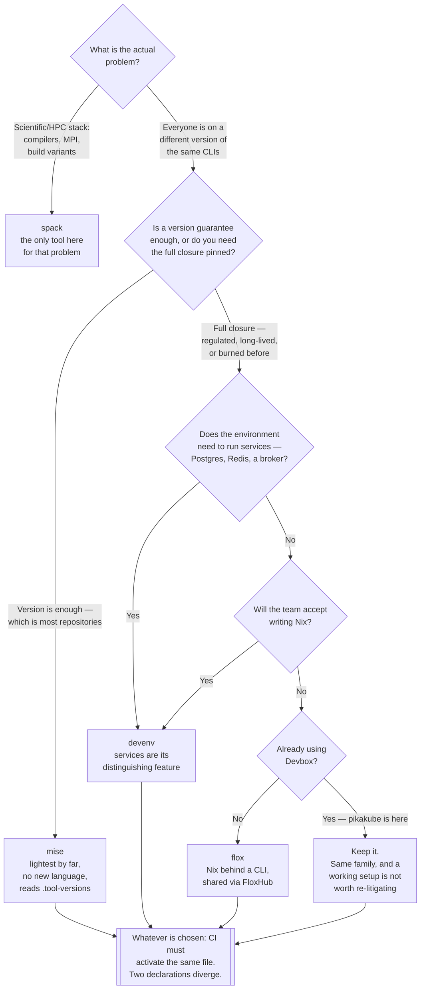

[← Developer environment](../README.md)

# Toolchain

Not *where* you write code — *which tools, at which versions, exist while you write it*.

Tools covered: [`mise`](mise/README.md) · [`devenv`](devenv/README.md) ·
[`flox`](flox/README.md) · [`spack`](spack/README.md)

Acquisition, not declaration — see [section 4.1](#41-acquisition-is-not-declaration):
[`arkade`](arkade/README.md) · [`downloadkubernetes`](downloadkubernetes/README.md)

## Contents

1. [The problem](#1-the-problem)
2. [A third axis: what tools exist, at what versions](#2-a-third-axis-what-tools-exist-at-what-versions)
3. [Three approaches](#3-three-approaches)
   1. [Version managers](#31-version-managers)
   2. [Nix-based environments](#32-nix-based-environments)
   3. [Source-building package managers](#33-source-building-package-managers)
4. [The four tools](#4-the-four-tools)
   1. [Acquisition is not declaration](#41-acquisition-is-not-declaration)
5. [Boundaries](#5-boundaries)
   1. [Containers](#51-containers)
   2. [CI](#52-ci)
   3. [Language dependency managers](#53-language-dependency-managers)
6. [Devbox is already here, in the wrong folder](#6-devbox-is-already-here-in-the-wrong-folder)
7. [Decision tree](#7-decision-tree)
8. [Anti-patterns](#8-anti-patterns)
9. [How this applies to pikakube](#9-how-this-applies-to-pikakube)

---

## 1. The problem

Every repository has a list of tools it assumes are installed, and in almost every repository that
list is undeclared. It lives in a CI workflow, in a Dockerfile, in a `brew install` line somebody
pasted into Slack, and in the gap between them.

| Symptom | What is actually happening |
|---|---|
| `terraform plan` produces a diff on one machine and not another | two Terraform versions, neither declared |
| A `helm template` output changes with no chart change | the Helm binary moved underneath |
| CI installs tools with `apt`, the laptop with `brew` | two package sets, two version policies, one repository |
| "Which Node version is this on?" | nobody knows, so everyone guesses |
| A tool upgrade breaks one project and fixes another | one global install serving projects with different needs |

The fix is the same one the rest of this repository applies: **declare it in a file, commit the
file, let a tool materialise it.** The tools in this folder differ in how strong that guarantee is
and how much you pay for it.

## 2. A third axis: what tools exist, at what versions

The [parent capability](../README.md) frames its four tools on two axes — **where the environment
runs** (local or remote) and **what edits it** (a local editor or a browser). Both are questions
about *where you write code*.

These four tools answer a different question entirely:

| Question | Answered by |
|---|---|
| Where does the environment run? | [devcontainer](../devcontainer/README.md), [DevPod](../devpod/README.md) |
| What edits it? | [code-server](../code-server/README.md), [VSCodium](../vscodium/README.md) |
| **What tools exist in it, at what versions?** | **this folder** |

A devcontainer says "this runs in a Debian container with VS Code attached". mise says "this
repository uses Node 20.11 and Terraform 1.7". Those statements are orthogonal — neither implies
the other, and you routinely want both. A devcontainer with an undeclared toolchain drifts the
moment its base image is rebuilt; a declared toolchain with no container still depends on whatever
the host provides underneath.

So `toolchain/` is a **third axis, not a fifth tool**. Nothing in this folder competes with
anything in the other four folders.

## 3. Three approaches

The four tools are not variations on one idea. They sit in three distinct families, and the
families differ in what "reproducible" is allowed to mean.

### 3.1 Version managers

**mise.** A declared list of tools and versions, resolved onto `PATH`, usually through shims. The
guarantee is scoped and honest: *the version of each named tool is the one the file says*. What it
does not guarantee is the rest — system libraries, the C toolchain, glibc, whatever the tool links
against at runtime. Two machines running the same `mise.toml` can still differ underneath.

This is the lightest family by a wide margin, and for most repositories it is enough. Getting
everyone onto the same `kubectl` and the same Terraform removes the majority of the real pain
without asking anyone to learn anything.

### 3.2 Nix-based environments

**devenv, flox — and [Devbox](../../../platform-engineering/kubernetes/local/linux/virtual-enviroment/devbox/README.md).**
Packages come from `nixpkgs`, built or fetched into `/nix/store` with their full dependency
closure pinned. The guarantee is genuinely stronger: not "the same version of the tool" but "the
same tool, built against the same dependencies, all the way down".

That is a real difference, not a marketing one. It is also not free:

| Cost | Detail |
|---|---|
| **Learning curve** | Nix is a functional language people find genuinely hard; each tool tries to hide it to a different degree |
| Disk | `/nix/store` only grows until somebody garbage-collects it |
| First build | a cache miss means building from source, which can be slow |
| Daemons stay outside | Docker and containerd belong to the host — a hard boundary, not a gap |

The three Nix-based tools differ mainly in **how much Nix they make you write**: devenv gives you
Nix with better ergonomics and expects you to meet it partway, flox tries to remove the language
from the picture, Devbox replaces it with a JSON package list.

### 3.3 Source-building package managers

**spack.** A different constituency altogether: scientific and HPC software, built from source
against a chosen compiler and MPI implementation, with many builds of the same package coexisting.
It answers the same underlying question — declared, reproducible, multi-version software
environments — for people whose problem is a build matrix rather than a CLI version list.

It is the odd one out here and this folder does not pretend otherwise. See
[`spack/`](spack/README.md).

## 4. The four tools

| Tool | Family | What it is for | Where it shines |
|---|---|---|---|
| **mise** | version manager | putting declared tool versions on `PATH` | **the default for a repository that just needs everyone on the same CLI versions** — fast, small, no new language [→](mise/README.md) |
| **devenv** | Nix | full environments **including running services** | `devenv up` starts Postgres or Redis as part of the environment, without Docker Compose [→](devenv/README.md) |
| **flox** | Nix | Nix environments **without learning Nix** | a CLI and a catalog, activated inside your existing shell, shared through FloxHub [→](flox/README.md) |
| **spack** | source-building | HPC and scientific stacks | compilers, MPI, hardware-tuned build variants, many versions side by side [→](spack/README.md) |

Three things worth separating explicitly, because they are the actual decision:

- **mise manages versions of tools; it does not build packages.** That limit is why it is fast and
  why its guarantee is weaker.
- **devenv is the only one of the four that runs services.** If the reason you reach for Docker
  Compose locally is "the app needs a database", that is devenv's specific pitch.
- **flox and devenv make opposite bets on Nix.** devenv assumes you will accept Nix in exchange for
  its power; flox assumes you will not, and hides it behind a CLI.

mise also covers two jobs beyond versions: **per-directory environment variables** (the job
`direnv` normally does) and **tasks**, which overlaps
[`devops/task-runner/`](../../../devops/task-runner/README.md). Overlapping a task runner is worth
knowing about before adopting both and having two places where commands live.

### 4.1 Acquisition is not declaration

Two more tools are filed in this folder and they are **not** a fifth and sixth option in the table
above. They answer a different question, and reading them as alternatives to mise is the mistake
worth heading off:

| Question | Answered by |
|---|---|
| Which tools exist in this repository, at which versions, **for everyone** | the four tools above |
| **How does this binary get onto this machine, right now** | [arkade](arkade/README.md), [downloadkubernetes](downloadkubernetes/README.md) |

| Tool | What it is for | Where it shines |
|---|---|---|
| **arkade** | `arkade get kubectl helm kind` — downloads statically linked binaries for your OS and architecture, ~200 tools catalogued | **a machine you did not set up**: a bastion, a container build, a fresh laptop, a workshop [→](arkade/README.md) |
| **downloadkubernetes** | a static picker over `dl.k8s.io` — version × OS × architecture × binary, with the checksum, signature and certificate beside each one | **pinning a Kubernetes release binary deliberately, and actually verifying it** [→](downloadkubernetes/README.md) |

The distinction is that an acquisition tool is **imperative and stateless**. You run a command, a
binary appears, and nothing records that it happened — so "which Helm is this repository built
against" has no answer a month later. A declaration tool commits a file, and the file *is* the
answer.

They compose in one direction only: a declared environment can shell out to arkade for something its
catalogue lacks, but no amount of `arkade get` pins anything. **Neither replaces the committed file,
and reaching for one instead of the other is the `latest` everywhere anti-pattern with better
ergonomics** — which is why both are documented here rather than in a folder of their own.

## 5. Boundaries

### 5.1 Containers

A devcontainer and a toolchain manager are **not alternatives**, and reading them as alternatives
is the most common mistake in this area.

| | [devcontainer](../devcontainer/README.md) | toolchain manager |
|---|---|---|
| What it isolates | the whole OS — libraries, filesystem, users | the tools on `PATH` |
| Where the code runs | inside a container | on the host |
| Needs a container runtime | yes | no |
| Startup cost | image build or pull | activating a shell |

They compose. A devcontainer can run mise inside it, which is often the right answer: the image
provides the OS and the base runtime, `mise.toml` provides the tool versions, and the same
`mise.toml` also works for the people who do not use the container. The definitions describe
different layers, so both can be true at once.

The case for a container over a toolchain manager is that the host is genuinely dirty, or the
project needs system packages a version manager cannot supply. The case against is weight: a
container to pin three CLIs is a lot of machinery for a small problem.

### 5.2 CI

This is the strongest argument for adopting any of these tools, and it is not the one usually
made first.

Toolchain drift is rarely fatal on a laptop. It is fatal at the boundary between the laptop and
CI, where "passes locally, fails in CI" comes from — two environments, assembled by two different
mechanisms, that nobody ever compared. A GitHub Actions workflow with `setup-node`,
`setup-terraform` and an `apt-get install` line is a *second, parallel* declaration of the
toolchain, and second declarations diverge.

The fix is the same definition on both sides: CI activates the environment from the committed
file instead of installing tools its own way. That is what actually closes the gap — not the
speed, not the ergonomics. Any of the four tools can do it; see
[`devops/cicd/`](../../../devops/cicd/README.md) for where the pipelines themselves live.

### 5.3 Language dependency managers

`uv`, Poetry and their equivalents in other languages are a **different layer**, and both layers
are needed.

| Layer | Declares | Example |
|---|---|---|
| Toolchain | the tools around the project | "Python 3.12, Terraform 1.7, kubectl 1.30" |
| [Dependency management](../../language/python/dependency-management/README.md) | the project's own libraries | "fastapi, pydantic, and their locked transitive set" |

The boundary blurs at exactly one point: the language runtime itself. mise can install Python, and
so can `uv python`. Pick one and be consistent — two tools both claiming to own the Python version
is a reliable source of confusion. Beyond that they do not overlap, and a repository normally
commits both a toolchain file and a lock file.

## 6. Devbox is already here, in the wrong folder

Recorded as an observation, with a recommendation attached.

**This repository already uses a tool from this capability.** [`devbox.json`](../../../../devbox.json)
at the repository root declares the workstation toolchain: `kubectl`, `kubectx`, `kind`,
`kubernetes-helm` and `fluxcd`, alongside `uv`, `git`, `docker` and some networking utilities. That
is not a reference or an experiment — it is this capability in production, in this repository,
today. It also makes the pikakube toolchain a **Nix-based** one, in the family described in
[3.2](#32-nix-based-environments).

Devbox is documented at
[`platform-engineering/kubernetes/local/linux/virtual-enviroment/devbox/`](../../../platform-engineering/kubernetes/local/linux/virtual-enviroment/devbox/README.md).

That location is wrong, and it is worth naming plainly: Devbox is workstation tooling filed under
`kubernetes/local/linux/`. It is not a Kubernetes concern, it is not Linux-specific, and the local
Kubernetes folder is about running clusters on a laptop, not about managing the laptop's tools.
The file it manages pins `kubectl` and `helm`, but it equally pins `git`, `uv` and `dnsutils` —
the Kubernetes packages are contents, not category.

**Recommendation: Devbox belongs in `toolchain/`, beside these four.** It is a direct peer of
devenv and flox — same Nix substrate, different ergonomic bet.

**It has deliberately not been moved.** Nothing in that folder was touched. Moving documentation
breaks inbound links and is a decision for whoever owns the tree, not a side effect of adding a
folder. This section exists so the observation is recorded rather than lost.

## 7. Decision tree

## 8. Anti-patterns

| Anti-pattern | Why it is bad | What to do instead |
|---|---|---|
| Tool versions declared only in CI | the laptop is the undeclared half, and it is the half people work in | one definition, activated in both |
| Tool versions declared only locally | CI installs its own and the two drift silently | the same file, read by the pipeline |
| Installing project tools globally | one version serving projects with different needs; upgrades become negotiations | per-project, declared |
| `latest` everywhere | the environment changes without a commit, so breakage has no cause to point at | pin, and update deliberately |
| Adopting Nix for a problem `mise` solves | a language and a learning curve bought for a version pin | match the guarantee to the need |
| Two tools owning the language runtime | mise and `uv` both claiming Python is a coin flip on which wins | pick one owner per runtime |
| Treating a devcontainer and a toolchain file as alternatives | they describe different layers; choosing one leaves the other undeclared | both, composed |
| An uncommitted environment file | it reproduces nothing and helps one person | commit it |
| Expecting a version manager to pin system libraries | it does not, and finding out during an incident is expensive | Nix-based tooling, or a container |
| Never garbage-collecting `/nix/store` | it grows monotonically until the disk is the problem | schedule it |
| A task runner in the toolchain file *and* a `Makefile` | two places for commands means one of them is stale | one home for tasks |

## 9. How this applies to pikakube

The honest summary: **this capability is already in use, is documented in the wrong place, and the
four tools here are references rather than deployments.**

| Tool | Status here |
|---|---|
| Devbox | **in production** — [`devbox.json`](../../../../devbox.json) at the repository root, documented [elsewhere](../../../platform-engineering/kubernetes/local/linux/virtual-enviroment/devbox/README.md) |
| mise | reference |
| devenv | reference |
| flox | reference |
| spack | reference, and of no plausible relevance to this platform |
| [arkade](arkade/README.md) | reference — acquisition, not a toolchain definition; useful on hosts that have no Nix store |
| [downloadkubernetes](downloadkubernetes/README.md) | reference — and the one that names a real gap: nothing here verifies a downloaded binary's signature |

Three concrete judgements:

**Devbox stays.** It works, the packages are pinned, and it is the same Nix family devenv and flox
belong to. Replacing a working toolchain manager to gain ergonomics is the migration-for-speed
anti-pattern that [Python dependency management](../../language/python/dependency-management/README.md)
already argues against. The change worth making is to the documentation tree, not the tool — see
[section 6](#6-devbox-is-already-here-in-the-wrong-folder).

**The gap is CI, not the tool.** `devbox.json` pins the toolchain for the workstation. Whether the
pipelines in [`devops/cicd/`](../../../devops/cicd/README.md) activate that same file or install
`kubectl` and `helm` their own way is the question that decides whether the pinning is worth
anything — a toolchain declared on one side of the boundary only is half a solution.

**mise is the interesting comparison, not the interesting migration.** For a repository that had
nothing, mise would be the recommendation on weight alone. For this one, its relevance is narrower:
it is what to reach for if the Nix store's disk footprint or a macOS contributor ever makes Devbox
awkward, and it is worth knowing that `.tool-versions` compatibility gives an asdf-based project a
cheap way in.

And the boundary already visible in this repository: `devbox.json` pins `docker` and
`docker-compose`, but the Docker **daemon** still has to live on the host. That is the hard edge of
every tool in this folder — they manage tools, not services on the host — and the one place where
a [devcontainer](../devcontainer/README.md) is answering a question these cannot.

---

[← Developer environment](../README.md)
