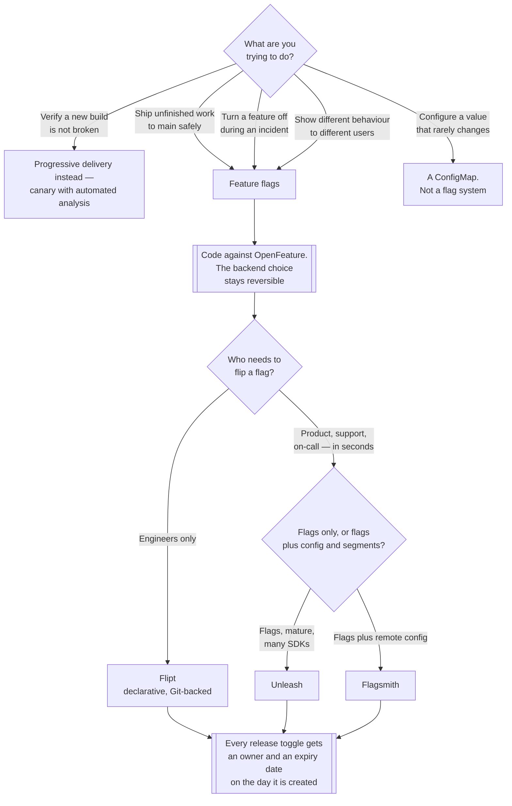

[← Software engineering](../README.md)

# Feature flags

Separating deploy from release — and the debt that accumulates when flags are never removed.

Tools covered: [`flagsmith`](flagsmith/README.md) · [`flipt`](flipt/README.md) ·
[`open-feature`](open-feature/README.md) · [`unleash`](unleash/README.md)

## Contents

1. [Deploy is not release](#1-deploy-is-not-release)
2. [Four kinds of flag, four lifetimes](#2-four-kinds-of-flag-four-lifetimes)
3. [OpenFeature — the standard, not another vendor](#3-openfeature--the-standard-not-another-vendor)
4. [Where the flag is evaluated](#4-where-the-flag-is-evaluated)
5. [Feature flags and progressive delivery](#5-feature-flags-and-progressive-delivery)
6. [Flag debt](#6-flag-debt)
7. [The tools](#7-the-tools)
8. [Decision tree](#8-decision-tree)
9. [Anti-patterns](#9-anti-patterns)
10. [How this applies to pikakube](#10-how-this-applies-to-pikakube)

---

## 1. Deploy is not release

These are two different events, and almost every deployment practice conflates them:

- **Deploy** — the code is running on the machines.
- **Release** — the behaviour is visible to users.

A feature flag is the switch that separates them. The code ships dark, in the same binary as
everything else, and someone turns it on later — for one user, then one percent, then everyone.

The consequence that matters is not the switch itself, it is what it makes possible upstream:

**Trunk-based development.** Without flags, work in progress lives on a long-lived branch until it
is finished, and the merge is a risk event proportional to how long it took. With flags, unfinished
work merges to main behind a disabled condition, and integration happens continuously.

The trade is real and worth stating plainly:

| | **Long-lived branches** | **Flags on trunk** |
|---|---|---|
| Where unfinished work lives | a branch nobody else sees | main, behind a condition |
| Integration pain | all at once, at merge | continuous, small |
| Risk concentrated at | the merge and the deploy | the flag flip |
| Rollback | redeploy | change a value — seconds |
| The cost you pay | merge conflicts | **flag debt** — see section 6 |

Neither is free. The argument for flags is that the cost is *visible in production and removable*,
whereas the cost of a three-week branch is discovered on the day it merges.

The other thing this buys is a **kill switch**. When a dependency starts failing under load,
turning off the feature that calls it is a value change, not a rollback, not a deploy, and not a
decision that needs a release engineer.

## 2. Four kinds of flag, four lifetimes

Treating every flag the same is the root of most flag problems. They have genuinely different
purposes and, critically, different expected lifetimes:

| Kind | Purpose | Lifetime | Who flips it |
|---|---|---|---|
| **Release toggle** | deploy dark, release later | **days to weeks** — then delete | the team shipping it |
| **Kill switch** (ops toggle) | turn off a feature or a dependency under stress | **permanent, on purpose** | whoever is on call |
| **Experiment** | A/B test, measure, decide | the length of the experiment | product |
| **Permission toggle** | entitlement by plan, tenant or role | permanent | the business |

Two consequences follow.

**Release toggles are the ones that rot.** They are created with an implicit expiry that nobody
records, and they survive because deleting them is somebody's third priority. Everything in
section 6 is about this row.

**Permission toggles are arguably not flags at all.** Entitlements are configuration, they change
with the customer rather than with the code, and putting them in a flag system means your billing
logic lives in a tool built for temporary switches. Sometimes that is the pragmatic choice; it is
worth making it knowingly rather than by default.

## 3. OpenFeature — the standard, not another vendor

[OpenFeature](open-feature/README.md) is the odd entry in this folder, and the difference is the
point: **it is a specification, not a backend.** The first link in its notes is the `spec`
repository rather than a program, which is the giveaway.

The shape:

```
application code  →  OpenFeature SDK  →  provider  →  Unleash / Flagsmith / flagd / ...
```

You write against one vendor-neutral API — `getBooleanValue("new-checkout", false, context)` — and
a *provider* connects it to whichever backend you chose. What this buys:

| Benefit | Detail |
|---|---|
| **The vendor choice becomes reversible** | swapping backends is a provider change, not a rewrite of every call site |
| One API across languages | the same evaluation semantics in Python, Go and JavaScript |
| Hooks | logging, telemetry and validation attach around every evaluation, once |
| Nothing to run | the SDK is a library; the standard has no server |

And what it costs: one more layer between your code and the flag, and **provider maturity varies
by language and by backend**. Check that the provider you need exists and is maintained for the
language you actually write, rather than assuming the matrix is filled in.

The Kubernetes-specific piece is separate from the standard: the **OpenFeature Operator** injects
`flagd` — the reference evaluation engine — as a sidecar, and sources flag definitions from custom
resources. That is a different deployment model from the SDK-plus-provider one, and it is what the
chart in this repository installs. See its README.

The recommendation this folder settles on: **code against OpenFeature, and pick exactly one
backend behind it.** The standard costs little and removes the part of the decision that is hard
to undo.

## 4. Where the flag is evaluated

This decides latency, failure behaviour and what you are exposing. It is a more consequential
choice than which vendor.

| Model | How | Trade-off |
|---|---|---|
| **In-process SDK with a local cache** | the SDK polls or streams rule updates and evaluates locally | **fast — no network call per evaluation.** A staleness window of seconds. The usual answer |
| **Remote evaluation** | every evaluation is an API call to the flag service | always consistent; adds latency to every request and makes the flag service a hard dependency |
| **Sidecar** (`flagd`) | a local process evaluates; rules are synced to it | localhost hop, no SDK-side rule logic, one more container per pod |
| **Client-side / browser** | the frontend evaluates | **rules and unreleased feature names leak to the user.** Never put anything sensitive in one |

Whatever the model, one rule is not negotiable:

> **The flag SDK must fail to a default, not to an error.**

If the flag service is unreachable and your code throws, blocks, or returns an exception, you have
converted a configuration service into a hard dependency of every request — and made the outage
worse than having no flags at all. Every evaluation call takes a default value for exactly this
reason. Use it, and test the path where the backend is down.

## 5. Feature flags and progressive delivery

This folder and [`site-reliability-engineering/progressive-delivery/`](../../site-reliability-engineering/progressive-delivery/README.md)
solve the same problem — *do not expose a change to everyone at once* — at **two different
layers**, and understanding the split stops one being bought as a substitute for the other.

| | **Traffic-level** — [Argo Rollouts](../../site-reliability-engineering/progressive-delivery/argo-rollouts/README.md), [Flagger](../../site-reliability-engineering/progressive-delivery/flagger/README.md) | **Code-level** — feature flags |
|---|---|---|
| The unit shifted | a **version of the whole binary** | **one behaviour** inside one binary |
| Who decides | the **router** — mesh, ingress, Gateway API | the **process**, per evaluation |
| Targeting | percentage of requests; headers if L7 allows | user ID, tenant, plan, region, anything in the context |
| Rollback | shift traffic back — minutes | change a value — seconds |
| Needs traffic splitting | **yes** — that is the prerequisite | no |
| Works for a change with no HTTP surface | no | yes — a batch job, a consumer, an algorithm |
| Automated rollback on metrics | **yes** — that is its whole point | not on its own |

They are complementary, and the combination is the mature setup:

**Deploy the binary with a canary; release the feature with a flag.** The canary answers "did this
build break the service", automatically, against metrics. The flag answers "should these users see
this behaviour", deliberately, with targeting the router cannot express because it cannot see who
the user is.

Two practical notes on the split:

- Progressive delivery has a **hard prerequisite** — a traffic-splitting layer — which is
  currently the blocker for this platform. Feature flags have no such prerequisite, which makes
  them the cheaper of the two to adopt first.
- A canary needs **enough traffic** for a percentage to be statistically meaningful. A flag
  targeted at internal users works at any volume.

## 6. Flag debt

Every flag is an `if` statement that becomes permanent unless somebody deletes it. This is not a
hypothetical failure mode, it is the *normal* end state of a flag system that nobody prunes.

What it costs:

| Symptom | Detail |
|---|---|
| **Untested combinations** | *n* flags describe 2ⁿ nominal paths. Your tests cover a handful of them |
| Dead code that looks live | nobody deletes the old branch because nobody is certain the flag is off everywhere |
| Reasoning becomes impossible | "what does production actually do" needs a query against a flag service, per environment |
| The flag service becomes critical | hundreds of permanent flags means the outage that turns them all to defaults is an incident |
| Onboarding cost | a new engineer reads a function and cannot tell which half runs |

The cures, in order of how much they actually help:

1. **An expiry date and an owner on every release toggle**, set when it is created. Not a
   convention — a field.
2. **Delete the flag and its dead branch in the same pull request.** Removing the flag but leaving
   the `if` is half the job and the worse half.
3. **Cleanup is part of the feature**, in the same ticket. A separate "remove old flags" ticket is
   a ticket that gets deprioritised forever.
4. **A report of stale flags** — flags that have been at 100% or 0% for longer than their expiry —
   reviewed on a schedule by the team, not by a platform engineer who does not know what they do.
5. **A cap on live release toggles.** An uncomfortable number is the point; it forces the cleanup
   conversation to happen.

The distinction to keep hold of: **kill switches and permission toggles are supposed to be
permanent.** The debt is release toggles that outlive their release. Applying an expiry policy to
all four kinds produces the opposite problem — someone deletes the kill switch you needed.

## 7. The tools

| Tool | What it is | Shines when | Do not use when | Detail |
|---|---|---|---|---|
| **Unleash** | mature open-source flag server, a rich activation-strategy model, SDKs in many languages | you want the most established option and a full UI | a capability you depend on turns out to be commercial-edition only — check first | [→](unleash/README.md) |
| **Flagsmith** | flags plus **remote config** and segments, self-hostable, UI-driven | you want flags and configuration values in one place, with segment targeting | you want the flag state to live in Git | [→](flagsmith/README.md) |
| **Flipt** | lightweight, **declarative** — flag state can be defined in files and read from Git | a GitOps repository, where flags should be reviewed like everything else | product managers need to flip flags without a pull request | [→](flipt/README.md) |
| **OpenFeature** | **a standard**, plus the operator and `flagd` | always — put it in front of whichever of the above you pick | you expect it to store flags; it is not a backend | [→](open-feature/README.md) |

The axis that actually separates the first three is **who is allowed to flip a flag, and how**:

- **Git-declared** (Flipt's declarative mode) — every change is a reviewed commit, the state is
  auditable by construction, and the audit trail is your existing one. Flipping a kill switch
  requires a merge, which is slower than an incident wants.
- **UI-driven with a database** (Unleash, Flagsmith) — non-engineers can change behaviour in
  seconds, which is the point of kill switches and experiments, at the cost of production state
  that lives outside Git.

Pick according to who the flags are *for*. If the answer is engineers only, Git wins. If product
or support need to act, a UI is not a compromise, it is the requirement.

## 8. Decision tree



## 9. Anti-patterns

| Anti-pattern | Why it is bad | What to do instead |
|---|---|---|
| **Flags that are never removed** | *n* flags means 2ⁿ paths and a codebase of permanent branches nobody can reason about | an owner and an expiry date per release toggle; delete the flag and its dead branch together |
| The SDK failing hard when the backend is down | a configuration service becomes a hard dependency of every request | a default on every evaluation, and test that path |
| Remote evaluation on a hot path | a network round trip added to every request | an in-process SDK with a local cache |
| Flags used for configuration | connection strings and timeouts in a system built for temporary switches | a ConfigMap or a Secret |
| Nesting flags inside flags | the combinations are untestable and nobody can predict the behaviour | one flag per decision, flat |
| Coding directly against a vendor SDK | the vendor choice becomes irreversible at every call site | OpenFeature in front of it |
| Sensitive rules evaluated in the browser | unreleased feature names and targeting logic are visible to users | evaluate server-side |
| Nobody knows a flag's state per environment | "what does production do" has no answer | one place to see current state, and treat it as an audited change |
| Flags as a substitute for a canary | a flag does not measure anything or roll itself back | [progressive delivery](../../site-reliability-engineering/progressive-delivery/README.md) for the build, flags for the behaviour |
| A schema change hidden behind a flag | the flag flips back instantly; the migration does not | backwards-compatible migrations, decoupled from the flag |
| Four flag systems in one platform | four backends, four sets of state, no single answer | one backend, behind the standard |

The last row is the one this folder has to answer for itself — see below.

## 10. How this applies to pikakube

Four charts, four namespaces, four empty `values` blocks — mapped, none deployed with real
configuration:

| Tool | Chart | Version |
|---|---|---|
| [Flagsmith](flagsmith/README.md) | `flagsmith` | 0.61.0 |
| [Flipt](flipt/README.md) | `flipt` | 0.77.0 |
| [OpenFeature](open-feature/README.md) | `open-feature-operator` | 0.8.1 |
| [Unleash](unleash/README.md) | `unleash` | 5.3.4 |

Three of those are alternatives to each other, and running all three would be the anti-pattern in
the last row of section 9. As a **catalogue** it is fine — that is what this repository is. As a
**deployment** it would not be.

**The recommendation:** [OpenFeature](open-feature/README.md) in the code, and exactly one backend
behind it. Given that this is a GitOps repository where the reviewed-commit model is already the
norm, [Flipt](flipt/README.md) is the closest fit — flag state declared in files, changed by pull
request, audited by the same mechanism as everything else. The counter-argument is real and worth
weighing: **a kill switch that needs a merge is not a kill switch.** If anyone outside engineering
ever needs to turn something off, [Unleash](unleash/README.md) or
[Flagsmith](flagsmith/README.md) is the honest choice instead.

**The dependency nobody notices until install time:** Flagsmith and Unleash are both PostgreSQL-
backed. That is a database this platform has to run and back up —
[`databases/sql/postgresql/`](../../databases/sql/postgresql/README.md) has
[CloudNativePG](../../databases/sql/postgresql/operator/cnpg/README.md) mapped for exactly this
kind of thing. Flipt's declarative mode avoids the database entirely, which is a genuine part of
its appeal here.

**The complementary piece:**
[`site-reliability-engineering/progressive-delivery/`](../../site-reliability-engineering/progressive-delivery/README.md)
is the traffic-level half of the same story, and it is also not deployed — blocked on a
traffic-splitting layer the cluster does not yet have. Feature flags have no such prerequisite.
That makes this folder **the cheaper half to adopt first**, and it is the argument for doing so:
the deploy/release split is available today with a library and one backend, while the canary half
waits on a mesh or a capable ingress controller.

---

[← Software engineering](../README.md)
