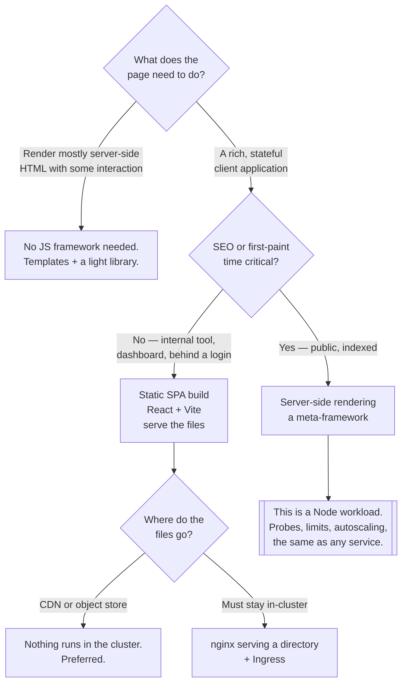

[← Software engineering](../README.md)

# Frontend

The one part of the application the platform barely touches — and the thinnest folder here.

Tools covered: [`react`](react/README.md)

## Contents

1. [What this folder is for](#1-what-this-folder-is-for)
2. [Two deployment shapes, and only one is a workload](#2-two-deployment-shapes-and-only-one-is-a-workload)
3. [What the platform owes a frontend](#3-what-the-platform-owes-a-frontend)
4. [Decision tree](#4-decision-tree)
5. [Anti-patterns](#5-anti-patterns)
6. [How this applies to pikakube](#6-how-this-applies-to-pikakube)

---

## 1. What this folder is for

The client side of the application: the code that runs in a browser, and the small number of
platform concerns that follow from it.

It is deliberately narrow. Component libraries, state management, CSS strategy and design systems
are application decisions, not platform ones, and they do not belong in an infrastructure
repository. What does belong is the part where a frontend meets the cluster: **how it is built,
how it is served, and how it reaches the API.**

The backend half of the same application is `api/` — protocols and frameworks — and that folder is
where nearly all the substance is. This one covers what is left.

## 2. Two deployment shapes, and only one is a workload

The single most useful distinction for anyone running a frontend on Kubernetes:

| | **Static build** | **Server-rendered** |
|---|---|---|
| Output of the build | a folder of HTML, JS and CSS | a Node process |
| Runs | in the browser only | in the cluster, per request |
| Deployed as | files behind a web server or a CDN | a `Deployment`, with replicas and probes |
| Scaling | the CDN's problem | yours — CPU, memory, autoscaling |
| Failure modes | a stale cache | a crash loop, an OOM kill, a slow render |
| Cost to operate | close to zero | a real service |

A static single-page application is **not a workload**. It is a bucket of files. Running it as a
pod is common and usually unnecessary — an nginx container serving a directory is a service to
patch, monitor and scale for something a CDN or an object store does better.

Server-side rendering changes that completely: the frontend becomes a Node service with all the
operational weight of any other service, and it should be treated as one. The decision to adopt
SSR is therefore a **platform** decision, not only a frontend one, and it is the only thing in
this folder that changes what the cluster runs.

## 3. What the platform owes a frontend

Short list, and each item is a real source of incidents:

| Concern | Detail |
|---|---|
| **The API endpoint** | it is baked in at build time, or read at runtime from a served config file — the first means one build per environment |
| **CORS** | a browser calling an API on another origin needs it configured on the API, not the frontend |
| **TLS and the domain** | an Ingress; frontends are the part users type into a browser |
| **Cache headers** | hashed asset filenames cached forever, `index.html` never — the reverse causes users on a version that no longer exists |
| **Secrets** | there are none. Anything in a frontend bundle is public |

The last row is worth stating flatly: **a frontend cannot hold a secret.** An API key in a build
is an API key that has been published. Anything that must stay secret goes behind the API, which
is one of the reasons the backend half of the application exists at all.

The fourth row causes the most confusing outages: `index.html` cached at a CDN keeps serving
references to asset files that the new deployment has replaced, and users get a white page until
the cache expires.

## 4. Decision tree

## 5. Anti-patterns

| Anti-pattern | Why it is bad | What to do instead |
|---|---|---|
| An API key in the frontend bundle | the bundle is public; the key is published | keep it behind the API |
| A separate build per environment | the artifact tested in staging is not the one released | one build, runtime configuration |
| `index.html` cached like an asset | users load a version whose files no longer exist | hashed assets cached forever, `index.html` never |
| SSR adopted without owning the workload | a Node process with no probes, limits or on-call | treat it as a service, or stay static |
| A pod serving static files that a CDN could serve | a container to patch and scale for a directory | object storage plus a CDN |
| CORS "fixed" with a wildcard | it disables an origin control rather than configuring it | list the origins on the API |
| Authorisation decided in the client | the client is under the user's control | enforce it on the server |
| The frontend built by a different pipeline from the API | versions drift, and the contract breaks silently | one pipeline, or a versioned contract |
| No bundle size budget | it grows monotonically and nobody notices until it is 4MB | measure it in CI |

## 6. How this applies to pikakube

**This is the least developed folder in
[`software-engineering/`](../README.md), and it is worth saying so plainly.** It contains one
entry — [React](react/README.md) — whose original note was a single link to the upstream
repository. There is no example application, no Dockerfile, no manifest and no recorded opinion.

That is a reasonable state rather than a neglected one, and the reason is structural: a frontend
is mostly **not a cluster concern**. A static build is files; the interesting infrastructure
questions around it are an Ingress and cache headers, both of which already live in
`infrastructure/network/`. There is far less for a platform repository to say about React than
about a database or a broker.

The contrast with the backend side is stark and intentional: `api/` holds REST, GraphQL, gRPC,
SOAP and WebSocket, with Flask and FastAPI examples that include Dockerfiles and manifests. That
folder effectively covers the application layer for this platform; this one covers the client
that would call it.

What would make this folder worth more than the React documentation, in order:

1. **A worked example** — a static build, an Ingress, and correct cache headers, in the same style
   as the Flask application under `api/`. That is the missing piece.
2. **A recorded position on SSR** — the only decision here that changes what the cluster runs.
3. **A second entry**, if one is ever evaluated. One tool in a folder is a catalogue of one, and
   the value of these pages is the comparison.

Until then, this page is honest about being a placeholder with a decision tree attached.

---

[← Software engineering](../README.md)
