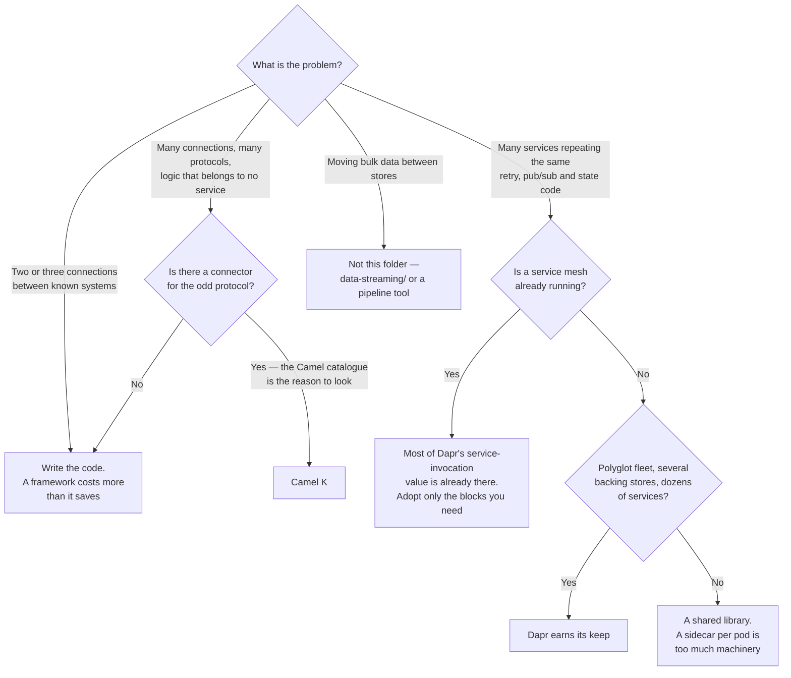

[← Software engineering](../README.md)

# Integration

Connecting systems that were never designed to talk to each other — and the runtime you take on
when you use a framework to do it.

Tools covered: [`camel-k`](camel-k/README.md) · [`dapr`](dapr/README.md)

## Contents

1. [What integration means here](#1-what-integration-means-here)
2. [Two shapes — a route engine and a sidecar runtime](#2-two-shapes--a-route-engine-and-a-sidecar-runtime)
3. [The cost of a layer in the middle](#3-the-cost-of-a-layer-in-the-middle)
4. [Where this overlaps with other folders](#4-where-this-overlaps-with-other-folders)
5. [Decision tree](#5-decision-tree)
6. [Anti-patterns](#6-anti-patterns)
7. [How this applies to pikakube](#7-how-this-applies-to-pikakube)

---

## 1. What integration means here

Not "data integration" in the pipeline sense, and not API gateways. This folder is about the
**mediation layer between systems**: an SFTP drop that has to become a queue message, a SOAP
service behind a REST facade, a legacy database whose changes must reach three consumers, an
application that should not hard-code which broker it publishes to.

The work is always the same handful of things — protocol translation, message transformation,
routing by content, retry and error handling, correlating a response with a request — and the
question is only whether you write them yourself or adopt something that already has them.

That question has a real answer, and it depends almost entirely on **count**:

| Situation | The honest answer |
|---|---|
| Two or three connections, stable, one protocol each | write the code; a framework is more to learn than to build |
| Dozens of connections, many protocols, changing | a framework — you are otherwise rewriting the same retry and transform logic per service |
| Many services, many backing stores, several languages | an abstraction layer starts to pay for itself |

Below the threshold, an integration framework is a runtime and a DSL to do what a function does.
Above it, hand-written glue becomes dozens of subtly different implementations of the same five
concerns, and every one of them fails differently.

## 2. Two shapes — a route engine and a sidecar runtime

The two tools here look like alternatives and are not. They sit at different places relative to
your code.

| | **Camel K** — route engine | **Dapr** — sidecar runtime |
|---|---|---|
| Where it runs | its **own workload**, next to your services | a **sidecar in every pod**, next to your process |
| What you write | a **route**: from a source, through steps, to a destination | ordinary application code that calls `localhost` |
| The abstraction | Enterprise Integration Patterns — split, aggregate, filter, route by content | building blocks — service invocation, state, pub/sub, bindings, secrets, actors |
| What it connects | **anything** — the Camel component catalogue is the reason to use it | whatever has a Dapr component implementation |
| Who owns the logic | the route, outside the application | the application, with the plumbing outside it |
| Language | a DSL (YAML, Java, and others) | none — it is an HTTP/gRPC API |

The distinction in one line: **Camel K moves messages between systems; Dapr changes how your
service talks to the systems it already uses.**

That is why "which one" is usually the wrong question. A route engine is for glue that belongs to
nobody in particular. A sidecar runtime is for standardising how a fleet of services reaches its
dependencies.

## 3. The cost of a layer in the middle

Both shapes charge, and the charges are different.

**A route engine costs a language.** The route is not your application's code, not in your
application's repository, and not debugged with your application's tools. A stack trace from an
integration DSL is a poor substitute for a debugger, and the person who knows the DSL is usually
one person.

**A sidecar runtime costs a container per pod.** Memory and CPU multiplied by every replica, an
extra network hop on every call, a version that has to be upgraded in lockstep with a control
plane, and a new class of failure — the sidecar not being ready yet — that has nothing to do with
your code.

Both cost **indirection at 3am**. When a message does not arrive, the set of places to look grows
from two to four, and the middle two are the ones you understand least.

None of that is an argument against either tool. It is an argument for being able to say, out
loud, what the layer is buying — and for noticing when the answer is "it seemed like the right
architecture".

## 4. Where this overlaps with other folders

Four neighbours, and stating the boundaries stops the same tool from being evaluated twice under
two names:

| Neighbour | What it does | Why it is not this |
|---|---|---|
| [`messaging/`](../messaging/README.md) | brokers and task queues | **transport**. Integration is the mediation on top — a broker moves the message, it does not transform or route it by content |
| [service mesh](../../network/service-mesh/README.md) | mTLS, retries, timeouts, traffic policy, telemetry | overlaps Dapr's **service invocation** block almost exactly, at L7, without touching application code. If a mesh is already running, that part of Dapr buys very little |
| [API gateway](../../network/api-gateway/README.md) | north-south: auth, rate limiting, exposing APIs to the outside | a front door, not glue between internal systems |
| [`data-streaming/`](../../data-streaming/README.md) and pipeline tools | bulk and continuous data movement | superficially identical — sources, transforms, sinks — but sized for throughput and history rather than for per-message business logic. [Benthos](../../data-streaming/processing/benthos/README.md) and [NiFi](../../analytics-engineering/integration/nifi/README.md) are the ones that look most like Camel K and are not |

The mesh row is the one worth acting on. Dapr and a service mesh both terminate calls in a
sidecar, both retry, both emit telemetry. Running both means two sidecars per pod and two answers
to "why was this request retried".

## 5. Decision tree

## 6. Anti-patterns

| Anti-pattern | Why it is bad | What to do instead |
|---|---|---|
| An integration framework for two HTTP calls | a runtime, a DSL and a control plane to do what a function does | write the function |
| Business logic hidden in routes | the rules live in a DSL nobody reviews, outside the service that owns them | routing and transformation in the route; decisions in the service |
| Dapr and a service mesh, both on | two sidecars, two retry policies, two telemetry pipelines, one confusing trace | pick which layer owns resilience |
| A sidecar on every pod for one capability | full runtime cost for a fraction of the value | a library, or the one block you need |
| An integration layer used as a database | routes accumulate state they were never meant to hold | an explicit store |
| Synchronous chains through the mediation layer | latency and failure probability multiply, and the middle layer gets the blame | events between the hops |
| No dead-letter path | a message that always fails is retried forever, invisibly | dead-letter, and alert on it — see [`messaging/`](../messaging/README.md) |
| Routes not versioned with the systems they connect | a schema changes and the route breaks silently in production | the route lives in Git and ships with the change |
| The abstraction adopted for portability nobody will use | permanent complexity paid for a migration that never happens | adopt it for a problem you have today |
| No tracing through the layer | the hop you added is the one you cannot see | propagate context — [`observability/tracing/`](../../observability/tracing/README.md) |

## 7. How this applies to pikakube

Both tools are mapped, neither is in use, and the two entries are very different in character.

[**Camel K**](camel-k/README.md) — chart 2.5.0, plus the only worked example in this folder: an
`Integration` that fires on a timer, sets a body and logs it, and an `IntegrationPlatform` that
configures the build registry. That second file is the important one. Camel K **builds an image
per Integration**, so it needs a registry it can push to; the committed platform points at
`registry.io` with `insecure: true`, which is a placeholder. Nothing runs until that is a real
address.

[**Dapr**](dapr/README.md) — chart 1.14.1, and a verdict: *"cool, but too much overengineering"*.
That judgement is carried forward as written, and it is the correct call **for this platform** —
the conditions under which Dapr pays for itself are set out in its README, and none of them hold
here.

Dapr also shows up a second time, as an optional component of
[OpenFunction](../serverless/openfunction/README.md), where it is likewise disabled. Two
independent decisions, the same conclusion.

The prerequisite worth naming: Camel K needs a registry it can push to, and this repository does
map several under `devops/image/oci-registry/` — Harbor, Zot and a plain docker-registry all have
charts committed there. So the missing piece is not the registry, it is **choosing one and
pointing the `IntegrationPlatform` at it**. Until that happens the example cannot build, which is
a reasonable place to leave both of these tools: catalogued, not built, waiting for an integration
problem that actually needs them.

---

[← Software engineering](../README.md)
