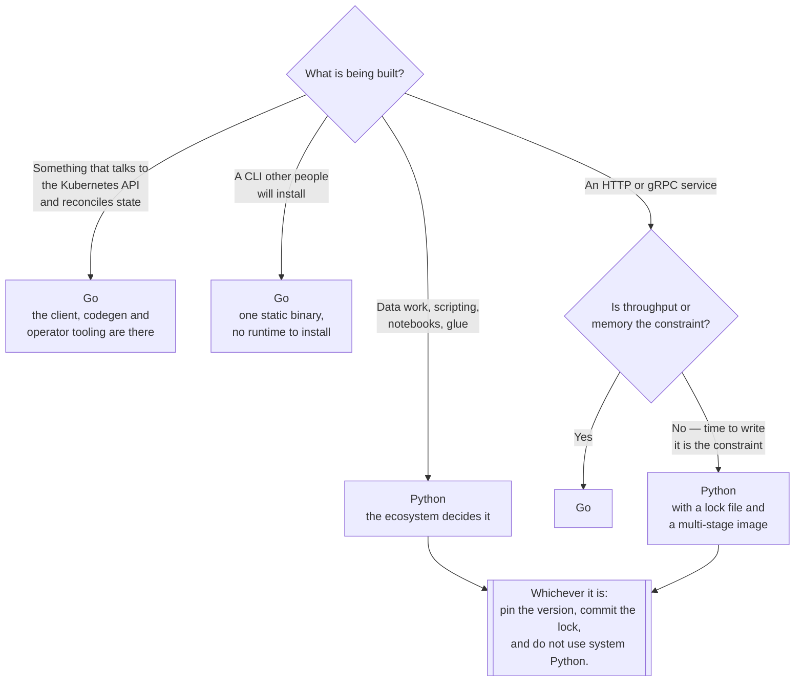

[← Software engineering](../README.md)

# Language

The two languages this platform is written in, and the toolchain each one drags along with it.

Tools covered: [`golang`](golang/README.md) · [`python`](python/README.md)

## Contents

1. [What belongs in this folder](#1-what-belongs-in-this-folder)
2. [Go and Python, side by side](#2-go-and-python-side-by-side)
3. [What each language is used for here](#3-what-each-language-is-used-for-here)
4. [The questions every language toolchain has to answer](#4-the-questions-every-language-toolchain-has-to-answer)
5. [Decision tree](#5-decision-tree)
6. [Anti-patterns](#6-anti-patterns)
7. [How this applies to pikakube](#7-how-this-applies-to-pikakube)

---

## 1. What belongs in this folder

A language folder holds the things that are true of the **language and its toolchain**, not of the
applications written in it:

| Belongs here | Belongs elsewhere |
|---|---|
| Dependency management and locking | Web frameworks — `api/` |
| Type checking, interpreter and version management | Test runners and load tools — `testing/` |
| Project layout conventions | Linters and formatters as CI gates — `code-quality/` |
| Building and publishing packages | Where packages are hosted — `artifact-registry/` |

The line is worth holding, because the alternative is a `python/` folder that slowly absorbs every
Python tool in the repository and stops being navigable.

## 2. Go and Python, side by side

Both languages are here for reasons, and the reasons are close to opposite:

| | Go | Python |
|---|---|---|
| **Artifact** | a single static binary | source plus an interpreter plus a dependency tree |
| **Container image** | `FROM scratch` is realistic | a base image, a virtualenv, and a lock file |
| Startup | milliseconds | tens to hundreds of milliseconds |
| Concurrency | goroutines, built into the language | asyncio, threads, or processes — pick one and live with it |
| Typing | static, enforced by the compiler | optional, enforced by a separate tool |
| **Ecosystem fit** | **Kubernetes** — client, controllers, operators, CLIs | **data, glue, and APIs** |
| Dependency management | in the toolchain since modules | four tools, converging on one — see [`python/dependency-management/`](python/dependency-management/README.md) |

The row that decides most platform work is the first one. A Go binary has no runtime to ship and
no dependency resolution at deploy time, which is why every Kubernetes component is written in it.
A Python service is faster to write and slower to ship.

## 3. What each language is used for here

| Work | Language | Why |
|---|---|---|
| Operators, controllers, admission webhooks | **Go** | the client libraries and code generators only exist there |
| CLIs distributed to other people | **Go** | one binary, no runtime on the target machine |
| Anything performance-sensitive in the data path | **Go** | no GIL, no interpreter |
| APIs and internal services | **Python** | speed of writing wins when throughput is not the constraint |
| Data pipelines, scripting, glue | **Python** | the ecosystem is not close to being matched |
| Automation around the cluster | either | Go if it becomes a controller, Python if it stays a script |

The trap is the last row. A Python script that grows into something reconciling cluster state is a
controller written badly; at that point it should have been Go from the start.

## 4. The questions every language toolchain has to answer

Regardless of language, the same six questions come up, and comparing the answers is how you judge
a toolchain:

| Question | Go | Python |
|---|---|---|
| How is a dependency declared? | `go.mod` | `pyproject.toml` |
| How is a build reproduced? | `go.sum`, verified by default | a lock file, if the project has one |
| How is the language version pinned? | `go` directive in `go.mod` | `requires-python`, plus a version manager |
| How are dev and runtime dependencies separated? | build tags and a separate tools module | dependency groups |
| How is a binary or artifact produced? | `go build` | `build`, then a wheel |
| How is the result containerised? | copy one file | multi-stage, lock file first |

Python needs a folder for this — [`python/dependency-management/`](python/dependency-management/README.md)
— and Go does not. That difference is most of the operational gap between the two.

## 5. Decision tree

## 6. Anti-patterns

| Anti-pattern | Why it is bad | What to do instead |
|---|---|---|
| A Python script that grows into a controller | reconciliation, watches and retries reimplemented badly | write it in Go once it watches the API |
| Go chosen for a one-off script | a build step and a module for twenty lines | Python, or a shell script |
| Language version unpinned | works on the developer's machine, fails in CI | `go` directive; `requires-python` plus a version manager |
| No lock file in a Python project | the build is not reproducible | see [`python/dependency-management/`](python/dependency-management/README.md) |
| Shipping the full language image to production | hundreds of megabytes of compilers and headers | multi-stage builds; `scratch` or `slim` at runtime |
| Type checking treated as optional in Python | the errors static typing would have caught arrive in production | mypy or pyright in CI, failing the build |
| Two languages for the same component | two toolchains, two images, two sets of dependencies | one per component, chosen deliberately |
| Frameworks documented in the language folder | the folder becomes a dumping ground | `api/` for frameworks, here for the toolchain |

## 7. How this applies to pikakube

The depth here is uneven, and deliberately so.

[`python/`](python/README.md) has real working material: three dependency managers compared from
actual use, a working uv multi-stage `Dockerfile`, a GitHub Actions workflow, and the recorded
findings about Poetry's constraint support and Docker documentation. That is the part worth
reading, because it records what happened rather than what the tools claim.

[`golang/`](golang/README.md) is a link list. That is honest: Go is the language everything on this
platform is *written in* — Kubernetes, Flux, the operators, the CLIs — but almost nothing here is
Go that was written for this repository. The references collected there are the ones worth having
when that changes.

The practical rule for this platform: **Python for what gets built on the platform, Go for what
extends the platform.** Anything reconciling cluster state crosses that line.

---

[← Software engineering](../README.md)
