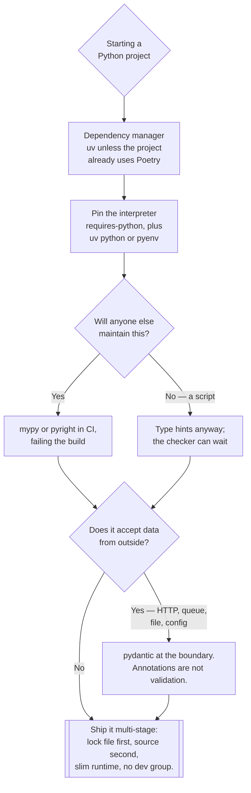

[← Language](../README.md)

# Python

The language most of what runs on this platform is written in — and the one that needs the most
scaffolding to be reproducible.

Tools covered: [`dependency-management`](dependency-management/README.md)

## Contents

1. [Why Python needs more scaffolding than most](#1-why-python-needs-more-scaffolding-than-most)
2. [Dependency management](#2-dependency-management)
3. [Typing and validation](#3-typing-and-validation)
4. [Reference: the toolchain](#4-reference-the-toolchain)
5. [Reading worth doing once](#5-reading-worth-doing-once)
6. [Decision tree](#6-decision-tree)
7. [Anti-patterns](#7-anti-patterns)
8. [How this applies to pikakube](#8-how-this-applies-to-pikakube)

---

## 1. Why Python needs more scaffolding than most

Python ships an interpreter, not a binary. Everything that follows is a consequence:

| Consequence | What it forces |
|---|---|
| The interpreter is on the machine, and shared | virtual environments, always |
| Dependencies resolve at install time | a lock file, or the build is not reproducible |
| The interpreter version changes behaviour | pin it, per project |
| Types are optional | a separate checker, in CI, or they are decorative |
| The artifact is source plus a tree | multi-stage images, or you ship the build toolchain |

None of this is exotic — it is the standard cost of the language. The mistake is treating any of
the five as optional and discovering which one was load-bearing during an incident.

## 2. Dependency management

This has its own folder because it is the part with real depth and real findings:
[`dependency-management/`](dependency-management/README.md) — uv, Poetry and virtualenv compared
from use, with the Docker and constraints findings recorded.

The short version: **uv for new work, Poetry left alone where it already works, virtualenv worth
understanding rather than adopting.**

## 3. Typing and validation

Two different jobs that get confused, and both matter:

| Job | When it runs | Tools |
|---|---|---|
| **Static type checking** | in CI, before merge | [mypy](https://github.com/python/mypy), [pyright](https://github.com/microsoft/pyright) |
| **Runtime validation** | on every request, at the boundary | [pydantic](https://github.com/pydantic/pydantic) |

Type hints are not enforced at runtime. A function annotated `-> int` will happily return a string,
and nothing will complain until something downstream breaks. Static checking closes that gap
before merge; pydantic closes it at the edge, where data arrives from outside and the annotations
are not trustworthy in the first place.

Use both. They do not overlap: one catches your mistakes, the other catches the caller's.

mypy is the reference implementation and the one the ecosystem targets; pyright is faster and is
what VS Code's Python support runs underneath, which makes it the one developers see first.
Picking one for CI and letting the other run in the editor is a reasonable arrangement.

## 4. Reference: the toolchain

Everything below was collected in the original notes. Grouped by the question it answers.

**The language itself**

| Reference | What it is | Why it is here |
|---|---|---|
| [python/cpython](https://github.com/python/cpython) | the reference interpreter | when behaviour is surprising, the source is the answer |
| [python/peps](https://github.com/python/peps) | the enhancement proposals | how every feature and convention was decided; the actual specification |
| [pypa/packaging.python.org](https://github.com/pypa/packaging.python.org) | the official packaging guide | the neutral answer when tools disagree about packaging |
| [toml-lang/toml](https://github.com/toml-lang/toml) | the TOML specification | `pyproject.toml` is the config format for everything now; knowing the format's edge cases pays off |

**Interpreter and tool installation**

| Tool | What it does | Note |
|---|---|---|
| [pyenv](https://github.com/pyenv/pyenv) | installs and switches Python versions per project | `uv python` covers this now — see [`dependency-management/`](dependency-management/README.md) |
| [pipx](https://github.com/pypa/pipx) | installs Python CLIs into isolated environments | how Poetry itself should be installed; `uv tool` also covers it |

The pattern both solve is the same: **do not install tools into the interpreter your project
uses.** A CLI installed with `pip install --user` shares a dependency tree with everything else
installed that way, and eventually two of them disagree.

**Building and publishing**

| Tool | What it does |
|---|---|
| [pypa/build](https://github.com/pypa/build) | the standard, backend-agnostic way to produce a wheel and an sdist |

`build` is the tool that turns a project into an artifact without caring which backend
(setuptools, Poetry, hatchling) is configured. Where the artifact then goes is
`artifact-registry/`, not here.

**Project workflow**

| Tool | What it does | When it earns its place |
|---|---|---|
| [cookiecutter](https://github.com/cookiecutter/cookiecutter) | generates a project from a template | from the third project that starts by copying the second |
| [taskipy](https://github.com/taskipy/taskipy) | task runner declared in `pyproject.toml` | the `npm run` equivalent — commands live with the project, not in someone's shell history |
| [pyupgrade](https://github.com/asottile/pyupgrade) | rewrites code to newer Python syntax automatically | after a version bump; it does the mechanical part of the migration |

**Serving**

| Tool | What it does |
|---|---|
| [uvicorn](https://github.com/encode/uvicorn) | the ASGI server async Python web frameworks run on |

Worth knowing which layer it is: the framework handles routing, uvicorn handles the socket and
the protocol. In a container it is the process actually running, and its worker count and timeouts
are what shape behaviour under load.

**User interfaces**

| Tool | What it does |
|---|---|
| [pydantic/FastUI](https://github.com/pydantic/FastUI) | builds a React front end from pydantic models, no JavaScript written |

Narrow but genuinely useful for internal tools, where the alternative is a front end nobody wants
to maintain.

## 5. Reading worth doing once

| Reference | What it covers |
|---|---|
| [The Twelve-Factor App](https://12factor.net/) | config in the environment, stateless processes, logs as streams, dev/prod parity |
| [refactoring.guru — design patterns in Python](https://refactoring.guru/design-patterns/python) | the patterns with Python examples and honest notes on which are unnecessary here |
| [RefactoringGuru/design-patterns-python](https://github.com/RefactoringGuru/design-patterns-python) | the same examples as a runnable repository |

Twelve-Factor is the one that matters for this repository specifically: nearly every convention in
`infrastructure/` — config through environment variables, no local state, one process per
container, logs to stdout — is a twelve-factor rule that Kubernetes then assumes you have already
followed. An application that ignores it fights the platform continuously.

The design patterns caveat worth stating: Python has first-class functions, decorators and duck
typing, so several classic patterns (Strategy, Command, some Factory variants) collapse into
passing a function. Read them to recognise them, not to reproduce them verbatim.

## 6. Decision tree

## 7. Anti-patterns

| Anti-pattern | Why it is bad | What to do instead |
|---|---|---|
| Installing into the system interpreter | conflicts with the OS and with every other project | a virtual environment, always |
| `pip install` for CLI tools | one shared dependency tree for unrelated tools | pipx, or `uv tool` |
| Type hints with no checker | annotations that drift from reality and mislead readers | mypy or pyright in CI |
| pydantic used as a type checker | it validates at runtime, at the boundary; it is not static analysis | both, for different jobs |
| Config read from a file baked into the image | one image per environment, and secrets in the build | environment variables — twelve-factor |
| Interpreter version unpinned | 3.11 locally, 3.12 in CI, and a difference nobody predicted | `requires-python`, and pin the base image tag |
| Commands living in shell history | nobody else can run the project | taskipy, or a Makefile |
| Design patterns transcribed from Java | classes wrapping what a function already does | use the language; read the patterns to recognise them |
| The build toolchain shipped in the runtime image | image size and attack surface for no benefit | multi-stage: build in one, copy the venv into a slim runtime |

## 8. How this applies to pikakube

Python is the default language for everything built *on* this platform, and it shows up across the
repository: the Flask and WebSocket applications under `api/`, the package published to the private
PyPI under `artifact-registry/`, the RabbitMQ streams producer and consumer, and the load tests.

The concrete assets here are in
[`dependency-management/`](dependency-management/README.md) — a working uv multi-stage
`Dockerfile`, a GitHub Actions workflow, and equivalent `pyproject.toml` files for uv and Poetry
so the two can be compared directly rather than described.

Two conclusions carried forward from that folder, because they are judgements rather than
documentation:

- **uv supports constraints, Poetry does not** —
  [python-poetry/poetry#7051](https://github.com/python-poetry/poetry/issues/7051)
- **uv's Docker documentation is good and Poetry's is not**, which matters disproportionately here
  because nearly every Python project in this repository ends up as a container image

The gap worth naming: nothing in this repository currently enforces type checking in CI. The tools
are catalogued above; none of them are wired into a pipeline yet.

---

[← Language](../README.md)
