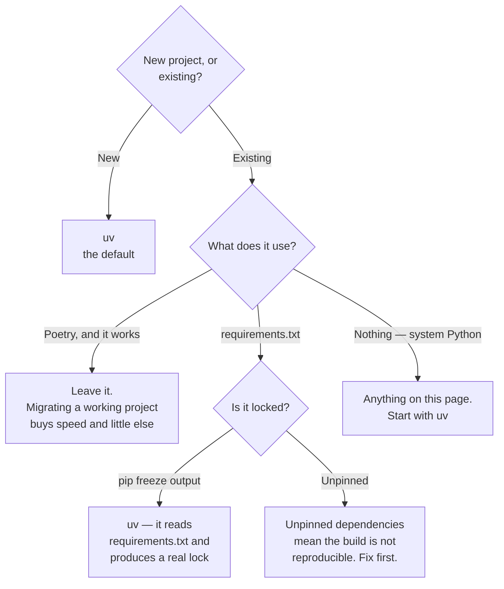

[← Python](../README.md)

# Python dependency management

The part of Python that has been solved four times and is finally converging.

Tools covered: [`uv`](uv/README.md) · [`poetry`](poetry/README.md) ·
[`virtualenv`](virtualenv/README.md)

---

## The problem

Python has no single answer to "what does this project depend on, and how do I reproduce that
environment". It has had several, layered on top of each other, and a project usually inherits
whichever was current when it started.

| Concern | Why it matters |
|---|---|
| **Isolation** | two projects needing different versions of the same library |
| **Resolution** | which versions actually satisfy every constraint together |
| **Locking** | the same versions on a laptop, in CI, and in the image |
| Dev vs. runtime | test tooling should not ship to production |
| **Reproducibility** | a build today and in six months producing the same environment |
| Speed | in CI, on every build, this is measurable |

`pip install -r requirements.txt` covers the first and, with `pip freeze`, approximates the third.
It does not resolve, does not separate groups, and does not distinguish direct dependencies from
transitive ones.

## The three tools

| Tool | Role | Where it shines |
|---|---|---|
| **uv** | resolver, installer, venv, and Python version manager | **the current answer** — very fast, and it replaces several tools at once | [→](uv/README.md) |
| **Poetry** | resolver, installer, packaging | mature, widely deployed, and where most existing projects are | [→](poetry/README.md) |
| **virtualenv** / `pip` | isolation and installation | **the baseline** — always present, no project to adopt | [→](virtualenv/README.md) |

## Why uv wins

Written in Rust by Astral, and it does something the others do not: it collapses the tool count.

| Job | Before | With uv |
|---|---|---|
| Virtual environments | `virtualenv` / `venv` | `uv venv` |
| Installing | `pip` | `uv pip` |
| Locking | `pip-tools` / Poetry | `uv lock` |
| **Python versions** | `pyenv` | **`uv python`** |
| Running tools | `pipx` | `uv tool` |
| Project management | Poetry | `uv add` / `uv remove` |

That last column is one binary. The speed is what gets attention — resolution and installation are
an order of magnitude faster, which is visible in CI — and the consolidation is what actually
matters over time.

Two specific advantages recorded from using both:

**uv supports constraints; Poetry does not.**
[python-poetry/poetry#7051](https://github.com/python-poetry/poetry/issues/7051) — being able to
pin a transitive dependency without making it a direct one is a real capability, and its absence
is felt whenever a sub-dependency needs holding back.

**uv's Docker documentation is good; Poetry's is not.** Poetry's guidance on multi-stage builds
lives in [a discussion thread](https://github.com/orgs/python-poetry/discussions/1879) and
[an unmerged PR](https://github.com/python-poetry/poetry/pull/9542). uv publishes
[a proper guide](https://docs.astral.sh/uv/guides/integration/docker/#installing-a-project).

For a platform that builds container images constantly, the second point is not a detail.

## Decision tree

## What to get right regardless of tool

| Practice | Why |
|---|---|
| **Commit the lock file** | it is what makes the build reproducible; without it the tool is a nicer installer |
| **Separate dev and runtime groups** | test tooling should not be in the production image |
| Pin the Python version | a project working on 3.11 and failing on 3.12 is a bad afternoon |
| **Multi-stage Docker builds** | install dependencies in one stage, copy into a slim runtime |
| Do not install into the system Python | container or not, the isolation is what prevents surprises |
| Regenerate the lock deliberately | not as a side effect of an unrelated change |

The Docker point deserves expanding because it is where most of the time goes. The pattern that
works: install dependencies in a builder stage using the lock file **before** copying the
application source, so a code change does not invalidate the dependency layer. Both uv and Poetry
support it; only one documents it well.

## Anti-patterns

| Anti-pattern | Why it is bad | What to do instead |
|---|---|---|
| No lock file | the build is not reproducible; "it worked last week" is unanswerable | commit it |
| `pip freeze > requirements.txt` as locking | it captures the environment, not the intent, including transitive noise | a real lock file |
| Unpinned dependencies | a transitive release breaks the build with no change on your side | pin, and update deliberately |
| Dev dependencies in the runtime image | a larger image and a larger attack surface | groups, and multi-stage builds |
| Installing into system Python | version conflicts across projects and with the OS | a virtual environment, always |
| Copying source before installing dependencies | every code change rebuilds the dependency layer | lock file first, source second |
| Several tools in one project | Poetry for locking, pip in Docker, pyenv for versions | one tool; uv covers all three |
| Migrating a working project for speed | risk taken for a marginal gain | new projects first |

## Notes

For this platform the recommendation is **uv for new work, Poetry left alone where it already
works** — the migration cost is real and the gain is speed rather than capability.

The exception is the Docker case. A project being containerised is a project where uv's
documented multi-stage pattern is worth the migration on its own, given how much of this
repository builds images.

[`virtualenv/`](virtualenv/README.md) remains worth knowing rather than using: it is what is
always available, it is what the other tools are built over, and understanding it makes their
behaviour legible rather than magical.

---

[← Python](../README.md)
