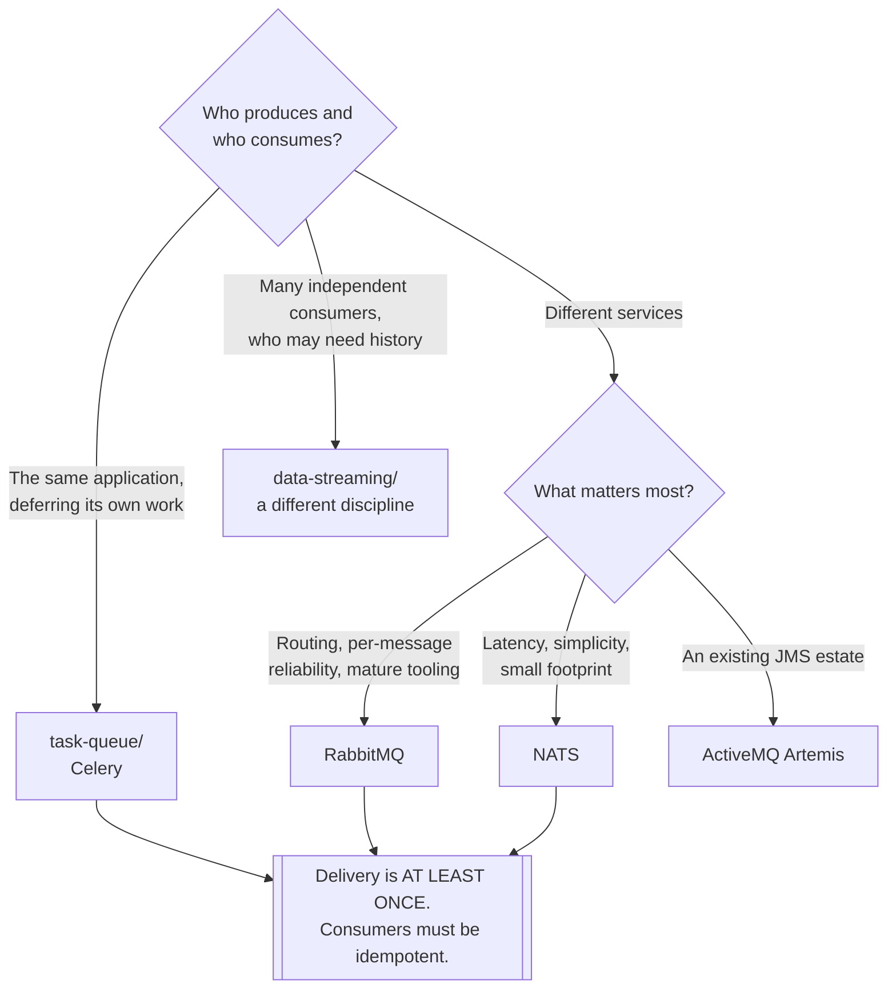

[← Software engineering](../README.md)

# Messaging

Doing work asynchronously — and the distinction that decides which tool is right.

Subfolders: [`broker/`](broker/README.md) — RabbitMQ, NATS, ActiveMQ ·
[`task-queue/`](task-queue/README.md) — Celery and friends

## Contents

1. [Three models, one word](#1-three-models-one-word)
2. [Broker or task queue](#2-broker-or-task-queue)
3. [Delivery guarantees](#3-delivery-guarantees)
4. [Decision tree](#4-decision-tree)
5. [What breaks in production](#5-what-breaks-in-production)
6. [Anti-patterns](#6-anti-patterns)
7. [How this applies to pikakube](#7-how-this-applies-to-pikakube)

---

## 1. Three models, one word

"Messaging" covers three genuinely different things, and this repository splits them across two
disciplines:

| Model | What it is | Here |
|---|---|---|
| **Work queue** | a message consumed **once**, by one worker | [`broker/`](broker/README.md) |
| **Task queue** | a **function** executed asynchronously, by workers of the same application | [`task-queue/`](task-queue/README.md) |
| **Event log** | an append-only log, **retained and replayable**, read by many independent consumers | [`data-streaming/`](../../data-streaming/README.md) |

The distinction that matters most:

> **A broker delivers and forgets. A log retains and replays.**

RabbitMQ acknowledges a message and it is gone. Kafka keeps it for the retention period, so a new
consumer can read history and a broken consumer can be rewound.

Choosing a log because "we need queues" is the most common and most expensive confusion in this
area — it brings partitions, consumer groups, retention policies and ordering semantics to solve a
problem a queue solves with none of them.

## 2. Broker or task queue

Less obvious, and it is a real choice:

| | **Broker** | **Task queue** |
|---|---|---|
| The unit | a **message** | a **function call** |
| Producer and consumer | usually **different services** | usually the **same application** |
| Serialisation | you define it | the framework handles it |
| Routing | exchanges, topics, subjects | a queue name |
| Cross-language | **yes** | rarely |
| Scheduling, retries, chaining | build it | **built in** |
| Examples | RabbitMQ, NATS | Celery, RQ |

**A task queue is a programming model; a broker is infrastructure.** Celery needs a broker
underneath — usually RabbitMQ or Redis — so this is not either/or but a question of which layer
the application works at.

Use a task queue when one application defers its own work: sending an email, generating a report,
processing an upload. Use a broker directly when **different services** communicate, especially in
different languages.

## 3. Delivery guarantees

The property that decides how the application must be written:

| Guarantee | Reality |
|---|---|
| At most once | fire and forget; messages can be lost |
| **At least once** | **what you actually get** — duplicates are possible |
| Exactly once | not really available end to end; it is at-least-once plus idempotency |

**Consumers must be idempotent.** That is not a recommendation, it is the consequence of
at-least-once delivery: a worker that crashes after doing the work and before acknowledging will
see the message again.

The practical patterns:

- an **idempotency key** per message, recorded when processed
- operations expressed as `UPSERT` rather than `INSERT`
- a check-then-act guarded by a unique constraint

Designing without this produces duplicate charges, duplicate emails and duplicate rows — under
load, intermittently, and long after the code was written.

## 4. Decision tree

## 5. What breaks in production

Five things, and none of them is the broker being slow:

| Problem | Detail |
|---|---|
| **No dead-letter queue** | a message that always fails is retried forever, blocking the queue behind it |
| **Unbounded queues** | a producer faster than its consumers fills memory or disk until the broker stops |
| **Non-idempotent consumers** | duplicates become duplicate side effects |
| Poison messages | one malformed message stops a partition or a consumer permanently |
| **Ordering assumed** | most setups do not guarantee it once there is more than one consumer |

The dead-letter queue is the one to configure **before** the first incident. Without it, a message
that cannot be processed is retried until someone notices, and what they notice is that nothing
else is being processed.

The ordering point is worth internalising: a single consumer preserves order, and the moment a
second one is added to keep up, it does not. Anything depending on order needs either one consumer
or a partitioning key — see [`data-streaming/`](../../data-streaming/README.md), where that is the
central design decision.

## 6. Anti-patterns

| Anti-pattern | Why it is bad | What to do instead |
|---|---|---|
| Kafka as a work queue | partitions, retention and consumer groups for a problem a queue solves | a broker |
| A broker as an event log | acknowledged means gone; no replay | [`data-streaming/`](../../data-streaming/README.md) |
| Non-idempotent consumers | at-least-once delivery makes duplicates inevitable | idempotency keys |
| No dead-letter queue | one bad message blocks everything behind it | configure it first |
| No queue depth monitoring | the first symptom is a full disk | alert on depth and consumer lag |
| Large payloads in messages | brokers are not object storage | a reference to the payload |
| Ordering assumed with several consumers | it is not guaranteed | one consumer, or a partition key |
| A broker per application | operational cost multiplied for isolation that vhosts provide | one broker, isolated logically |
| Retry without backoff | a failing downstream is hammered until it stays down | exponential backoff, with a cap |

## 7. How this applies to pikakube

**RabbitMQ is the one with real depth here** — see
[`broker/rabbitmq/`](broker/rabbitmq/README.md): the cluster operator, the messaging topology
operator, a streams producer and consumer, and a notebook. That is a working setup rather than a
mapped one.

NATS is mapped with [NUI](broker/nats/nui/README.md), its web interface, and
[ActiveMQ Artemis](broker/activemq-artemis/README.md) carries the recorded finding that there is
**no Helm chart** — which in a GitOps repository is most of the evaluation.

[Celery](task-queue/celery/README.md) is mapped, with the note that its **Helm chart is very
new**. That matters more than it sounds: Celery is normally deployed as part of the application
rather than as a platform service, and a chart is a recent way of doing it.

The boundary to keep clear for this platform: [`data-streaming/`](../../data-streaming/README.md)
already runs Kafka and Redpanda for the event-log model. This folder is for the queue model, and
the two exist side by side because they answer different questions — not because one has replaced
the other.

---

[← Software engineering](../README.md)
