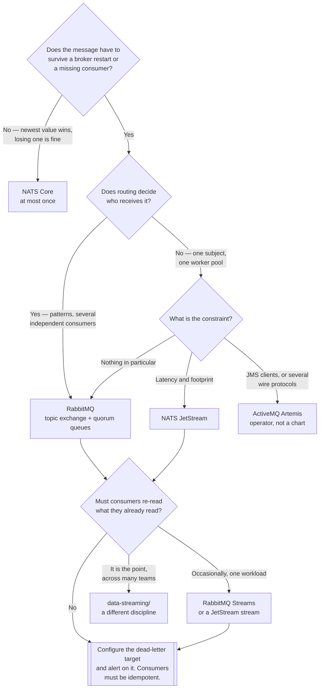

[← Messaging](../README.md)

# Broker

The middleman that accepts a message, decides where it goes, and hands it to exactly one consumer.

Tools covered: [`rabbitmq`](rabbitmq/README.md) · [`nats`](nats/README.md) ·
[`activemq-artemis`](activemq-artemis/README.md)

## Contents

1. [What a broker actually does](#1-what-a-broker-actually-does)
2. [Protocols](#2-protocols)
   1. [AMQP](#21-amqp)
   2. [The NATS protocol](#22-the-nats-protocol)
3. [Routing — RabbitMQ's exchange types](#3-routing--rabbitmqs-exchange-types)
   1. [The four exchange types](#31-the-four-exchange-types)
   2. [What routing actually buys](#32-what-routing-actually-buys)
4. [Quorum queues vs classic mirrored queues](#4-quorum-queues-vs-classic-mirrored-queues)
5. [NATS Core vs JetStream](#5-nats-core-vs-jetstream)
6. [Dead-letter queues](#6-dead-letter-queues)
7. [RabbitMQ Streams — the blurred boundary](#7-rabbitmq-streams--the-blurred-boundary)
8. [The tools](#8-the-tools)
9. [Decision tree](#9-decision-tree)
10. [Anti-patterns](#10-anti-patterns)
11. [How this applies to pikakube](#11-how-this-applies-to-pikakube)

---

## 1. What a broker actually does

Three things, and the third is the one people forget:

| It does | Meaning |
|---|---|
| **Accepts** | a producer publishes and is done — it does not wait for a consumer to exist |
| **Routes** | the broker decides which queues a message lands in, from rules the producer never sees |
| **Forgets** | once a consumer acknowledges, the message is gone |

That last property is the whole boundary with [`data-streaming/`](../../../data-streaming/README.md).
A broker is a **hand-off**, not a record. If someone will need the message again next month, this
is the wrong folder — see [`messaging/`](../README.md) for the three-model split.

Everything else — protocols, exchange types, queue replication — is detail about how the hand-off
is made reliable.

## 2. Protocols

The protocol is not a compatibility checkbox. It decides what the broker's model *is*, because
the model is defined in the protocol itself.

### 2.1 AMQP

Two protocols share the name, and they are genuinely different:

| | **AMQP 0-9-1** | **AMQP 1.0** |
|---|---|---|
| What it is | a broker model *and* a wire format | a wire format only |
| Defines exchanges, queues, bindings | **yes** — they are protocol concepts | **no** — the broker decides |
| Who speaks it | RabbitMQ, natively | ActiveMQ Artemis natively; RabbitMQ too |
| Standard | a de-facto one, driven by RabbitMQ | an OASIS/ISO standard |

The consequence: **AMQP 0-9-1 is why RabbitMQ clients declare exchanges and bindings in
application code**. `channel.queue_declare(...)` is not a RabbitMQ API, it is a protocol method.
AMQP 1.0 deliberately dropped that — it standardises how bytes move between two peers and says
nothing about routing topology, which is why an AMQP 1.0 client cannot assume RabbitMQ's
exchange model exists.

For a broker like [ActiveMQ Artemis](activemq-artemis/README.md), speaking many protocols
(AMQP 1.0, MQTT, STOMP, OpenWire, JMS) is the entire selling point — one broker, several client
ecosystems, at the cost of a more abstract internal model.

### 2.2 The NATS protocol

[NATS](nats/README.md) does not speak AMQP at all. It has its own text-based protocol, and the
difference in philosophy is larger than the difference in bytes:

| | AMQP brokers | NATS |
|---|---|---|
| The addressable thing | a queue, **declared** in advance | a **subject**, which just exists |
| Wildcards | via topic exchange bindings | in the subscription: `orders.*.created`, `orders.>` |
| Request/reply | build it — reply queue, correlation id | **built into the protocol** |
| Load balancing | several consumers on one queue | a **queue group** |
| Broker state | queues, bindings, policies — durable config | Core NATS holds almost none |

Nothing is declared and nothing is provisioned: publishing to `orders.eu.created` requires no
prior setup, and a subscriber to `orders.>` receives it. That makes NATS trivial to start with
and means **there is no queue accumulating messages** unless JetStream is enabled — see
[section 5](#5-nats-core-vs-jetstream).

## 3. Routing — RabbitMQ's exchange types

In AMQP 0-9-1 a producer **never publishes to a queue**. It publishes to an *exchange* with a
routing key; bindings decide which queues receive a copy.

### 3.1 The four exchange types

| Exchange | Matches on | Use it for |
|---|---|---|
| **direct** | routing key, exact string | a queue per job type: `pdf.generate`, `email.send` |
| **topic** | routing key, pattern with `*` (one word) and `#` (zero or more) | event hierarchies: `order.eu.created`, bound as `order.#` |
| **fanout** | nothing — every bound queue gets a copy | broadcast: cache invalidation, config reload |
| **headers** | message header attributes, `all` or `any` | routing on several independent attributes at once |

The default exchange (`""`) is a direct exchange where the routing key is the queue name — which
is why `basic_publish(exchange='', routing_key='testqueue', ...)` appears to publish straight to
a queue. It does not; it uses a shortcut that hides the model.

**headers** is the one to be suspicious of: it is slower than `topic` and almost every use of it
is a routing key that should have been designed properly.

### 3.2 What routing actually buys

One thing, and it is worth the concept:

> **The producer does not know who consumes.** Adding a consumer is a binding, not a code change
> and not a deployment.

Concretely — an `order.created` publisher is written once. Later, billing, search indexing and
the fraud team each bind their own queue with their own pattern. The publisher is never touched,
never redeployed, and cannot break them by adding a subscriber it forgot about.

The alternative — the producer holding a list of destination queue names — puts the consumer
topology inside the producer's source code, where every new consumer becomes a pull request
against someone else's service.

NATS reaches the same outcome by a different route: subject wildcards in the *subscription*
rather than bindings in the broker.

## 4. Quorum queues vs classic mirrored queues

**Quorum queues are the current answer.** This is not a preference; classic mirrored queues are
deprecated and were removed in RabbitMQ 4.0.

| | Classic mirrored (gone) | **Quorum** |
|---|---|---|
| Replication | leader plus mirrors, ad-hoc protocol | **Raft consensus** |
| Behaviour under partition | known data-loss modes, confusing failover | majority wins, minority refuses writes |
| Durability | optional | **always durable** |
| Poison messages | nothing built in | **`delivery-limit`**, then dead-letter |
| Configured by | a policy applied to a pattern | a queue argument at declaration |
| Node count | any | odd — **3 or 5** |

The trade-offs to know before declaring everything as quorum:

- more memory and disk per message, because every message is replicated and journalled
- **many small queues cost more** — each quorum queue is its own Raft cluster with its own
  processes and elections; thousands of them is a real load
- non-durable, exclusive and auto-delete queues are not available — by design
- a queue needs a majority of its replicas alive; with 3 nodes, two must be up

For short-lived, per-connection, throwaway queues, a classic (non-mirrored) queue is still the
right shape. For anything the business depends on, quorum.

## 5. NATS Core vs JetStream

The single most important thing to understand about NATS, and the one that surprises people:

| | **Core NATS** | **JetStream** |
|---|---|---|
| Delivery | **at most once** | at least once |
| If no subscriber is connected | the message is **gone** | it is stored |
| Persistence | none | memory or file, replicated |
| Acknowledgements | none | per message, with redelivery |
| Replay / history | no | **yes, from a sequence or a time** |
| Also provides | — | key-value and object stores, built on streams |

> **Core NATS is fire-and-forget. Use JetStream for anything durable.**

Core NATS is not a degraded mode — it is a deliberate design, and it is excellent for metrics
gossip, service discovery, request/reply RPC and telemetry, where the newest value matters and a
lost one does not. The failure is using it for work that must happen: no subscriber connected at
publish time means no error, no queue, and no message.

JetStream turns NATS into something closer to a log than to a queue: streams retain messages,
consumers hold their own position, and a consumer can be replayed. That makes it a genuine
overlap with [`data-streaming/`](../../../data-streaming/README.md) — the same blurring described
in [section 7](#7-rabbitmq-streams--the-blurred-boundary).

## 6. Dead-letter queues

A message that can never be processed must go **somewhere that is not the front of the queue**.
Without that, the consumer takes it, fails, returns it, takes it again — and everything behind it
waits.

In RabbitMQ, dead-lettering is a property of the queue (`x-dead-letter-exchange`), and a message
is dead-lettered when:

| Trigger | Typical cause |
|---|---|
| Rejected with `requeue=false` | the consumer decided it is unprocessable |
| Message TTL expired | it sat unconsumed too long |
| Queue length limit reached | the queue overflowed and dropped from the head |
| **`delivery-limit` exceeded** | quorum queues only — the retry counter ran out |

`delivery-limit` is the reason quorum queues matter here: with classic queues nothing counts
redeliveries, so "retry a few times then give up" had to be built in the application.

NATS JetStream has no DLQ as a first-class object. A consumer has `max_deliver`, and when it is
exhausted the server publishes an **advisory** on `$JS.EVENT.ADVISORY.CONSUMER.MAX_DELIVERIES.>`
— you subscribe to that and write the failure into a stream of your own. It works, but it is
assembly rather than configuration.

Two rules that survive every incident review:

1. **Configure the dead-letter target before the first message is published**, not after the
   first outage.
2. **Alert on the DLQ having anything in it.** A dead-letter queue nobody watches is a slower way
   to lose messages.

## 7. RabbitMQ Streams — the blurred boundary

RabbitMQ Streams is an append-only, **replayable** log living inside RabbitMQ. It is not a queue
with different settings — it is a different structure, with its own binary protocol on port
**5552**, its own clients, and retention by size or age instead of by acknowledgement.

| | RabbitMQ queue | RabbitMQ stream |
|---|---|---|
| On consume | message removed | **nothing removed** — the consumer moves an offset |
| Many independent consumers | each needs its own queue and binding | all read the same stream |
| Replay | impossible | **from an offset or a timestamp** |
| Retention | until acknowledged | by size or time |
| Consumer position | held by the broker | held by the consumer (or stored server-side) |

This genuinely blurs the boundary the [parent README](../README.md#1-three-models-one-word)
draws: "a broker delivers and forgets" stops being true for this one feature.

Where the boundary reasserts itself:

- ordering and scale are **per stream**; partitioning requires "super streams", which is a
  layer on top rather than the native model Kafka has
- the ecosystem around it — connectors, stream processing, schema tooling — is a fraction of
  Kafka's
- it is still a RabbitMQ cluster, sized and operated as one

**The honest rule:** if RabbitMQ is already running and one workload needs replay or several
independent readers, streams save you an entire platform. If event streaming is a first-order
requirement across many teams, it is [`data-streaming/`](../../../data-streaming/README.md), and
pretending otherwise buys a year of pain.

## 8. The tools

| Tool | Model | Shines when | Do not use when | Detail |
|---|---|---|---|---|
| **RabbitMQ** | AMQP 0-9-1, exchanges and bindings, quorum queues, streams | routing matters, per-message reliability matters, and you want mature operational tooling | you need microsecond latency or a footprint measured in megabytes | [→](rabbitmq/README.md) |
| **NATS** | its own protocol, subjects; JetStream for persistence | latency, simplicity, a tiny footprint, request/reply as a native operation | you want AMQP, or rich broker-side routing rules | [→](nats/README.md) |
| **ActiveMQ Artemis** | multi-protocol — AMQP 1.0, MQTT, STOMP, OpenWire, JMS | an existing **JMS** estate, or several protocols against one broker | greenfield on Kubernetes — see the deployment note below | [→](activemq-artemis/README.md) |

The Artemis caveat is operational rather than technical: there is **no Helm chart**, which in a
GitOps repository where everything is a Flux `HelmRelease` is most of the evaluation. See
[`activemq-artemis/`](activemq-artemis/README.md).

## 9. Decision tree

## 10. Anti-patterns

| Anti-pattern | Why it is bad | What to do instead |
|---|---|---|
| Classic mirrored queues on a new cluster | deprecated, and removed in RabbitMQ 4.0 | quorum queues |
| Quorum queues for thousands of tiny short-lived queues | each one is a Raft cluster with elections | classic queues for throwaway ones |
| **NATS Core for work that must happen** | at most once — no subscriber connected means silently lost | JetStream |
| No dead-letter exchange | one unprocessable message blocks the queue behind it | set it at declaration, alert on depth |
| A DLQ nobody looks at | failures accumulate unnoticed | alert on any message in it |
| Routing decided by `if` statements in the producer | consumer topology lives in the producer's source | topic exchange bindings, or subject wildcards |
| `headers` exchange as the default | slower, and usually a badly designed routing key | `topic` |
| Auto-ack for work that matters | the message is gone the moment it is delivered, crash or not | manual ack after the work succeeds |
| Queues with no `max-length` | a fast producer fills disk until the broker refuses everything | bound the queue and dead-letter the overflow |
| RabbitMQ as an event log | acknowledged means gone | streams, or [`data-streaming/`](../../../data-streaming/README.md) |
| Streams because "it is like Kafka" | no native partitioning, a much smaller ecosystem | be honest about which problem you have |
| The management UI as monitoring | nobody is looking at 03:00 | export to [Prometheus](../../../observability/metrics/storage/prometheus/README.md) |
| Credentials in chart values | they end up in Git in plain text | a secret reference |

## 11. How this applies to pikakube

**RabbitMQ is the one with real depth here.** Both deployment shapes are present —
[the chart](rabbitmq/rabbitmq/README.md) and
[the cluster operator](rabbitmq/rabbitmq-cluster-operator/README.md) — plus working Python
examples rather than mapped intent: a [`pika`](https://github.com/pika/pika) notebook and an
[`rstream`](https://github.com/qweeze/rstream) producer and consumer against RabbitMQ Streams.

The chart deliberately enables the stream plugins (`rabbitmq_stream`,
`rabbitmq_stream_management`) and exposes port **5552**, which is what makes those stream
examples runnable — that is [section 7](#7-rabbitmq-streams--the-blurred-boundary) in practice,
not in theory.

The cluster operator release enables metrics and a `ServiceMonitor` for **both** the cluster
operator and the messaging topology operator, which is the pairing that matters: one runs the
cluster, the other turns queues, exchanges, policies and users into Kubernetes resources — so
topology becomes a pull request instead of a click in the management UI.

[NATS](nats/README.md) is mapped with [NUI](nats/nui/README.md) as its web interface.
[ActiveMQ Artemis](activemq-artemis/README.md) carries the recorded finding that there is **no
Helm chart**, which in this repository is a decision, not a footnote.

The boundary to keep clear: [`data-streaming/`](../../../data-streaming/README.md) already runs
Kafka and Redpanda for the event-log model. This folder is the queue model. RabbitMQ Streams sits
between them, and the reason to prefer it is *not having to run a second platform* — never
because it is a Kafka substitute.

---

[← Messaging](../README.md)
