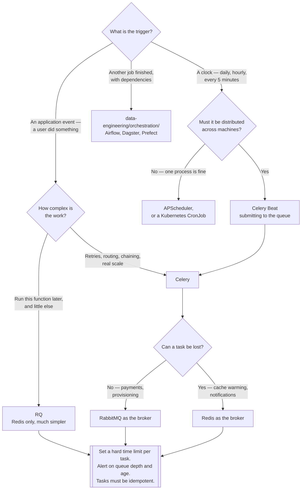

[← Messaging](../README.md)

# Task queue

Running a function later, somewhere else — and the broker underneath that makes it possible.

Tools covered: [`celery`](celery/README.md)

## Contents

1. [What a task queue is](#1-what-a-task-queue-is)
2. [It needs a broker underneath](#2-it-needs-a-broker-underneath)
   1. [Which broker](#21-which-broker)
   2. [Result backends](#22-result-backends)
3. [A task queue is not a scheduler](#3-a-task-queue-is-not-a-scheduler)
4. [The tools](#4-the-tools)
5. [Long-running tasks and visibility](#5-long-running-tasks-and-visibility)
6. [Decision tree](#6-decision-tree)
7. [Anti-patterns](#7-anti-patterns)
8. [Notes](#8-notes)
9. [How this applies to pikakube](#9-how-this-applies-to-pikakube)

---

## 1. What a task queue is

A programming model, not a piece of infrastructure. The unit is a **function call**, not a message:

```
send_email.delay(user_id)
```

The framework serialises the call, puts it on a queue, and a worker process — the same
application, deployed separately — deserialises and runs it. What the framework gives you is
everything around that: retries with backoff, timeouts, scheduled execution, chaining tasks
together, and a way to collect results.

The contrast with [`broker/`](../broker/README.md), stated in the
[parent README](../README.md#2-broker-or-task-queue):

| | Broker | Task queue |
|---|---|---|
| The unit | a message | **a function call** |
| Both ends | usually different services | usually **the same application** |
| Serialisation | you define it | the framework does it |
| Cross-language | yes | rarely |
| Retries, scheduling, chaining | build it | **built in** |

The practical consequence: a task queue is code you deploy, not a platform service. Its workers
are your application image with a different command, they carry your dependencies, and they
version with your releases. That is why this folder is thinner than [`broker/`](../broker/README.md)
— most of the decisions belong to the application, not the platform.

## 2. It needs a broker underneath

**This is the fact that decides the architecture.** Celery is not a queue; it is a client and a
worker around a queue that something else provides.

```
application  →  Celery client  →  BROKER  →  Celery worker  →  result backend
                                (RabbitMQ                        (Redis, a DB)
                                 or Redis)
```

So "we chose Celery" is an incomplete statement. It always means Celery **plus** RabbitMQ or
Celery **plus** Redis, and the second half determines the operational reality: what has to be
highly available, what has to be backed up, and what fills up at 03:00.

### 2.1 Which broker

| | **RabbitMQ** | **Redis** |
|---|---|---|
| Purpose-built for this | yes | no — it is a data store used as one |
| Durability | messages survive a restart | depends entirely on persistence configuration |
| Acknowledgement | native, per message | emulated with a visibility timeout |
| A worker crashes mid-task | the message returns to the queue | returns after the timeout, if configured right |
| Priorities, routing | native | limited |
| Latency, simplicity | higher, more to run | lower, and it is often already there |
| Celery's own recommendation | **RabbitMQ** | supported, with caveats |

Redis is chosen constantly because it is already deployed, and that is a legitimate reason for
work that can be lost. For work that must happen — a payment, an invoice, a provisioning step —
**RabbitMQ**, because "already there" is not a durability guarantee.

The subtle failure with Redis: acknowledgement is emulated. A task is moved to an "unacked" set
and returned after `visibility_timeout` seconds. Set that lower than the task's real duration and
the task is redelivered **while still running**, producing a duplicate that looks like a race
condition and is actually a configuration value.

### 2.2 Result backends

A result backend stores what a task returned so the caller can retrieve it. It is optional, it is
**off by default in effect**, and it is the source of most surprise cost:

| Reality | Consequence |
|---|---|
| It is a **separate store** from the broker | usually Redis or a database — another dependency |
| Results have a TTL | without it, they accumulate until the store fills |
| Every task writes a result if enabled | including the thousands whose result nobody reads |
| Waiting on a result synchronously | turns async work back into a blocking call, badly |

The rule: **if nobody reads the result, do not store it.** Most tasks are fire-and-forget — send
the email, resize the image — and they should have results disabled per task, not globally
enabled because the tutorial did.

The other rule: `.get()` on a result inside a web request is an anti-pattern that removes the
entire point of the task queue while keeping all of its complexity. If the caller must wait, it
was not background work.

## 3. A task queue is not a scheduler

Three different things get called "background jobs", and choosing the wrong one is common:

| Concern | Question | Tool shape |
|---|---|---|
| **Queue** | "run this, somewhere, soon" | Celery, RQ |
| **Scheduler** | "run this at 07:00 every day" | APScheduler, Rocketry, a CronJob |
| **Orchestrator** | "run these in a DAG, with dependencies, retries and lineage" | [`orchestration/`](../../../data-engineering/orchestration/README.md) |

They compose rather than compete. Celery Beat is a scheduler that *submits to* a queue; APScheduler
is a scheduler with no queue at all. Airflow schedules **and** orchestrates but is a poor fit for
thousands of small tasks per second.

The mistake in each direction:

- a **scheduler used as a queue** — work is triggered at a time but there is no distribution, so
  one process does all of it and the next trigger fires while it is still running
- a **queue used as a scheduler** — everything is `apply_async(eta=...)`, and the schedule lives
  scattered across the codebase with no way to see what runs when
- an **orchestrator used as a queue** — a DAG run per user action, and the scheduler becomes the
  bottleneck at a volume the queue would not notice

## 4. The tools

| Tool | What it is | Shines when | Do not use when | Detail |
|---|---|---|---|---|
| **Celery** | the full-featured distributed task queue for Python | retries, routing, scheduling, chaining and workflows are needed; scale is real | the job is "run this function later" and nothing more | [→](celery/README.md) |
| **RQ** | a much simpler task queue, **Redis only** | simplicity is the requirement — the whole thing is readable in an afternoon | you need RabbitMQ, priorities, complex workflows, or non-Unix workers |  |
| **APScheduler** | a **scheduler library**, in-process | "run this on a cron/interval/date" inside an existing application | work must be distributed across machines — it is not a queue |  |
| **Rocketry** | a scheduling framework with condition-based triggers | schedules expressed as conditions rather than cron strings |  long-term maintenance matters — check current activity first |  |

Only Celery has a folder here; the rest are recorded alternatives — see [section 8](#8-notes).

**RQ deserves the comparison it usually loses.** It is Redis-only, Python-only, and its worker
forks a process per job (so no Windows). In exchange, the entire library is small enough to read,
there is no broker abstraction layer, and the failure modes are obvious. For an application whose
background work is "send this email, generate this PDF", RQ does the job with a fraction of
Celery's configuration surface. Celery earns its complexity at scale and with routing; below that,
it is complexity paid for nothing.

**APScheduler is not in the same category** and the comparison is a category error. It runs inside
your process, holds jobs in a job store, and fires them on a trigger. There is no queue, no worker
pool on other machines, and no distribution — two replicas of your application means the job runs
twice unless you add locking yourself. That is fine, and it is much lighter than Celery Beat plus
a broker plus workers — as long as "distributed" is genuinely not required.

## 5. Long-running tasks and visibility

The failure mode that defines this folder: a task that runs for a long time, in a worker nobody is
watching, on a queue nobody has graphed.

What goes wrong, in order:

1. a task takes longer than expected and holds its worker slot
2. other tasks queue behind it, and the queue grows
3. the broker's acknowledgement timeout (or Redis `visibility_timeout`) expires and the task is
   **redelivered while still running** — now two copies are doing the same work
4. a deploy restarts the workers mid-task, and everything in flight is redelivered too
5. nobody notices, because the only signal was a log line

What prevents it:

| Measure | Why |
|---|---|
| **A hard time limit per task** | a task with no timeout runs forever and never surrenders its slot |
| Break long tasks into chunks | a five-minute task is fine; a five-hour one is a batch job in the wrong place |
| **Alert on queue depth and age** | depth alone is ambiguous; the age of the oldest message is not |
| Separate queues for slow work | one slow queue must not starve the fast one |
| Idempotent tasks | redelivery is a certainty, not a risk — see the [parent README](../README.md#3-delivery-guarantees) |
| Graceful shutdown on deploy | let workers finish, with a bounded grace period |
| A monitoring UI | [Flower](https://github.com/mher/flower) for Celery — see [`celery/`](celery/README.md) |

If the work is measured in hours rather than seconds, it is not a task — it is a batch job, and it
belongs in a Kubernetes `Job` or an [orchestrator](../../../data-engineering/orchestration/README.md).

## 6. Decision tree



## 7. Anti-patterns

| Anti-pattern | Why it is bad | What to do instead |
|---|---|---|
| **Long-running tasks with no visibility** | it holds a worker, gets redelivered mid-run, and the only signal is a log line | a hard time limit, chunking, and alerts on queue age |
| Treating Celery as infrastructure | it is your application code with a different command | version and deploy it with the application |
| Forgetting Celery needs a broker | the broker is what actually fails, fills and needs backing up | choose it deliberately — [section 2.1](#21-which-broker) |
| Redis as the broker for work that must not be lost | acknowledgement is emulated; durability depends on configuration | RabbitMQ |
| `visibility_timeout` shorter than the task | the task is redelivered while still running, silently duplicating work | set it above the longest realistic runtime |
| Results stored for every task | the backend fills with results nobody reads | disable results per task; set a TTL |
| `.get()` on a result in a web request | the request blocks — async complexity, synchronous behaviour | return a task id and poll, or use a callback |
| Non-idempotent tasks | redelivery is guaranteed, not hypothetical | idempotency keys — [parent README](../README.md#3-delivery-guarantees) |
| Passing large objects as arguments | arguments go through the broker, which is not object storage | pass an id, fetch inside the task |
| One queue for everything | slow tasks starve fast ones | queues by class of work, with separate worker pools |
| Retry without backoff or a limit | a failing dependency is hammered until it stays down | exponential backoff with a cap and a maximum retry count |
| A scheduler where a queue is needed | one process does everything, and triggers overlap | a queue, with the scheduler only submitting |
| No dead-letter path for tasks that always fail | they retry forever, occupying workers | a retry limit, then park the failure somewhere visible |

## 8. Notes

Alternatives recorded at this level rather than as folders — no manifests here, deliberately:

- <https://github.com/rq/rq> — **RQ (Redis Queue)**. A Python task queue that is Redis-only by
  design. No broker abstraction, no protocol negotiation, a fork-per-job worker (Unix only). Far
  simpler than Celery and, for applications whose background work is a handful of straightforward
  jobs, the better answer. The scheduling extension is a separate package, which is honest about
  what the core does.
- <https://github.com/agronholm/apscheduler> — **APScheduler**. A scheduling **library**, not a
  queue: it runs inside an existing process, triggers jobs on date, interval or cron, and persists
  them in a job store (memory, SQLAlchemy, Redis, Mongo) so a restart does not lose the schedule.
  There is no distribution — two application replicas run the job twice unless you add locking.
  The right tool when the requirement is genuinely "run this periodically" and not "distribute
  this work".
- <https://github.com/Miksus/rocketry/> — **Rocketry**. A Python scheduling framework whose
  distinguishing idea is **condition-based triggers**: schedules written as statements
  (`daily after 07:00`, `after task 'x'`) rather than cron expressions, with async support. An
  interesting model; check the project's current maintenance activity before adopting it.
- <https://rocketry.readthedocs.io/en/stable/rocketry_vs_alternatives.html#> — Rocketry's own
  comparison against crontab, APScheduler, Airflow and Celery. Worth reading not for the verdict —
  it is written by the project — but because it lays out exactly the distinction
  [section 3](#3-a-task-queue-is-not-a-scheduler) makes: scheduling frameworks, task queues and
  workflow orchestrators are three categories, and most arguments about them are people comparing
  across categories.

## 9. How this applies to pikakube

[Celery](celery/README.md) is the only tool mapped here, as a Flux `HelmRelease` — and the way it
is installed is itself the finding. There is no chart repository: the `HelmRelease` points at a
**`GitRepository`** cloning `celery/celery` at tag `v5.5.0rc4`, filtered to the `/helm-chart`
directory. A release candidate, and an in-repository chart rather than a published one, which is
what "the chart is very new" looks like in practice.

That is the point worth carrying: **Celery is normally deployed as part of the application** — a
worker `Deployment` built from the application image, sharing its code and dependencies — not as a
platform service installed from a chart. The chart is a recent way of doing it, and it does not
change the fact that workers need application code to be useful.

The broker dependency is the architectural link out of this folder. Celery here has no broker of
its own: it needs [RabbitMQ](../broker/rabbitmq/README.md), which this repository runs with both
the chart and the cluster operator, or
[Redis](../../../databases/nosql/key-value/redis/README.md), which it also runs. That choice is
made in Celery's configuration and it decides whether a task can be lost.

The gap, stated plainly: what is mapped is the deployment, not the operational discipline around
it. Queue depth and age alerts, per-task time limits and [Flower](https://github.com/mher/flower)
are what turn this from an installation into something that can be run — see
[`celery/`](celery/README.md).

---

[← Messaging](../README.md)
