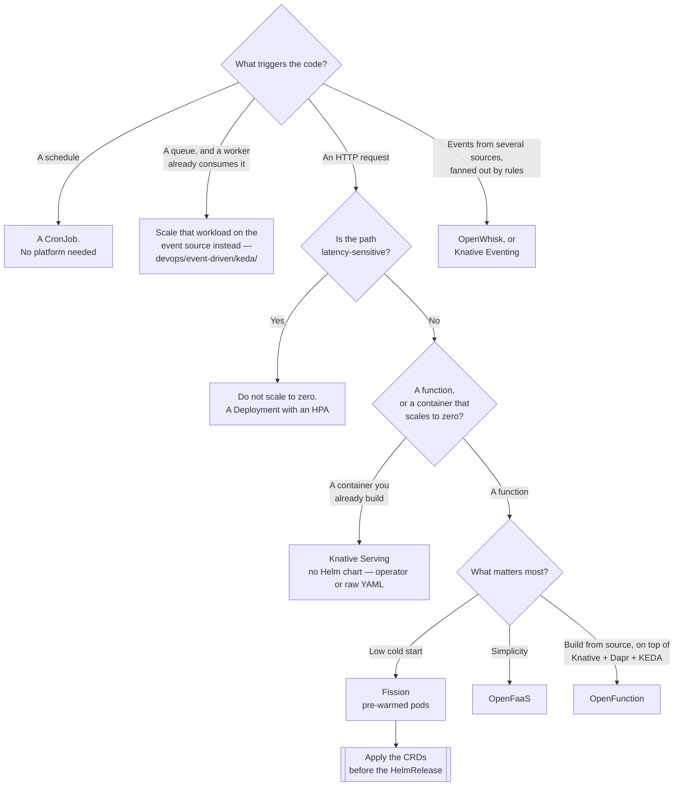

[← Software engineering](../README.md)

# Serverless

Running code without owning the service around it — and the question of whether the platform is
needed at all.

Tools covered: [`fission`](fission/README.md) · [`knative`](knative/README.md) ·
[`openfaas`](openfaas/README.md) · [`openfunction`](openfunction/README.md) ·
[`openwhisk`](openwhisk/README.md)

## Contents

1. [What serverless means on your own cluster](#1-what-serverless-means-on-your-own-cluster)
2. [Is this just a Job](#2-is-this-just-a-job)
3. [Cold starts — the tax you cannot remove](#3-cold-starts--the-tax-you-cannot-remove)
4. [The boundary with event-driven autoscaling](#4-the-boundary-with-event-driven-autoscaling)
5. [The platforms](#5-the-platforms)
6. [Decision tree](#6-decision-tree)
7. [Anti-patterns](#7-anti-patterns)
8. [How this applies to pikakube](#8-how-this-applies-to-pikakube)

---

## 1. What serverless means on your own cluster

On a managed cloud, serverless means somebody else owns the capacity and you pay per invocation.
On your own Kubernetes cluster **none of that is true** — the nodes are still yours, running
whether a function is invoked or not.

What is left is a developer experience, and it is worth naming precisely:

| What the platform gives you | What it costs |
|---|---|
| A **function** as the unit of deployment, instead of a Deployment plus Service plus Ingress | a control plane to run and upgrade |
| A **build path from source**, so the developer never writes a Dockerfile | a build system inside the cluster, and its cache |
| **Triggers** — HTTP, timer, message queue, Kubernetes events — declared rather than coded | a second routing layer next to your ingress |
| **Scale to zero**, so idle functions hold no pods | cold starts, permanently |

That trade is the whole decision. You are exchanging a control plane you must operate for a
deployment experience your developers get. On a small platform, the exchange usually loses.

## 2. Is this just a Job

The question to ask before any of this is installed, because the answer is very often yes:

| What the code does | What it actually needs |
|---|---|
| Runs on a schedule | a **`CronJob`**. Nothing else. |
| Runs once, to completion, on demand | a **`Job`** |
| Consumes a queue, and a service already consumes that queue | the existing worker, scaled on queue depth |
| Serves HTTP, always has traffic | a **`Deployment`** with an HPA |
| Serves HTTP, is idle most of the day, and cold starts are acceptable | **a function platform** |
| Dozens of small handlers, written by people who should not learn Kubernetes | **a function platform** |

Only the last two rows justify installing anything from this folder. A serverless platform to run
one scheduled task is a control plane in exchange for six lines of YAML.

## 3. Cold starts — the tax you cannot remove

Scale to zero is the feature people want and the cost they forget. When the replica count is zero,
the next request pays for everything that normally happens before your process is ready:

```
scheduling → image pull → container start → runtime init → application init → first request
```

The mitigations all work, and every one of them gives something back:

| Mitigation | What it gives back |
|---|---|
| A **pool of pre-warmed pods** (Fission's model) | idle capacity is held permanently — you are paying for it, just not per function |
| A **minimum scale above zero** (Knative's `minScale`) | scale to zero is gone, which was the reason for the platform |
| Small runtimes, pre-pulled images, lazy imports | real, and the cheapest win; bounded by how heavy the language is |
| Keeping the function warm with synthetic traffic | you have built a `Deployment` with extra steps |

The number that matters is **p99 latency after an idle period**, not p50 under load. Benchmarks
taken while traffic is flowing measure a warm platform and tell you nothing about the case that
hurts.

The rule that follows: **do not put scale-to-zero in front of a user-facing, latency-sensitive
path.** Batch work, webhooks, internal tools and glue code tolerate a cold start. A checkout page
does not.

## 4. The boundary with event-driven autoscaling

This is the boundary most often blurred, and the folders are separate for a reason.

| | **Function platform** (this folder) | **Event-driven autoscaling** |
|---|---|---|
| The unit | a **function** — source code plus a trigger | an existing **Deployment** |
| What it does | builds it, routes to it, runs it | changes its replica count, including to zero |
| Your code changes | yes — it is written to the platform's handler signature | **no** |
| Brings a build system | usually | no |
| Brings a router | usually | no |

If a service already exists and the requirement is "scale it on RabbitMQ queue depth", the answer
is autoscaling on the event source — see `../../devops/event-driven/keda/` — not a function
platform. Nothing about the application has to change.

If there is no service, and the requirement is "let developers ship handlers without learning
Kubernetes", that is what this folder is for.

The two also compose: several platforms here use event-driven autoscaling internally rather than
implementing scale-to-zero themselves.

## 5. The platforms

| Tool | Model | Shines when | Do not use when | Detail |
|---|---|---|---|---|
| **Fission** | functions, with a **pool of pre-warmed pods** per environment | cold start is the constraint you actually care about | you want the pool's idle cost to be zero | [→](fission/README.md) |
| **Knative** | not a FaaS — **Serving** autoscales ordinary containers to zero, **Eventing** routes CloudEvents | you want scale-to-zero for containers you already build | you want a GitOps install by Helm — **there is no chart** | [→](knative/README.md) |
| **OpenFaaS** | one container per function, a gateway in front, a CLI-driven workflow | you want the simplest thing that works, quickly | edition boundaries matter to you — check which features are community and which are commercial | [→](openfaas/README.md) |
| **OpenFunction** | a **composition** — Knative Serving, Dapr, KEDA and a build system under one `Function` CRD | you want the whole stack assembled, and accept every part of it | you do not want four subsystems to own | [→](openfunction/README.md) |
| **OpenWhisk** | Apache's actions / triggers / rules model, polyglot | the programming model fits, and the footprint is affordable | the cluster is small — it brings CouchDB, Kafka and a controller/invoker pair | [→](openwhisk/README.md) |

The structural point hidden in that table: **Knative is not in the same category as the others.**
Fission, OpenFaaS and OpenWhisk give you a function abstraction. Knative gives you a container
that scales to zero and an event router — which is why OpenFunction is built *on top of* it rather
than competing with it.

## 6. Decision tree



## 7. Anti-patterns

| Anti-pattern | Why it is bad | What to do instead |
|---|---|---|
| A function platform for one function | a control plane, a build system and a router to run a cron job | a `CronJob`, or a plain `Deployment` |
| Scale to zero on a user-facing path | the first user after an idle period pays the cold start | a minimum of one replica — then ask what the platform is still for |
| Long-running work inside a function | the gateway times out; the model is request/response | a queue and a worker — [`messaging/`](../messaging/README.md) |
| State kept in the function | replicas are created and destroyed without warning | an external store |
| Installing the operator before its CRDs | resources are rejected because the type does not exist yet | apply the CRDs first, then the release |
| A second platform for a second team | two control planes, two build pipelines, two sets of triggers | one platform, or none |
| Functions as the unit of architecture | a distributed monolith with an HTTP hop between every method | services, with functions at the edges |
| Cold start never measured | the number is discovered by a user, in production | measure p99 after idle, not p50 under load |
| Chaining functions synchronously | latency and failure probability multiply along the chain | events between them, or one function |
| The platform's router next to your ingress | two places decide routing, and they disagree | one entry point, decided deliberately |

## 8. How this applies to pikakube

Five platforms mapped, none in use, and the recorded findings are worth more than the catalogue:

| Tool | State here |
|---|---|
| [Fission](fission/README.md) | chart `fission-all` 1.20.4, plus a **pre-sliced `crds/` folder** — eight CRDs extracted by hand because the chart cannot be trusted to install them first |
| [Knative](knative/README.md) | **no chart, no manifests** — only the note that there is no Helm chart, which in a Flux repository is most of the evaluation |
| [OpenFaaS](openfaas/README.md) | chart 14.2.90, `functionNamespace` set, dashboard left commented out with the access note |
| [OpenFunction](openfunction/README.md) | chart 0.7.0 with **only Knative Serving enabled** — Dapr, KEDA, Tekton, Shipwright and Contour all off |
| [OpenWhisk](openwhisk/README.md) | chart 1.0.1, nothing else |

Two findings generalise beyond this folder.

**The CRD ordering problem.** Fission is the case that made it explicit, and it is a general
Kubernetes and Helm limitation rather than a Fission bug: Helm does not reliably install a
sub-chart's CRDs before the resources that use them, so a single `HelmRelease` can fail on first
apply with "no matches for kind". The fix used here — render the CRDs, split them into one file
per resource, commit them, apply them ahead of the release — is the pattern to reach for whenever
an operator chart behaves this way. See [`fission/`](fission/README.md) for the exact command.

**No Helm chart is a decision, not an inconvenience.** This repository installs things through
Flux `HelmRelease` resources. A tool without a chart needs a different path — a `Kustomization`
over released YAML, or an operator installed the same way — and that is a real cost, recorded
against [Knative](knative/README.md) here and against ActiveMQ Artemis in
[`messaging/`](../messaging/README.md).

The honest recommendation for this platform: **nothing here is needed yet.** There is no fleet of
handlers to serve, and every workload currently mapped in this repository is a long-running
service or a scheduled job. If that changes, [OpenFaaS](openfaas/README.md) is the cheapest thing
to try and [Fission](fission/README.md) is the one with the interesting answer to cold starts.

---

[← Software engineering](../README.md)
