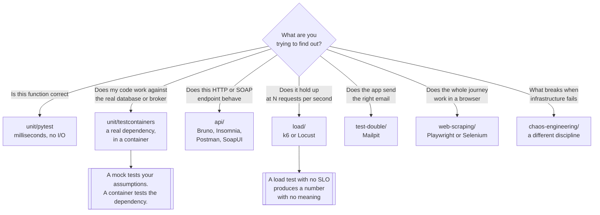

[← Software engineering](../README.md)

# Testing

Verifying that the system does what it was said to do — and knowing which layer answers which
question.

Subfolders: [`unit/`](unit/README.md) — pytest, testcontainers ·
[`api/`](api/README.md) — Bruno, Insomnia, Postman, SoapUI ·
[`load/`](load/README.md) — k6, Locust ·
[`test-double/`](test-double/README.md) — MailHog, Mailpit

## Contents

1. [The pyramid, and why it inverts](#1-the-pyramid-and-why-it-inverts)
2. [What belongs in each layer](#2-what-belongs-in-each-layer)
3. [Real dependencies beat mocks](#3-real-dependencies-beat-mocks)
4. [The four kinds of thing in this folder](#4-the-four-kinds-of-thing-in-this-folder)
5. [Where testing stops and chaos engineering starts](#5-where-testing-stops-and-chaos-engineering-starts)
6. [Decision tree](#6-decision-tree)
7. [Anti-patterns](#7-anti-patterns)
8. [How this applies to pikakube](#8-how-this-applies-to-pikakube)

---

## 1. The pyramid, and why it inverts

The standard model: many fast unit tests at the bottom, fewer integration tests in the middle, a
handful of end-to-end tests at the top.

| Layer | Count | Runtime | What a failure tells you |
|---|---|---|---|
| **Unit** | hundreds to thousands | milliseconds | exactly which function is wrong |
| **Integration** | tens to hundreds | seconds | the boundary between your code and a real dependency is wrong |
| **End-to-end** | a handful | minutes | *something* in the system is wrong |

Almost every suite drifts the other way — the "ice cream cone": a thin layer of unit tests under a
thick layer of end-to-end and manual ones. The drift is not carelessness, it has causes:

- an end-to-end test maps **directly onto a requirement**, so it is the obvious thing to write
- a unit test requires the code to be **designed to be testable**, which is work done earlier
- the cost of an end-to-end test is **not paid when it is written** — it is paid every run, forever

The result is predictable: a suite that takes forty minutes, fails intermittently for reasons
nobody investigates, and is eventually retried until green or skipped under pressure. **A test that
is routinely retried has stopped being a test.**

The correction is not "delete the end-to-end tests". It is to be deliberate about what each layer
is for, and to keep the top layer small enough that a red build is believed.

## 2. What belongs in each layer

| | **Unit** | **Integration** | **End-to-end** |
|---|---|---|---|
| Scope | one function or class | your code plus **one real dependency** | the whole system, through its public surface |
| I/O | none | the dependency under test | everything |
| Dependency | replaced in-process | **real, in a container** | real, deployed |
| Deterministic | must be | should be | rarely is |
| Owner | [`unit/`](unit/README.md) | [`unit/testcontainers/`](unit/testcontainers/README.md) | browser tools, [`api/`](api/README.md) |

The layer people under-invest in is the middle one, and it is where most real bugs live. The kinds
of defect that only appear at the boundary:

- SQL that is valid in the ORM and wrong against the actual dialect
- a migration that works on an empty database and not on one with data
- transaction and isolation behaviour — a mock has no isolation level
- serialisation: dates, decimals, `NULL`, timezone handling, encoding
- connection pooling, timeouts, retries

None of these is reachable by a unit test with the dependency mocked out, because a mock encodes
**your belief about the dependency** rather than the dependency.

## 3. Real dependencies beat mocks

This is the single highest-leverage change available to most suites, and it is what
[testcontainers](unit/testcontainers/README.md) exists for: start a **real PostgreSQL in a
container**, per test session, from inside the test code, and throw it away afterwards.

| | Mocked database | Real Postgres in a container |
|---|---|---|
| Tests | your assumptions | the database |
| Migrations | not exercised | exercised every run |
| Constraints, defaults, triggers | invisible | enforced |
| SQL dialect errors | undetectable | fail immediately |
| Setup cost | none | a Docker socket, and startup time |
| Environment drift | "works locally" | the same image everywhere |

The trade is honest: container startup is measured in seconds, and CI needs a working container
runtime. That is a real cost. It buys a class of bug being caught in the pipeline instead of in
production, and it removes the shared-test-database problem — no fixture pollution, no ordering
dependencies, no "someone was running migrations".

The same argument applies to anything with a protocol: a broker, an object store, and SMTP — which
is what [`test-double/`](test-double/README.md) is about.

## 4. The four kinds of thing in this folder

These subfolders are not four layers of the pyramid. They are four different jobs:

| Folder | Job | Runs where |
|---|---|---|
| [`unit/`](unit/README.md) | tests **written in code** by developers, executed in the pipeline | CI, and locally |
| [`api/`](api/README.md) | **exercising an HTTP or SOAP API** — exploration first, collections that can be run in CI second | a desktop client, then a CLI runner |
| [`load/`](load/README.md) | **behaviour under traffic** — latency and errors at a given rate | a load generator, ideally in-cluster |
| [`test-double/`](test-double/README.md) | **fake dependencies** so the other three can run at all | deployed as a service |

The last one is the odd member and is named deliberately — see its README for why a folder of fake
SMTP servers sits inside `testing/`.

## 5. Where testing stops and chaos engineering starts

Both are experiments. They differ in what the hypothesis is about:

| | **Testing** (this folder) | **Chaos engineering** |
|---|---|---|
| Question | does it do what we said? | what happens when something we did not plan for happens? |
| Hypothesis about | the **code** | the **system's resilience** |
| Failure modes | **known**, enumerated in advance | **unknown**, discovered by injecting faults |
| Input | requirements | a steady state and a fault |
| Target | a build | a running system |
| Verdict | pass or fail | the steady state held, or it did not |

Testing verifies **known behaviour**. Chaos engineering probes **unknown failure modes** — kill a
pod, add 300ms of network latency, fill a disk, partition a node — and observes whether the system
degrades the way everyone assumed it would. It normally finds that it does not.

The two are complementary, not a progression. A green suite says the code is correct; it says
nothing about what happens when a node disappears mid-request. See
[`chaos-engineering/`](../../site-reliability-engineering/chaos-engineering/README.md).

The other neighbour: browser automation. [Playwright](../web-scraping/playwright/README.md) and
[Selenium](../web-scraping/selenium/README.md) are also — arguably primarily — end-to-end testing
frameworks, and they live in [`web-scraping/`](../web-scraping/README.md) because that is how they
are used here. The overlap is real and is stated openly in that folder.

## 6. Decision tree

## 7. Anti-patterns

| Anti-pattern | Why it is bad | What to do instead |
|---|---|---|
| An inverted pyramid | slow, flaky, and eventually ignored | a small end-to-end layer over a large unit layer |
| Retrying until green | the suite stops carrying information | fix or delete the flaky test |
| Mocking the database | you assert your beliefs about SQL, not SQL | a real one via [testcontainers](unit/testcontainers/README.md) |
| A shared test database | fixture pollution and order dependence between tests | one container per run, thrown away |
| Coverage as a target | tests written to touch lines, asserting nothing | coverage as a diagnostic, never a gate on its own |
| Tests that require the whole environment | unrunnable locally, so nobody runs them | isolate the layer, fake the rest |
| End-to-end tests for edge cases | minutes of runtime to check a branch | a unit test |
| Load testing without an SLO | a number nobody can call pass or fail | [`service-level/`](../../site-reliability-engineering/service-level/README.md) first |
| API collections only on a laptop | untracked, unreviewed, unrunnable in CI | collections in git, run by a CLI |
| A real SMTP server in test environments | mail sent to real people, eventually | [`test-double/`](test-double/README.md) |
| Sleeps instead of waits | slow when it passes, flaky when it does not | wait on a condition |
| Tests written after the incident only | the suite documents the past, not the contract | a test with each change |

## 8. How this applies to pikakube

What actually exists here, rather than what is merely catalogued:

| Tool | State in the repository |
|---|---|
| [k6](load/k6/README.md) | **the k6-operator deployed via Flux** — HelmRepository, HelmRelease, namespace, and a sample `TestRun` |
| [Mailhog](test-double/mailhog/README.md) | HelmRelease against the codecentric chart |
| [Mailpit](test-double/mailpit/README.md) | HelmRelease against the jouve chart |
| everything else | documented, not deployed |

k6 is the one with real depth: it is the only tool in this folder with a Kubernetes operator, which
is what makes it deployable as a platform service rather than something run from a laptop.

Two recorded judgements worth carrying forward:

- **[Postman](api/postman/README.md) is the only tool in this folder that is not open source.** Its
  note is a bare website link rather than a repository link, which is itself the finding.
- **[MailHog and Mailpit are both deployed.](test-double/README.md)** They do the same job, and
  MailHog is effectively unmaintained. Mailpit is the one to build on.

The organisational note for this folder: it was previously `tests/`, and `tests/smtp/` became
[`test-double/`](test-double/README.md). The rename is the useful part — MailHog and Mailpit are
not test suites, they are fake dependencies, and filing them by protocol hid what they are.

---

[← Software engineering](../README.md)
