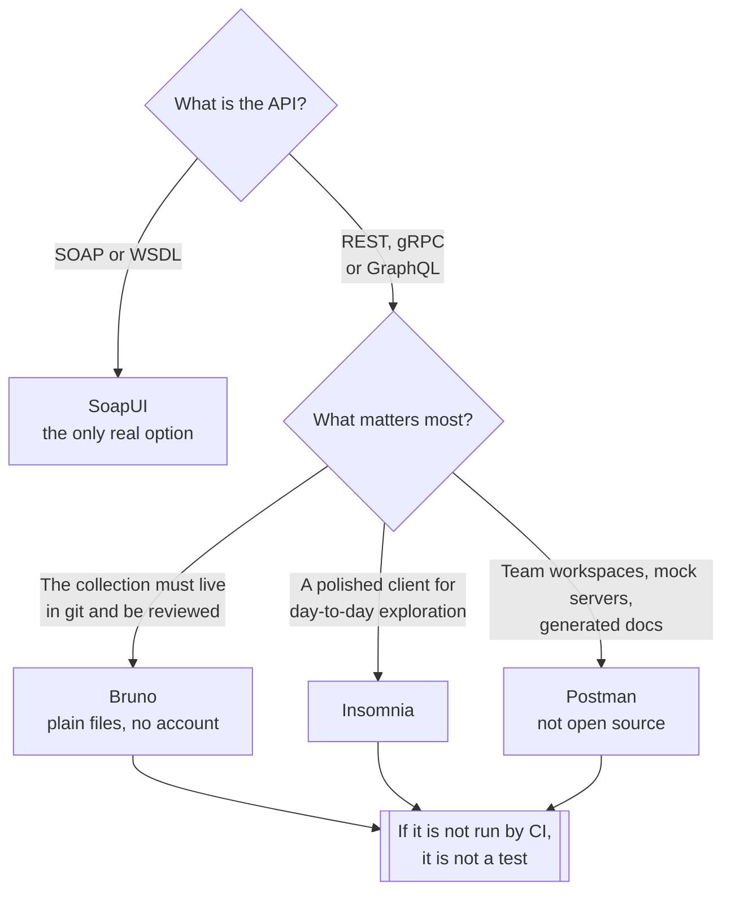

[← Testing](../README.md)

# API testing

Clients for poking at an API by hand — and the question of whether the collection survives the
laptop it was written on.

Tools covered: [`bruno`](bruno/README.md) · [`insomnia`](insomnia/README.md) ·
[`postman`](postman/README.md) · [`soapui`](soapui/README.md)

## Contents

1. [What these tools actually are](#1-what-these-tools-actually-are)
2. [The axis that decides: where the collection lives](#2-the-axis-that-decides-where-the-collection-lives)
3. [The tools](#3-the-tools)
4. [Getting a collection into CI](#4-getting-a-collection-into-ci)
5. [Decision tree](#5-decision-tree)
6. [Anti-patterns](#6-anti-patterns)
7. [How this applies to pikakube](#7-how-this-applies-to-pikakube)

---

## 1. What these tools actually are

All four are the same shape: a **GUI client that sends requests**, groups them into a
**collection**, substitutes **environment variables**, and can assert on the response.

That double life is the thing to be clear about, because it decides how they should be treated:

| Use | Value | Caveat |
|---|---|---|
| **Exploration** | irreplaceable — the fastest way to understand an endpoint | throwaway by nature |
| **Documentation by example** | a collection is a runnable description of an API | drifts unless it is versioned with the code |
| **Regression testing** | a CLI runner turns the collection into a pipeline stage | it is a black-box test — it does not replace [`unit/`](../unit/README.md) |
| Load testing | none — do not | use [`load/`](../load/README.md) |

The failure mode is treating the second and third as free. A collection is source code: if it is
not in the repository, reviewed, and executed by CI, it is one person's scratch file.

## 2. The axis that decides: where the collection lives

Feature comparisons between these tools are mostly noise. The one difference with consequences is
storage:

| | **Files on disk** | **A cloud workspace** |
|---|---|---|
| Version control | native — it is just files in git | export, or a sync integration |
| Code review | a normal diff | not really |
| Secrets | your problem, which is the correct answer | in someone else's account, which is not |
| Offline | works | depends |
| Collaboration | branches and pull requests | real-time, and genuinely good at it |
| Account required | no | yes |
| Examples | **Bruno** | **Postman** |

For a GitOps repository the first column wins by default, and it is not close: everything else in
this platform is a file in git that gets reviewed. An API contract test that lives in a SaaS
workspace is the one artefact nobody can diff.

The cloud model is not wrong — it is genuinely better for a large team collaborating on an API in
real time, with mock servers and shared environments. It is a different trade, and it should be
chosen knowingly rather than by installing whatever is most familiar.

## 3. The tools

| Tool | Storage | Open source | Where it shines | Detail |
|---|---|---|---|---|
| **Bruno** | **plain files** (`.bru`) in a folder | yes | git-native by design; no account, no sync, collections review like code | [→](bruno/README.md) |
| **Insomnia** | local, with optional cloud sync | core is open source (Kong) | a clean, fast client; good gRPC and GraphQL support | [→](insomnia/README.md) |
| **Postman** | cloud workspace by default | **no** | the largest feature surface — mocks, monitors, docs, team workspaces | [→](postman/README.md) |
| **SoapUI** | project XML files | yes (SmartBear) | **SOAP and WSDL** — the reason it still exists | [→](soapui/README.md) |

**Bruno** is the one that fits this repository's assumptions. Its collection format is a directory
of text files, so a collection is added, reviewed and merged like any other change.

**Insomnia** is the middle ground: a better client than Bruno by most accounts, with a storage model
that has moved around over the years. Worth checking which mode a given version defaults to before
adopting it.

**Postman** is a platform rather than a client, and it is **the only tool in this folder that is not
open source**. It does more than the others and it costs more than the others — in licensing, and in
the fact that the collection is not in your repository unless you make it so.

**SoapUI** is on a different axis entirely. It is not a worse REST client than the other three, it
is a **SOAP client** — WSDL import, XML schema validation, WS-Security. Nothing in the other three
handles WSDL properly, so if there is a SOAP service in the estate, this is the tool; if there is
not, there is no reason to install it.

## 4. Getting a collection into CI

Every one of these has a headless runner. That is what turns a collection from a personal tool into
a pipeline stage:

| Tool | Runner |
|---|---|
| Bruno | the `bru` CLI |
| Insomnia | the `inso` CLI |
| Postman | Newman |
| SoapUI | its own test runner, or the Maven plugin |

Two rules make this work rather than rot:

1. **The collection lives in the application's repository**, next to the code it tests. A separate
   "collections" repository drifts within a month.
2. **Environments contain no secrets.** Base URLs and IDs in the file; tokens injected at run time
   from the pipeline's secret store.

What these tests are good at is contract-level checking against a deployed environment: status
codes, response shape, required fields, auth behaviour. What they are bad at is anything needing
setup or state — that belongs in [`unit/`](../unit/README.md), where the test can create its own
fixtures against a real dependency.

## 5. Decision tree

## 6. Anti-patterns

| Anti-pattern | Why it is bad | What to do instead |
|---|---|---|
| Collections only on a laptop | untracked, unreviewed, lost with the machine | files in the application's repository |
| Secrets stored in the environment file | credentials committed, or synced to a vendor | injected at run time by the pipeline |
| A separate repository for collections | it drifts from the API within weeks | next to the code it tests |
| Using an API client as a load tester | these send requests serially; the numbers are meaningless | [`load/`](../load/README.md) |
| API collections as the whole test suite | black-box only, slow, and no setup | a base of [`unit/`](../unit/README.md) tests |
| Tests that depend on data already existing | green until someone cleans the environment | create and clean up within the run |
| Choosing Postman by habit | a cloud dependency and a licence, adopted without a decision | pick on the storage model — section 2 |
| Assertions on status code only | a 200 with a wrong body passes | assert on the response shape too |
| One giant collection for everything | nobody can tell what failed or why | one collection per service |

## 7. How this applies to pikakube

None of these four is deployed — they are desktop clients, and that is the right place for them.
This folder is a comparison rather than a platform service.

The recorded notes are bare links, and one of them carries the whole finding:
[**Postman**](postman/README.md) is documented with a link to `postman.com` rather than a GitHub
repository, because **there is no repository — it is the only non-open-source tool in this
folder.** The other three are [usebruno/bruno](bruno/README.md), [Kong/insomnia](insomnia/README.md)
and [SmartBear/soapui](soapui/README.md).

For a repository built on GitOps, **Bruno** is the one that matches the model already in use
everywhere else: a collection is a directory of text files, reviewed in a pull request, run by a
CLI. That is the same shape as every manifest in this repository.

**SoapUI** is kept for a specific reason, not as a fourth alternative: if a SOAP service appears,
none of the other three will import its WSDL.

---

[← Testing](../README.md)
