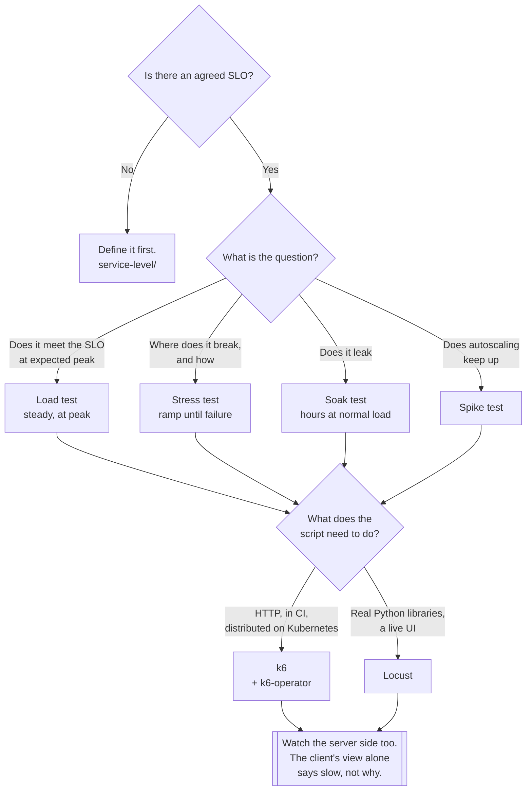

[← Testing](../README.md)

# Load testing

Finding out what happens at traffic — and the reason most load tests produce a number nobody can
interpret.

Tools covered: [`k6`](k6/README.md) · [`locust`](locust/README.md)

## Contents

1. [A load test without an SLO is a number with no meaning](#1-a-load-test-without-an-slo-is-a-number-with-no-meaning)
2. [Four different tests people call "load testing"](#2-four-different-tests-people-call-load-testing)
3. [k6 or Locust](#3-k6-or-locust)
4. [Where the load comes from](#4-where-the-load-comes-from)
5. [Decision tree](#5-decision-tree)
6. [Anti-patterns](#6-anti-patterns)
7. [How this applies to pikakube](#7-how-this-applies-to-pikakube)

---

## 1. A load test without an SLO is a number with no meaning

A run finishes and reports `p95 = 412ms, 0.3% errors, 1200 rps`. Is that a pass?

There is no answer to that question without a target agreed beforehand. Without one, the number
gets interpreted by whoever is in the room — usually as "it did not fall over, ship it" — and the
test has verified nothing.

The order that makes load testing useful:

1. **Define the SLO first** — for example, 99% of requests under 300ms, measured over 30 days. See
   [`service-level/`](../../../site-reliability-engineering/service-level/README.md).
2. **Derive the test's pass condition from it**, as a threshold the tool enforces.
3. **Run the test**, and let it fail the build on its own.

Both tools support this directly: k6 calls them **thresholds**, Locust exposes it through its exit
condition and failure ratios. A threshold turns the run from a report into a verdict.

Two measurement rules that decide whether the number is honest at all:

- **Never report the average.** Latency distributions are long-tailed; the mean hides exactly the
  users having a bad time. Report p95 and p99.
- **Report errors alongside latency.** A service that gets fast under load is usually a service
  that started returning 503 quickly.

## 2. Four different tests people call "load testing"

Same tool, different shape of traffic, completely different questions:

| Test | Traffic shape | Question it answers | Typical duration |
|---|---|---|---|
| **Load** | expected peak, held steady | does it meet the SLO at the traffic we expect? | 10–60 min |
| **Stress** | ramped up until it breaks | where is the limit, and **how** does it fail? | until failure |
| **Soak** (endurance) | normal load, for a long time | do resources leak? | hours to days |
| **Spike** | a sudden jump, then back down | does autoscaling react in time? | minutes |

The two that get skipped are the two that find the expensive problems:

**Stress testing** is not about the breaking point number. It is about the **failure mode**. A
system that sheds load and returns 429s is healthy at its limit. A system that queues until memory
is exhausted, gets OOM-killed, and takes the database's connections with it is not — and both look
identical on a load test that stops below the limit.

**Soak testing** is the only way to find the class of bug that is invisible in a ten-minute run:
memory leaks, file descriptors never closed, connection pools that grow and never shrink, unbounded
in-memory caches, disks filled by logs. These do not appear as a slope in a short test; they appear
as an incident at 3am on day four.

A **spike test** is really a test of the autoscaler and of cold starts, not of the application code.
It answers "how long is the system degraded while it scales?", which is a number the SLO cares about
and the load test never shows.

## 3. k6 or Locust

| | **k6** | **Locust** |
|---|---|---|
| Scripts written in | **JavaScript** (ES6, run by a Go engine) | **Python**, as ordinary code |
| Implementation | a single Go binary | a Python process, gevent-based |
| Resource cost per virtual user | **low** | higher |
| Distributed runs | **the k6-operator**, on Kubernetes | built-in master/worker |
| Live UI during the run | no — terminal output, or Grafana | **yes**, a web UI with live charts |
| Pass/fail built in | **thresholds** | via failure ratios and exit code |
| Extensibility | **xk6** extensions, compiled in | any Python library, imported |
| Owner | Grafana | community (`locustio`) |

**k6** is the better fit for a pipeline. It is a static binary with a low footprint, thresholds are
first-class, and the [k6-operator](k6/README.md) makes a distributed run a Kubernetes resource
rather than a fleet of machines someone has to manage. Being Grafana's means its output lands in the
stack the platform already runs.

The cost is the scripting model: k6 scripts are JavaScript executed by a Go runtime, not Node. There
is no `npm install` — libraries need to work in that environment, and anything else needs an xk6
extension, which means recompiling the binary.

**Locust** wins when the load itself is complicated. Because a Locust script is plain Python, the
whole ecosystem is available: the real client library for the service under test, `pandas` to build
the payloads, an SDK, whatever the scenario needs. That is a decisive advantage for testing
something that is not simply HTTP.

The cost is per-user overhead — a Python process holds fewer concurrent users than the Go binary
does — so a very high-concurrency test needs more workers.

> **Rule of thumb: k6 for HTTP against an SLO in CI. Locust when the scenario needs real code.**

## 4. Where the load comes from

The most common way to get a wrong answer is to generate load in the wrong place.

| Generator location | What it measures | Watch out for |
|---|---|---|
| **A laptop over the internet** | your home connection | almost never valid |
| Outside the cluster, same region | ingress, TLS, the full path | the most realistic for a public API |
| **Inside the cluster** | the service, minus ingress | reproducible, and what the operator gives you |
| The same node as the service | nothing useful | the generator and target compete for CPU |

Three failure modes worth naming:

- **The generator saturates before the target does.** Check the load generator's own CPU. If it is
  pinned, the reported latency is the generator's queueing, not the service's. This is the single
  most common invalid load test.
- **Everything downstream is included.** A load test hits the service, the database, the cache, the
  broker and every dependency. That is realistic, and it also means a shared staging database can
  make the result about someone else's workload.
- **Nothing is observed except the tool's output.** A run that only produces the client's view tells
  you it was slow but not why. Watch the server side at the same time —
  [`observability/metrics/`](../../../observability/metrics/README.md) and the
  [Grafana](../../../observability/dashboards/grafana/README.md) dashboards for the service.

## 5. Decision tree

## 6. Anti-patterns

| Anti-pattern | Why it is bad | What to do instead |
|---|---|---|
| No SLO before the run | the result cannot be called pass or fail | [`service-level/`](../../../site-reliability-engineering/service-level/README.md), then a threshold |
| Reporting the average latency | it hides the users having the worst time | p95 and p99 |
| Latency without errors | fast 503s look like a fast service | both, always |
| A saturated load generator | you are measuring the generator | check its CPU; scale out with the operator |
| Load testing from a laptop | measures your internet connection | generate load in or near the cluster |
| Only ever running the steady load test | leaks and failure modes stay hidden | add a soak and a stress run |
| No warm-up or ramp | JIT, caches and pools skew the first minute | ramp up, and discard the ramp |
| Every virtual user hitting one identical request | caches make it meaningless | parameterised, realistic data |
| Testing against a shared staging environment | someone else's workload is in your numbers | an isolated environment, or accept the caveat |
| Load testing production without a plan | it is an outage you scheduled | a documented blast radius and an abort condition |
| Watching only the tool's output | you learn it was slow, not why | server-side metrics during the run |
| Using an [API client](../api/README.md) to generate load | serial requests are not load | k6 or Locust |

## 7. How this applies to pikakube

**[k6](k6/README.md) is the one deployed.** The manifests here are a Flux `HelmRepository` pointing
at Grafana's charts, a `HelmRelease` for **`k6-operator` 3.10.1** in its own namespace, and a sample
`TestRun` under `k6/example/`.

That sample is worth reading as documentation of the model: `parallelism: 4` splits the run across
four runner pods, the script comes from a `ConfigMap`, and both the runner and the starter carry
their own `securityContext` and resource limits. A load test is a Kubernetes resource — which means
it is a file in git, reviewed and applied like everything else in this repository.

The operator is the reason k6 is deployed and Locust is not. Distributed load generation is
otherwise a fleet of machines someone maintains; here it is a CRD.

[Locust](locust/README.md) is documented rather than deployed. It stays on the map because the axis
it wins on — scripts as real Python, using the service's actual client libraries — is not something
k6 can be extended into.

The missing piece for both is the first section of this page. This repository has
[`service-level/`](../../../site-reliability-engineering/service-level/README.md) with Sloth, Pyrra
and OpenSLO. Until a service's SLO is defined there, a `TestRun` here produces a number with nothing
to compare it against.

---

[← Testing](../README.md)
