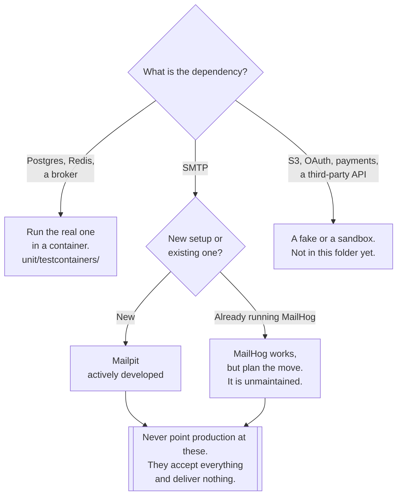

[← Testing](../README.md)

# Test doubles

Fake dependencies you can actually connect to — and why a working fake beats a mock.

Tools covered: [`mailpit`](mailpit/README.md) · [`mailhog`](mailhog/README.md)

## Contents

1. [Why this folder is not called smtp/](#1-why-this-folder-is-not-called-smtp)
2. [The five test doubles, and which one this is](#2-the-five-test-doubles-and-which-one-this-is)
3. [Why a real fake beats a mock](#3-why-a-real-fake-beats-a-mock)
4. [The category beyond SMTP](#4-the-category-beyond-smtp)
5. [Mailpit or MailHog](#5-mailpit-or-mailhog)
6. [Decision tree](#6-decision-tree)
7. [Anti-patterns](#7-anti-patterns)
8. [How this applies to pikakube](#8-how-this-applies-to-pikakube)

---

## 1. Why this folder is not called smtp/

It used to be. This folder was `tests/smtp/`, and the rename to `testing/test-double/` is the point
of this section.

**MailHog and Mailpit are not test suites.** They do not run tests, assert anything, or produce a
pass or fail. They are **fake SMTP servers**: a service that speaks the real protocol, accepts
everything, delivers nothing, and shows you what it caught in a web UI.

That makes them **test doubles** — service virtualisation — and filing them under `smtp/` described
the *protocol* rather than the *job*. The protocol is an implementation detail; the job is "stand in
for a dependency so the thing under test can run". A fake S3 or a fake OAuth provider belongs in the
same folder for the same reason, and would have had nowhere to go under the old name.

They still sit inside [`testing/`](../README.md) because that job only exists in service of testing
and local development. They are the one subfolder here that is **deployed as a service** rather than
executed as a test — see [`testing/`](../README.md) section 4.

## 2. The five test doubles, and which one this is

The vocabulary is worth having precisely, because the choice between the last two is the whole
argument:

| Double | What it is |
|---|---|
| **Dummy** | passed to satisfy a signature, never used |
| **Stub** | returns canned answers to calls made during the test |
| **Spy** | a stub that also records how it was called |
| **Mock** | pre-programmed with expectations; **fails the test if they are not met** |
| **Fake** | a **working implementation** with a shortcut that makes it unsuitable for production |

MailHog and Mailpit are **fakes**. An in-memory repository is a fake. SQLite standing in for
Postgres is a fake — and a bad one, which is the caveat: a fake is only useful when the shortcut is
in the *storage or delivery*, not in the *behaviour being tested*.

The distinction that matters in practice: a **mock lives inside your process** and replaces a call.
A **fake runs as a real service** and is reached the way the real one would be.

## 3. Why a real fake beats a mock

Mock the mailer and the test asserts `send_email` was called with the right arguments. That is a
test of your own code calling your own function. Everything between that call and an email arriving
is untested:

| What breaks in reality | Mocked mailer | Fake SMTP server |
|---|---|---|
| SMTP host, port or credentials wrong | invisible | **connection fails immediately** |
| TLS/STARTTLS misconfigured | invisible | **fails** |
| Malformed MIME, broken multipart | invisible | **visible in the UI** |
| Wrong `From`, missing `Reply-To` | asserted against your own assumption | **the actual headers** |
| Template renders `None` into the body | passes if the call happened | **you can read the email** |
| Attachment encoding | invisible | **you can open it** |
| The client library's own behaviour | replaced | **exercised** |

The general principle, and it is the same one behind
[testcontainers](../unit/testcontainers/README.md): **a mock encodes your beliefs about the
dependency; a fake exercises the protocol.** Bugs live in the gap between the two.

The second benefit is not about tests at all. A fake SMTP server gives a developer, a QA engineer or
a product owner **a web inbox to look at**. Reviewing the actual rendered email is something no unit
test replaces.

The trade is real and worth stating: a fake is a service to deploy, keep running and keep out of
production. A mock is a line of code. For anything with a protocol and a rendering step — mail
especially — the fake earns it.

## 4. The category beyond SMTP

SMTP is the case in this repository, but the category is broader. The same argument applies wherever
the real dependency is expensive, external, or has side effects on real people:

| Dependency | Why fake it | Common fakes |
|---|---|---|
| **SMTP** | mail would reach real inboxes | **Mailpit**, MailHog |
| **Object storage** | S3 costs money and needs credentials | MinIO, LocalStack |
| **OAuth / OIDC** | you cannot run an identity provider per test | a mock OIDC provider |
| Payments | there is no undo on a real charge | the vendor's sandbox |
| SMS and push | messages reach real phones | the vendor's sandbox |
| Third-party HTTP APIs | rate limits, flakiness, cost | a recorded or programmable stub |

Only the first row is in this folder today. The folder name is what makes the others addable without
another reorganisation.

One boundary: **a fake dependency is not the same as a container of the real dependency.** Postgres,
RabbitMQ and Redis should be run for real via
[testcontainers](../unit/testcontainers/README.md) — the real thing is available, cheap and has no
external side effects, so there is no reason to fake it. Fakes are for dependencies you *cannot*
run: someone else's mail relay, someone else's identity provider, someone else's payment network.

## 5. Mailpit or MailHog

They do the same job, and the choice is not close:

| | **Mailpit** | **MailHog** |
|---|---|---|
| Maintenance | **actively developed** | **effectively unmaintained** |
| Origin | `axllent/mailpit` | `mailhog/MailHog` |
| Positioning | explicitly the modern replacement | the original, and the one everyone knows |
| UI | modern, responsive, searchable | dated but functional |
| Extras | HTML source checks, link checking, spam scoring, message release | capture and view |
| Storage | SQLite-backed, with retention | memory or MongoDB |
| Chart used here | `jouve/mailpit` | `codecentric/mailhog` |

**Say it plainly: MailHog is effectively unmaintained, and Mailpit is its actively developed
successor.** MailHog still works — it is a small Go binary doing a simple job, and simple unmaintained
software can stay useful for a long time — but it accumulates unfixed issues, no new features, and
an ageing dependency set, and nothing about it is better than Mailpit.

**New work should use Mailpit.** MailHog stays documented because it is widely deployed and its name
appears in a great deal of existing tutorials and `docker-compose.yml` files, so knowing what it is
and that it has a successor is the useful part.

## 6. Decision tree

## 7. Anti-patterns

| Anti-pattern | Why it is bad | What to do instead |
|---|---|---|
| Mocking the mail client | proves you called your own function | a fake SMTP server |
| A real SMTP relay in staging | real mail reaches real people, eventually | Mailpit |
| Pointing production at a fake | every email is silently discarded | separate configuration, and check it |
| Choosing MailHog for new work | unmaintained, with a direct successor | Mailpit |
| Faking Postgres with SQLite | a different dialect, different constraints, different bugs | a real Postgres via [testcontainers](../unit/testcontainers/README.md) |
| The fake exposed without authentication | a searchable archive of everything the system sends | authentication on the ingress |
| Never reading the captured mail | the UI is the point; nobody notices the broken template | look at the rendered email |
| No retention limit | the store grows until the volume fills | cap messages or age |
| Asserting via the UI by hand | not a test, just a look | assert through the HTTP API |
| One shared fake for every environment | tests read each other's mail | one per environment, or filter by recipient |

## 8. How this applies to pikakube

**Both are deployed**, and they are near-duplicates:

| Tool | Manifests |
|---|---|
| [Mailpit](mailpit/README.md) | namespace, `HelmRepository` (`jouve`), `HelmRelease` — chart `mailpit` 0.21.0 |
| [MailHog](mailhog/README.md) | namespace, `HelmRepository` (`codecentric`), `HelmRelease` — chart `mailhog` 5.5.0 |

The recommendation follows section 5: **keep Mailpit, and treat MailHog as the one to retire.** They
occupy the same position on the platform, and running both means maintaining two SMTP endpoints that
applications can be pointed at by mistake.

The MailHog note records the chart source explicitly — `codecentric/helm-charts` — which is worth
keeping visible, because MailHog being unmaintained upstream does not by itself say anything about
the chart, and in a GitOps repository the chart's health is half the evaluation.

The folder's own name is the other thing to carry forward. It was `tests/smtp/`; it is now
`testing/test-double/` because these are **fake dependencies, not tests**. That leaves room for the
next fake — an S3 or an OIDC stub — without another rename.

---

[← Testing](../README.md)
