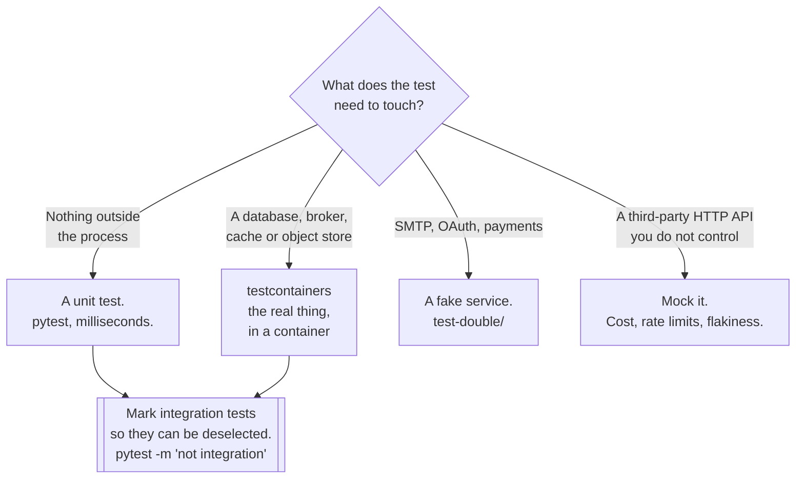

[← Testing](../README.md)

# Unit and integration testing

Tests written in code, run by the pipeline — the layer everything else in this folder rests on.

Tools covered: [`pytest`](pytest/README.md) · [`testcontainers`](testcontainers/README.md)

## Contents

1. [Two tools, two different layers](#1-two-tools-two-different-layers)
2. [What makes a unit test worth having](#2-what-makes-a-unit-test-worth-having)
3. [Where to draw the mock line](#3-where-to-draw-the-mock-line)
4. [Integration tests that are actually reliable](#4-integration-tests-that-are-actually-reliable)
5. [Coverage is a diagnostic, not a target](#5-coverage-is-a-diagnostic-not-a-target)
6. [Decision tree](#6-decision-tree)
7. [Anti-patterns](#7-anti-patterns)
8. [How this applies to pikakube](#8-how-this-applies-to-pikakube)

---

## 1. Two tools, two different layers

The folder is called `unit/`, and one of the two tools in it is not a unit-testing tool. Worth
saying up front rather than pretending otherwise:

| Tool | What it is | Layer |
|---|---|---|
| [**pytest**](pytest/README.md) | the **test runner and framework** — collection, fixtures, assertions, parametrisation, plugins | unit, and everything else |
| [**testcontainers**](testcontainers/README.md) | a **library that starts real dependencies in Docker** from inside the test | integration |

They sit together because they are used together and belong to the same job: *tests that developers
write in code and CI executes.* pytest runs the test; testcontainers supplies the Postgres it runs
against. The alternative — a separate `integration/` folder — would split one workflow across two
places for a naming reason.

The layers are still different, and mixing them up produces the classic slow suite:

| | Unit | Integration |
|---|---|---|
| Dependencies | replaced in-process | **real, in a container** |
| Runtime | milliseconds | seconds, plus container startup |
| Run when | on every save | before push, and in CI |
| Count | hundreds | tens |
| Marked as | the default | an explicit marker, so it can be deselected |

**Split them by marker from day one.** `pytest -m "not integration"` is the difference between a
suite developers run constantly and one they run once a day.

## 2. What makes a unit test worth having

Four properties. A test missing any of them costs more than it returns:

| Property | What it means | What goes wrong without it |
|---|---|---|
| **Fast** | milliseconds, no I/O | the suite stops being run |
| **Deterministic** | same result every time | red builds get ignored |
| **Isolated** | no shared state, any order | failures depend on what ran first |
| **One reason to fail** | a focused assertion | the name says what broke, so nobody debugs the test |

The two most common sources of non-determinism are `datetime.now()` and randomness. Both are fixed
the same way: **inject them**. A function that takes `now` as an argument is testable; one that
calls the clock is a test that fails at midnight, in another timezone, on the last day of a month.

The things worth actually testing, in order:

1. **Branches and edge cases** — empty, one, many, `None`, negative, the boundary value
2. **Error paths** — what happens when the input is wrong, or the dependency raises
3. **Pure logic** — calculations, parsing, transformations, state machines
4. Anything that has broken before, as a regression test

The thing not worth testing is code with no logic in it: getters, framework wiring, a function that
only forwards a call. Testing those inflates coverage and asserts nothing.

## 3. Where to draw the mock line

Mocking is not wrong; mocking the wrong thing is. The line that works:

| Mock it | Do not mock it |
|---|---|
| A **third-party HTTP API** — cost, rate limits, flakiness | **your own database** — use a container |
| The clock, randomness, UUIDs | your own code — that is testing the mock |
| Something with real side effects on real people (mail, SMS, payments) | the standard library |
| A dependency that does not exist yet | anything cheap to run for real |

The rule underneath: **mock at the boundary of what you own and cannot cheaply run.** Everything
inside that boundary should be exercised for real.

The specific failure mode is mocking the database. A test with a mocked ORM asserts that your code
called the methods you thought it would call, in the order you thought — which is your own
assumption, restated. It cannot detect invalid SQL, a missing migration, a constraint violation, a
timezone conversion or a serialisation bug. That is what
[testcontainers](testcontainers/README.md) removes.

The second failure mode is over-mocking within your own code. A test where every collaborator is a
mock verifies wiring rather than behaviour, and it breaks on every refactor while catching no bugs —
the worst possible ratio.

## 4. Integration tests that are actually reliable

The historical reason integration tests were bad was the **shared test database**: one instance,
several developers and CI all writing to it. That produced every symptom people attribute to
integration tests in general — order dependence, fixture pollution, failures that vanish on rerun,
and a schema drifting from the migrations.

[testcontainers](testcontainers/README.md) removes the shared instance. Each run starts its own
container, applies the migrations, runs, and destroys it:

| Problem with the shared database | With a container per run |
|---|---|
| Tests see each other's data | a fresh instance |
| Order dependence | any order works |
| "Works on my machine" | the same image everywhere |
| The schema drifts from the migrations | migrations run every time, so a broken one fails |
| Nobody can run it locally | the same code path as CI |

The practical shape:

- **one container per test session**, not per test — startup cost is paid once
- **run the real migrations** against it; that is half the value
- **isolate per test with a transaction rollback**, not by recreating the schema
- **do not pin a floating tag** — the same image tag as production, so the dialect matches

The costs, stated plainly: seconds of startup on every run, and CI needs a usable container runtime
with a Docker socket, which is a real constraint in some sandboxed runners. That is the price of the
column on the right.

## 5. Coverage is a diagnostic, not a target

Coverage measures which lines executed. It does not measure whether anything was asserted — a test
that calls a function and asserts nothing reports full coverage of it.

Once a percentage becomes a gate, it gets met the cheapest way available, and the cheapest way is
tests that execute code without checking it. The number goes up and the suite gets worse.

What the report is good for:

- **finding untested branches** — the error path nobody exercised
- **spotting dead code** — never reached by anything
- **coverage of the diff**, which is a fair question about a change, unlike a project-wide number

A reasonable position: look at the report, act on the gaps that matter, and do not set a threshold
that anyone has to game.

## 6. Decision tree

## 7. Anti-patterns

| Anti-pattern | Why it is bad | What to do instead |
|---|---|---|
| Mocking your own database | asserts your beliefs about SQL, not SQL | [testcontainers](testcontainers/README.md) |
| SQLite standing in for Postgres | different dialect, different constraints, different bugs | the production image |
| A shared test database | pollution, order dependence, flakiness | one container per run |
| Everything mocked, including your own code | verifies wiring; breaks on every refactor | mock at the boundary you do not own |
| Unit and integration tests unmarked | the fast suite inherits the slow one's runtime | markers, deselectable |
| `datetime.now()` inside the logic | fails at midnight, in another timezone | inject the clock |
| `sleep()` to wait for something | slow when it passes, flaky when it does not | wait on a condition |
| Coverage as a gate | tests that execute lines and assert nothing | coverage as a diagnostic |
| Tests that assert nothing | green forever, regardless of the code | at least one meaningful assertion |
| One test asserting ten things | the name does not say what broke | one reason to fail |
| Fixtures shared mutably between tests | the failure depends on execution order | function-scoped, or immutable |
| A container started per test | startup cost multiplied by the test count | session scope, transaction rollback per test |
| Testing getters and framework wiring | coverage without information | test branches and error paths |
| Skipping a flaky test instead of fixing it | it stays skipped, and the bug stays | fix it or delete it |

## 8. How this applies to pikakube

Neither tool is deployed — these are libraries, and they belong in the application's dependencies
rather than in a manifest. This folder is documentation of the practice.

The recorded notes point at something specific: the [testcontainers](testcontainers/README.md) note
links the **Python**, **Go** and **Node** quickstarts alongside the `testcontainers-python`
repository. That breadth is the point. Testcontainers is not a Python library that happens to exist
elsewhere; it is the same idea implemented per language, which matters here because
[`language/`](../../language/README.md) covers both Python and Go. The same testing approach carries
across both.

[pytest](pytest/README.md) is noted as `pytest-dev/pytest` alone, which is right — it is the default
Python test framework and there is nothing to compare it against in this repository.

Where this connects to the rest of the platform:

- integration tests here use the same **PostgreSQL image** as the CloudNativePG clusters in
  [`databases/`](../../../databases/README.md), so the dialect matches
- a fake SMTP endpoint for tests is already deployed —
  [`test-double/`](../test-double/README.md)
- the [`api/`](../api/README.md) collections are the black-box layer above this one, and they are not
  a substitute for it

---

[← Testing](../README.md)
