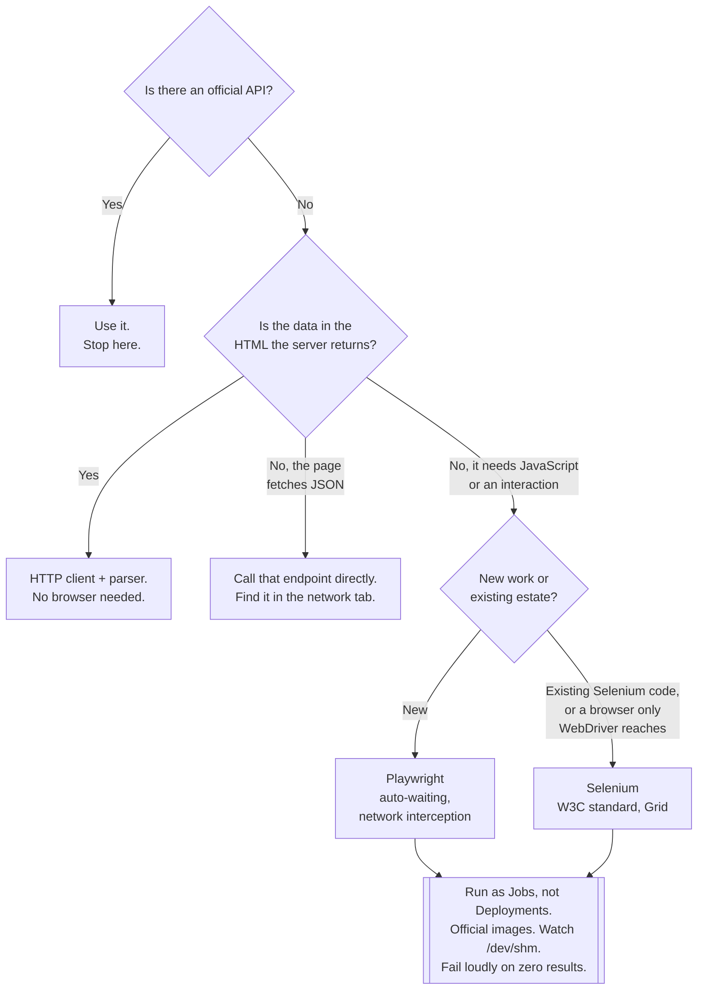

[← Software engineering](../README.md)

# Web scraping

Driving a real browser to get data out of a page — and being honest that these are testing tools
filed by how they are used.

Tools covered: [`playwright`](playwright/README.md) · [`selenium`](selenium/README.md)

## Contents

1. [These are browser testing frameworks](#1-these-are-browser-testing-frameworks)
2. [Most scraping does not need a browser](#2-most-scraping-does-not-need-a-browser)
3. [Playwright or Selenium](#3-playwright-or-selenium)
4. [Running a browser on Kubernetes](#4-running-a-browser-on-kubernetes)
5. [What makes scrapers break](#5-what-makes-scrapers-break)
6. [Legality and courtesy](#6-legality-and-courtesy)
7. [Decision tree](#7-decision-tree)
8. [Anti-patterns](#8-anti-patterns)
9. [How this applies to pikakube](#9-how-this-applies-to-pikakube)

---

## 1. These are browser testing frameworks

Stated plainly, because the folder name hides it: **Playwright and Selenium are end-to-end browser
testing frameworks.** That is what they were built for, what most of their documentation is about,
and — arguably — their primary use. Playwright ships a test runner, assertions, tracing, video
recording and screenshot comparison. Selenium is the reference implementation of the **W3C WebDriver
standard**, which exists to automate browsers for testing.

They are filed here rather than under [`testing/`](../testing/README.md) because **this repository
classifies tools by how they are used, not by everything they can do.** The same rule puts
diagnostic database tools under monitoring and keeps queues separate from event logs. It is applied
consistently, including where — as here — it produces a slightly surprising result.

The overlap is therefore real and worth naming rather than hiding:

| Use | Folder | Question being answered |
|---|---|---|
| Extracting data from pages you do not control | **`web-scraping/`** (here) | what does this site say? |
| End-to-end testing of your own application | [`testing/`](../testing/README.md) | does the journey still work? |

The mechanics are identical — launch a browser, find elements, wait for the page to settle, read
what is there. The differences are entirely in the surrounding concerns: a test controls the
application and its data, and a scraper controls neither. That produces the two sections below on
breakage and on legality, which have no equivalent on the testing side.

If you are writing end-to-end tests for your own service, read this folder for the tool comparison
and read [`testing/`](../testing/README.md) for where those tests belong in the pyramid — and keep
the end-to-end layer small, for the reasons set out there.

## 2. Most scraping does not need a browser

The first decision, and the one that saves the most effort:

| Approach | Cost | Use when |
|---|---|---|
| **HTTP client + HTML parser** | milliseconds, no dependencies | the data is in the HTML the server returns |
| **Calling the page's own API** | the cheapest of all | the page fetches JSON — check the network tab |
| An official API | free of all of this | one exists |
| **A real browser** | hundreds of MB, seconds per page, memory | the content only exists after JavaScript runs |

A browser is one to two orders of magnitude more expensive per page than an HTTP request, and it
brings a browser's operational profile: memory, zombie processes, crashes, version drift.

**Check for the underlying API first.** Modern pages usually render from a JSON endpoint the browser
itself calls. Finding it in the network tab turns a fragile DOM scraper into a stable HTTP client
that returns structured data — faster, more reliable, and immune to layout changes.

Reach for a browser when the content genuinely requires one: client-side rendering with no
accessible API, an interaction sequence (login, multi-step forms), or content behind a flow that
cannot be replayed as plain requests.

## 3. Playwright or Selenium

| | **Playwright** | **Selenium** |
|---|---|---|
| Origin | Microsoft | the WebDriver project; **the W3C standard** |
| Age | recent | the oldest and most established |
| Protocol | mostly **direct browser protocols** (CDP and equivalents) | **WebDriver**, via a driver per browser |
| Waiting | **auto-waiting** built into every action | explicit waits, written by you |
| Browsers | bundled Chromium, Firefox, WebKit | anything with a WebDriver, including real Safari and Edge |
| Language bindings | Python, JS/TS, Java, .NET | **more, and longer-established** |
| Parallelism | **browser contexts** — cheap isolation in one browser | one session per browser instance |
| Network interception | **first-class** — intercept, stub, capture | limited |
| Distribution | its own runner; containers | **Selenium Grid**, mature |
| Ecosystem | growing fast | enormous, and a lot of it is old |

**Playwright is the better default for new work.** The decisive feature is **auto-waiting**: every
action waits for the element to be attached, visible, stable and able to receive the event before
acting. That removes the single largest source of flakiness in browser automation, which is the
`sleep(2)` someone added because the click was intermittently too early.

Its second real advantage for scraping is **network interception**: you can watch the requests the
page makes — which is often how you find the JSON API from section 2 — and you can block images,
fonts and analytics, which is a large speed-up on a scraper that only wants text.

**Selenium's advantages are not nostalgia.** It is the W3C standard, so it drives browsers no other
tool reaches — real Safari, and vendor-supplied drivers generally. Its language coverage is wider.
**Selenium Grid** is a mature, well-understood way to run many browsers across many machines, and
there is far more existing code and institutional knowledge written against it than against anything
else.

The honest summary: **new project, choose Playwright; existing Selenium estate, there is no reason
to rewrite it.**

## 4. Running a browser on Kubernetes

Both tools run headless in a container, and the failure modes are the same for both:

| Concern | What happens | What to do |
|---|---|---|
| **Shared memory** | Chromium crashes with the default 64MB `/dev/shm` | mount a larger `/dev/shm`, or disable `/dev/shm` usage |
| **Memory limits** | a browser is OOM-killed mid-page and the job just fails | generous limits; one page at a time per worker |
| **Zombie processes** | crashed browsers accumulate and exhaust the pod | an init process to reap them (PID 1 matters) |
| **Image size** | the browser plus its dependencies is hundreds of MB | the vendor's official image |
| **Version drift** | the driver and the browser must match | pin both; the official images do this for you |
| Ephemeral by design | a long-lived browser leaks | run scrapes as `Job`s, not a `Deployment` |

Use the **official images** — Playwright and Selenium both publish images with the browsers and
system libraries already correct. Building your own is a long afternoon spent discovering which
shared library Chromium wants.

## 5. What makes scrapers break

This is the part with no equivalent in end-to-end testing, and it is why a scraper is a maintenance
commitment rather than a task:

| Cause | Detail |
|---|---|
| **The page changed** | you do not control it, there is no deprecation notice, and it can happen tonight |
| **Selectors chosen badly** | generated class names and deep CSS paths change on every deploy |
| Rate limiting | too fast, and you are blocked |
| Bot detection | a headless browser is detectable, and increasingly detected |
| Login and sessions | expiry, MFA, and CAPTCHAs |
| Pagination and infinite scroll | the tricky part is knowing when you have reached the end |
| Regional variation | different HTML per country, currency or A/B test bucket |
| Silent partial failure | **the worst one** — the selector matches nothing, and the scraper reports zero results as success |

Two things reduce the pain more than anything else:

**Choose selectors by meaning, not position.** Text, `aria` roles, `data-` attributes and stable IDs
survive a redesign. `div > div:nth-child(3) > span.css-1x2y3z` does not survive the next deploy.

**Fail loudly when the shape changes.** A scraper that expected 50 rows and found 0 must raise, not
return an empty list. Silent zero-result runs are how a broken pipeline goes unnoticed for a month.

## 6. Legality and courtesy

Not a legal opinion, and worth writing down before someone writes a crawler:

- **Read the terms of service.** Many prohibit automated access outright, whatever the technical
  feasibility.
- **Respect `robots.txt`.** It is not legally binding in most jurisdictions and ignoring it is still
  a bad position to be in.
- **Rate limit yourself**, and identify the client honestly in the user agent. A polite scraper
  rarely gets blocked; an aggressive one degrades someone else's service, which is the actual harm.
- **Personal data is regulated regardless of how it was obtained.** Publicly visible does not mean
  freely processable — GDPR and its equivalents apply to the scraped copy.
- **Cache aggressively.** Re-fetching a page that has not changed is cost imposed on someone else
  for nothing.
- **Prefer the official API**, including a paid one. It is cheaper than maintaining a scraper and it
  cannot be withdrawn without notice.

## 7. Decision tree

## 8. Anti-patterns

| Anti-pattern | Why it is bad | What to do instead |
|---|---|---|
| A browser when an HTTP request would do | 100x the cost for the same bytes | a client and a parser |
| Not looking for the page's own JSON API | a fragile DOM scraper replacing a stable endpoint | check the network tab first |
| `sleep()` instead of waiting for a condition | slow when it works, flaky when it does not | Playwright's auto-waiting, or explicit waits |
| Selectors based on generated class names | broken by the next deploy | text, roles, `data-` attributes |
| Returning an empty result silently | a broken scraper looks like a working one | assert on the expected shape and raise |
| A long-lived browser process | memory grows, zombies accumulate | a `Job` per scrape |
| Building your own browser image | a day spent on shared libraries | the official image |
| Default `/dev/shm` in a container | Chromium crashes with no useful error | mount more, or disable its use |
| No rate limiting | you degrade someone else's service and get blocked | throttle, and cache |
| Ignoring `robots.txt` and the terms of service | a legal and reputational position nobody wants | read them first |
| Scraping personal data without a basis | regulated regardless of public visibility | do not, unless you have one |
| These tools as the main testing layer | slow, flaky, and it inverts the pyramid | [`testing/`](../testing/README.md) — a small end-to-end layer |

## 9. How this applies to pikakube

Neither tool is deployed. They are libraries, used from application code, so the manifests would be
whatever `Job` runs the scrape rather than the tool itself.

The recorded notes are precise about which package is meant:
[**playwright**](playwright/README.md) is noted as `microsoft/playwright-python` — the Python
binding specifically, not the Node original — which matches
[`language/python/`](../language/python/README.md) being the primary language in this repository.
[**Selenium**](selenium/README.md) is noted as `SeleniumHQ/selenium`, the umbrella project covering
every binding.

The classification note is repeated at the top of this page and belongs in the summary too, because
it is the kind of thing a reader will otherwise flag as a mistake: **these are also, and arguably
primarily, end-to-end browser testing frameworks.** They are in `web-scraping/` because that is the
use they are here for. The repository's rule is to classify by use rather than by full capability,
and [`software-engineering/README.md`](../README.md) states it as such.

Anyone arriving here looking for end-to-end testing should read [`testing/`](../testing/README.md)
for where that layer belongs, and this page for which of the two tools to use.

---

[← Software engineering](../README.md)
